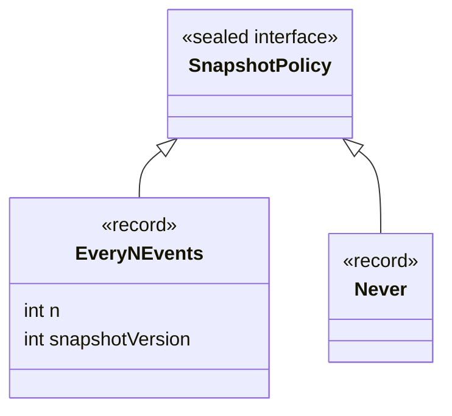

# ADR-002: Sealed Interfaces for Domain Type Hierarchies

**Status:** Accepted
**Date:** 2026-04-15

## Context

Domain event sourcing requires modeling command, event, and policy hierarchies as closed, exhaustive sets known at compile time. Java historically offered four options:

1. **Marker interfaces** (`interface DomainEvent {}`) — no enforcement. Any class can implement the interface, making the hierarchy open and unverifiable at compile time. `switch` on type requires a default branch even when all types are covered.
2. **Abstract classes** — can carry shared state and behavior but single-inheritance constraint prevents composing hierarchies; every event must extend the abstract class, coupling unrelated events to shared superclass fields.
3. **Enums** — fixed set of singleton constants. Cannot carry per-instance data beyond enum fields, making it impractical to represent events like `OrderPlaced(orderId, customerId, items)`.
4. **Sealed interfaces with records** (Java 17+) — declares a closed set of permitted subtypes; `record` implementations are immutable value objects with automatic `equals`, `hashCode`, and `toString`.

StreamRune has three primary sealed hierarchies: `SnapshotPolicy` (permits `EveryNEvents`, `Never`), `DomainEvent` (user-defined per aggregate, recommended as sealed), and command types. The `SnapshotPolicy` sealed interface is defined in the core library itself; `DomainEvent` is unsealed in the framework but the `Decider` Javadoc explicitly recommends `sealed interface` for the type parameter `E`.

## Decision

Use sealed interfaces as the idiomatic representation for all closed domain type hierarchies in StreamRune.

- `SnapshotPolicy` is declared `public sealed interface SnapshotPolicy permits SnapshotPolicy.EveryNEvents, SnapshotPolicy.Never`. Both permitted types are `record` implementations nested inside the sealed interface.
- The `EveryNEvents` record carries `int n` and `int snapshotVersion` with compact constructor validation. The `Never` record carries no data — an empty record used as a unit type.
- In `VirtualThreadCommandBus`, the command bus switches on `snapshotPolicy` using `instanceof` pattern matching: `if (snapshotPolicy instanceof SnapshotPolicy.EveryNEvents policy)`. The compiler guarantees exhaustiveness without a default branch in contexts where all permitted types are handled.
- Users are guided to declare their own sealed interfaces for commands and events (e.g. `public sealed interface OrderEvent permits OrderPlaced, OrderShipped, OrderCancelled`) so that the compiler enforces exhaustive handling in `Decider.evolve()`.

## Consequences

**Positive:**

- **Compiler-enforced exhaustiveness.** Adding a new permitted type to a sealed interface causes compile errors at every unhandled `switch` expression, preventing silent bugs where new event types are silently ignored by projections.
- **Pattern matching synergy.** Java 21 pattern matching in `switch` works naturally with sealed hierarchies: `switch (event) { case OrderPlaced p -> ...; case OrderShipped s -> ...; }`. No default branch needed when all types are covered.
- **Immutability for free.** Record implementations give `equals`, `hashCode`, `toString`, and immutable field access without boilerplate. Event sourcing correctness depends on events being stable value objects; records enforce this.
- **Zero runtime overhead.** Sealed/record is a compile-time feature. No reflection, no proxy generation, no annotation processing.

**Negative:**

- Sealed interfaces require Java 17 at minimum (StreamRune requires Java 25, so this is not an additional constraint).
- Adding a new permitted subtype to a sealed interface that is used in exhaustive `switch` expressions is a breaking change for all downstream callers. This is intentional — it is the point — but framework authors must version sealed hierarchies carefully to avoid surprising API consumers.
- Some JSON libraries (Jackson 2.x without explicit configuration) do not automatically detect sealed subtype hierarchies. Users must register subtypes or configure Jackson's `@JsonSubTypes` / module-based sealed type support.
