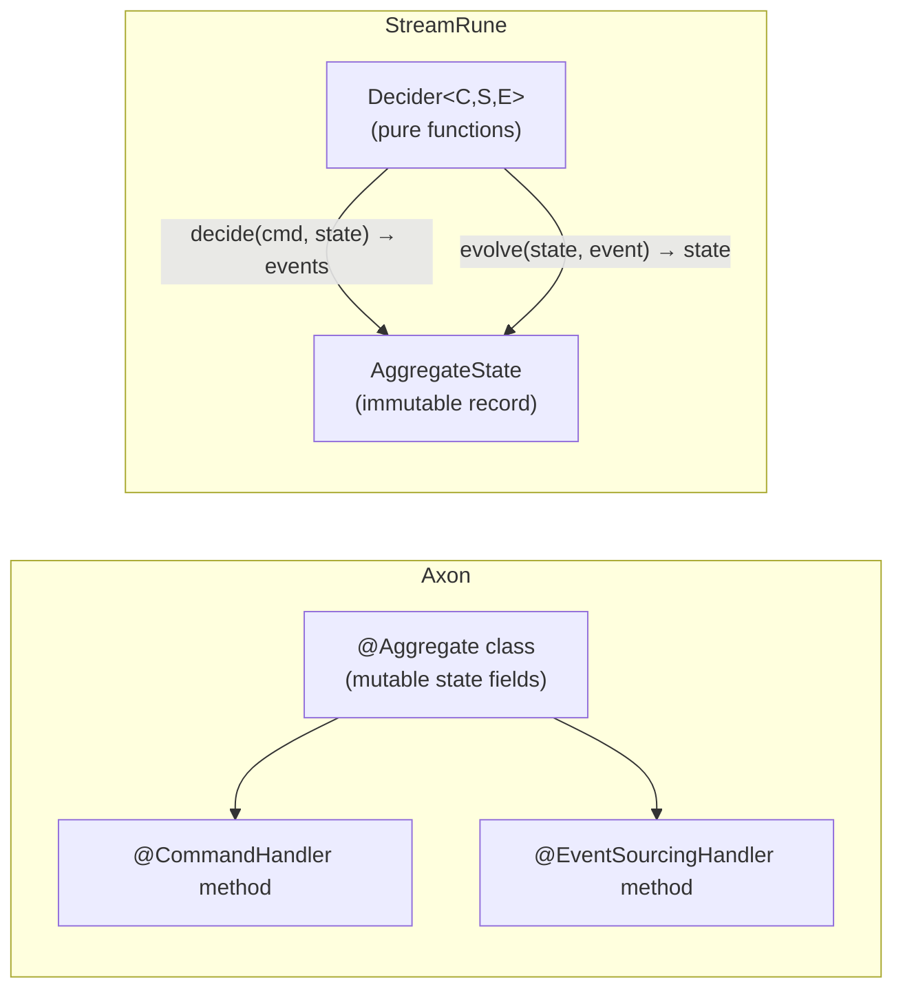

# StreamRune vs Axon Framework

## At a Glance

- StreamRune uses plain Java interfaces (`Decider`, `EventStore`) with explicit builder wiring; Axon uses annotation-driven Spring magic (`@Aggregate`, `@CommandHandler`, `@EventSourcingHandler`).
- Axon requires Axon Server (or a custom event bus) for command routing; StreamRune stores events directly in PostgreSQL with no separate infrastructure service.
- StreamRune's `Decider` is a pure function (`decide(command, state) → events`, `evolve(state, event) → state`) with no framework callbacks; Axon aggregates carry mutable state and are wired by the framework.
- StreamRune targets Java 21 virtual threads; Axon has reactive support via Reactor but also supports traditional threading models.
- StreamRune is BSL 1.1 with an Apache 2.0 conversion clause; Axon Framework is Apache 2.0 (Axon Server has a separate commercial tier).

## Concept Mapping

| Axon Framework | StreamRune | Notes |
|---|---|---|
| `@Aggregate` class | `Decider<C,S,E>` + `AggregateState` record | Axon aggregate carries state internally; StreamRune separates pure logic from state |
| `@CommandHandler` method | `Decider.decide(command, state)` | Axon discovers handlers by annotation scanning; StreamRune registers explicitly via `VirtualThreadCommandBus.Builder.register()` |
| `@EventSourcingHandler` method | `Decider.evolve(state, event)` | Axon rebuilds state by calling annotated methods; StreamRune calls `evolve()` in a fold |
| `@QueryHandler` | `QueryBus.register(queryType, handler)` | Both dispatch queries to handlers; StreamRune uses explicit registration, not annotations |
| Axon Server (event bus + store) | `PostgresEventStore` | Axon Server is a separate JVM process; StreamRune writes directly to PostgreSQL |
| `@Saga` / `SagaEventHandler` | `SagaRunner` + `SagaOrchestrator` interface | Both support long-running process coordination |
| `SnapshotTriggerDefinition` | `SnapshotPolicy.everyNEvents(n)` | Axon has multiple trigger strategies; StreamRune currently supports count-based only |
| Event Upcasters | `EventUpcaster` / `UpcasterChain` | Both support schema evolution; StreamRune's upcasters are plain Java functions |

## Key Differences



**1. Annotation magic vs. explicit wiring.**
Axon relies heavily on Spring's dependency injection and annotation scanning to wire aggregates, command handlers, event handlers, and sagas. StreamRune inverts this: you wire everything explicitly using a builder (`VirtualThreadCommandBus.builder().register(ORDER, CreateOrder.class, cmd -> AggregateId.of(cmd.orderId()), new OrderDecider()).build()`). The explicit approach is more verbose for trivial cases but eliminates "magic" failures where the framework cannot find a handler because of a missing annotation, a component scan exclusion, or a proxy issue.

**2. Aggregate model: stateful object vs. pure functions.**
An Axon aggregate is a stateful object. State is carried as fields on the aggregate class; `@EventSourcingHandler` methods mutate those fields when replaying events. StreamRune's `Decider` is a pure function interface with no mutable state — `decide()` and `evolve()` are stateless methods. `AggregateState` is an immutable record. This means StreamRune deciders are trivially unit-testable without a Spring context, an `AggregateTestFixture`, or any framework infrastructure.

**3. Infrastructure dependencies.**
A minimal Axon application requires Axon Server for command routing, event distribution, and tracking event processors. Axon Server is a separate JVM process that must be deployed, monitored, and scaled. StreamRune's only infrastructure dependency is PostgreSQL, which most teams already run.

**4. Concurrency model.**
Axon's tracking event processors support both traditional thread-pool and reactive (Project Reactor) modes. StreamRune's `VirtualThreadCommandBus` uses Java 21 virtual threads: each `executeAsync()` call runs the full load-decide-append cycle on a dedicated virtual thread. There is no reactive layer in StreamRune Horizon 1.

**5. Testability.**
Axon provides `AggregateTestFixture` and `SagaTestFixture` — specialized test utilities that simulate the framework's command/event lifecycle. StreamRune deciders are pure Java: `List<OrderEvent> events = decider.decide(new PlaceOrder(...), OrderState.empty())` — a plain JUnit assertion. No fixtures, no Spring context, no Axon test module needed.

## Code Comparison

### Defining an aggregate

**Axon:**
```java
@Aggregate
public class Order {
    @AggregateIdentifier
    private String orderId;
    private OrderStatus status;

    @CommandHandler
    public Order(PlaceOrderCommand command) {
        apply(new OrderPlaced(command.orderId(), command.customerId()));
    }

    @EventSourcingHandler
    public void on(OrderPlaced event) {
        this.orderId = event.orderId();
        this.status = OrderStatus.PLACED;
    }
}
```

**StreamRune:**
```java
public sealed interface OrderEvent extends DomainEvent
    permits OrderPlaced, OrderShipped, OrderCancelled {}
public record OrderPlaced(String orderId, String customerId) implements OrderEvent {}

public record OrderState(String orderId, OrderStatus status) implements AggregateState {
    public static OrderState empty() { return new OrderState(null, null); }
}

public class OrderDecider implements Decider<OrderCommand, OrderState, OrderEvent> {
    public OrderState initialState() { return OrderState.empty(); }

    public List<OrderEvent> decide(OrderCommand cmd, OrderState state) {
        return switch (cmd) {
            case PlaceOrder c -> List.of(new OrderPlaced(c.orderId(), c.customerId()));
            case ShipOrder c  -> List.of(new OrderShipped(c.orderId()));
        };
    }

    public OrderState evolve(OrderState state, OrderEvent event) {
        return switch (event) {
            case OrderPlaced e  -> new OrderState(e.orderId(), OrderStatus.PLACED);
            case OrderShipped e -> state.withStatus(OrderStatus.SHIPPED);
        };
    }
}
```

### Registering a projection

**Axon:**
```java
@ProcessingGroup("order-summary")
@Component
public class OrderSummaryProjection {
    @EventHandler
    public void on(OrderPlaced event, @Timestamp Instant timestamp) {
        repository.save(new OrderSummary(event.orderId(), "PLACED", timestamp));
    }
}
```

**StreamRune:**
```java
public class OrderSummaryProjection extends BaseProjection {
    public OrderSummaryProjection(ProjectionRepository repo) {
        super(repo, "order_summary"); // or super(repo): the derived name is also order_summary
    }

    @Override
    public void process(List<EventEnvelope> batch) {
        for (EventEnvelope envelope : batch) {
            if (envelope.event() instanceof OrderPlaced e) {
                save(e.orderId(), new OrderSummary(e.orderId(), "PLACED", envelope.metadata().timestamp()));
            }
        }
    }
}
```

### Unit testing a decider

**Axon:**
```java
private FixtureConfiguration<Order> fixture;

@Test
void placeOrder() {
    fixture.givenNoPriorActivity()
           .when(new PlaceOrderCommand("order-1", "customer-1"))
           .expectEvents(new OrderPlaced("order-1", "customer-1"));
}
```

**StreamRune:**
```java
@Test
void placeOrder() {
    var decider = new OrderDecider();
    var events = decider.decide(
        new PlaceOrder("order-1", "customer-1"),
        OrderState.empty()
    );
    assertThat(events).containsExactly(new OrderPlaced("order-1", "customer-1"));
}
```

## When to Choose StreamRune

- You want testable domain logic without a Spring context or Axon test fixtures.
- Your team prefers reading code over reading annotations. Wiring is explicit; nothing happens behind the framework's back.
- PostgreSQL is already in your stack and you do not want to operate Axon Server as an additional service.
- You are starting a new Java 21 project and want virtual threads without a reactive learning curve.
- You want an event sourcing framework that does not lock you into a Spring Boot monoculture — StreamRune integrations exist for Quarkus and Micronaut.

## When to Choose Axon

- Your team is already invested in Axon Framework and has existing aggregates, sagas, and projections.
- You need Axon Server's capabilities: multi-node command routing, event replay across services, competing consumers across JVMs.
- Spring Boot annotation-driven wiring is your team's preferred development style and reducing explicit registration boilerplate matters more than transparency.
- You need reactive backpressure on event processors (Axon's tracking processors with Reactor back-pressure support).
- You need a mature ecosystem: Axon has years of production deployments, extensive documentation, AxonIQ support contracts, and a larger community.
