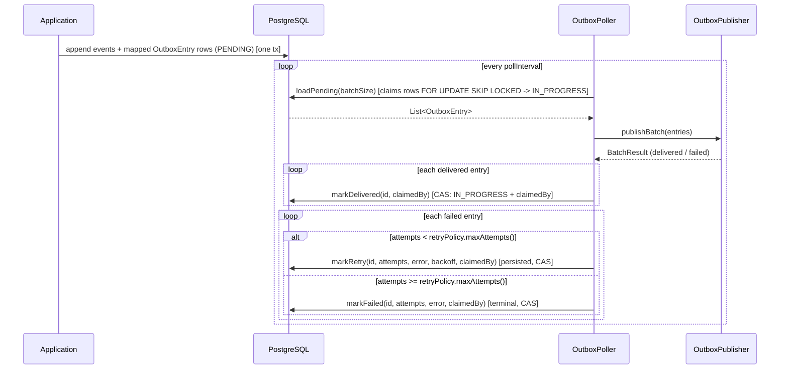

# Outbox Pattern

## When to use

Use the outbox pattern when you need to reliably publish events or notifications to external systems (HTTP webhooks, message queues) as part of a command that also writes to the database — ensuring no message is lost even if the application crashes between the database write and the external publish.

Use it when your downstream system must see each change effectively once: the outbox delivers at-least-once, and a receiver that dedups by the outbox entry id (`X-Outbox-Entry-Id`) turns that into one effect per change.

Do **not** use the outbox for internal event subscriptions within the same StreamRune instance — `PollingEventSubscription` / `HybridEventSubscription` handles that.

Do **not** use the outbox if you can tolerate eventual delivery failures without retries — a direct HTTP call is simpler.

## How it works

Outbox entries are written in the **same database transaction as the event append**. You supply an `OutboxEventMapper` (`org.streamrune.core.outbox`, `List<OutboxEntry> toOutbox(EventEnvelope event)`) together with a `PostgresOutboxStore`; `PostgresEventStore` calls the mapper for every event it appends and saves the returned entries on the append's own connection, so a command's events and its outbox entries commit — or roll back — together. An empty list publishes nothing for that event. The mapper runs on the append path, before the append's transaction opens, and its entries are saved inside that transaction: it must be fast, side-effect-free and total — a thrown exception fails the append (no event and no entry are persisted) — and it is where you select integration events, choose the wire format and keep personal data out of the payload.

With Spring, Quarkus or Micronaut, define **both** an `OutboxEventMapper` bean and a `PostgresOutboxStore` bean; with only one of the two, transactional emission is disabled and the integration logs a WARN saying which is missing. Spring and Quarkus look the store up by its `PostgresOutboxStore` type, so declare the bean method with that return type there. Micronaut looks it up by the `OutboxStore` interface, so either return type works, and startup fails when the mapper is paired with an `OutboxStore` that is not a `PostgresOutboxStore` — only a `PostgresOutboxStore` can write the entries inside the append transaction; for any other store, supply your own `EventStoreFactory`. Without an integration, set both on the factory: `new PostgresEventStoreFactory(dataSource, typeRegistry).outboxStore(outboxStore).outboxEventMapper(mapper)`. A direct `OutboxStore.save(OutboxEntry)` call uses its own connection — it is **not** part of any event append's transaction.

`OutboxPoller` runs on a virtual thread and periodically calls `OutboxStore.loadPending(batchSize)`, which atomically claims a batch of due `PENDING` entries (`FOR UPDATE SKIP LOCKED`, a competing-consumer lease that moves each claimed row to `IN_PROGRESS`) in oldest-first order. Entries whose `next_retry_at` is in the future are skipped.

**Strict per-aggregate ordering.** For entries carrying a non-null `streamId`, `loadPending` claims **at most one entry per stream at a time — always that stream's lowest-`seq` eligible entry**. If a stream's lowest-`seq` entry is still backing off (a future `next_retry_at`), the whole stream waits: a later `seq` of the same stream is never claimed past it, whether by the same relay on its next poll or by a competing relay. Entries with a `null` `streamId` have no ordering constraint and are claimed freely in parallel (a `STRICT_PER_AGGREGATE` channel refuses to write them — see [Ordering modes](#ordering-modes) — but still drains any it finds). In practice this means a single claimed batch contains at most one entry per non-null stream — parallelism is *across* streams; delivery *within* one stream is serial and always in strict `seq` order. A stream is the typed pair of aggregate type and aggregate id, so two aggregate types that share an id value are two streams and never hold each other up. This is a deliberate throughput trade-off: a workload dominated by one hot stream sees that stream's own delivery rate drop to one-in-flight, while `NULL`-stream and cross-stream traffic are unaffected. `PostgresOutboxStore` serves the per-stream gate off the `idx_outbox_stream_seq` index over `(aggregate_type, aggregate_id, seq)` (partial on `aggregate_id IS NOT NULL AND status IN ('PENDING', 'FAILED')`). What a terminal `FAILED` entry does to its stream — block it, or let its successors past — is the channel's [ordering mode](#ordering-modes).

The poller hands the whole batch to `OutboxPublisher.publishBatch(entries)`. Every `mark*` write is a **compare-and-set guarded by the claiming identity**: `OutboxStore.claimedBy()` returns a stable per-store-instance identity, `loadPending` stamps it into each claimed entry, and every `mark*` call only transitions an entry that is still `IN_PROGRESS` **and** claimed by that exact identity. For each entry that succeeds the poller calls `OutboxStore.markDelivered(id, claimedBy)`; for each that fails it **persists** the retry state via `OutboxStore.markRetry(id, attempts, error, backoff, claimedBy)` — recording `last_error` and scheduling the next attempt `backoff` from now on the database clock (the backoff comes from the configured `RetryPolicy`). The durable `attempts` column advances only for a per-entry rejection; a transport outage leaves it unchanged (see [Retry](#retry-transport-outages-vs-per-entry-rejections)). When `attempts` reaches `retryPolicy.maxAttempts()` the entry is marked terminal via `OutboxStore.markFailed(id, attempts, error, claimedBy)`. Because `attempts` and `next_retry_at` live in the `outbox_events` row, retry progress survives a poller restart and is coordinated across multiple poller instances.

**A lost lease is a benign no-op, not an error.** If another relay's claim already recorded an outcome for an entry (e.g. this relay was blocked past its lease and got reclaimed), `mark*` transitions 0 rows — `markDelivered`/`markFailed`/`markRetry` return `boolean` (`markDeliveredAll` returns the transitioned count as `int`). The poller logs a WARN naming the count and moves on; it never throws, since throwing on an expected failover race would crash the poller loop.

`OutboxEntryId` is the idempotency key — saving the same id twice is a no-op.

`HttpOutboxPublisher` is the built-in implementation: it POSTs `OutboxEntry.payload()` as JSON to a configured endpoint, setting `X-Outbox-Entry-Id` and `X-Outbox-Payload-Type` headers for receiver-side correlation.



## Ordering modes

Per-aggregate ordering is a **typed, per-channel choice**: `OutboxOrderingMode` (`org.streamrune.core.outbox`) is a constructor argument of the store, and the relay logs it at start (`Outbox relay started: orderingMode=…`). A *channel* is one `OutboxStore` instance polled by one `OutboxPoller` (any number of replicas) into one `OutboxPublisher`; every shipped integration wires exactly one channel per application, and there is no configuration property for the mode — the store is where the choice lives, so it cannot disagree with itself.

```java
// Strict is the default; the three-argument form makes the choice visible where the channel is built.
new PostgresOutboxStore(dataSource, Duration.ofMinutes(2), OutboxOrderingMode.STRICT_PER_AGGREGATE);
```

| mode | a terminal `FAILED` head… | `streamId` | choose it for |
|---|---|---|---|
| `STRICT_PER_AGGREGATE` (**default**) | **blocks** every later entry of its stream until an operator replays or skips it | **mandatory** — a `null` stream fails the append with `OutboxOrderingViolationException` | cross-context state changes, inventory, payments, order lifecycle, cache invalidation — anything where "n+1 before n" is a bug |
| `AVAILABILITY_FIRST` | does not hold its stream: the next `PENDING` entry is delivered past it (a gap), and a later replay arrives *after* already-delivered successors (a reorder) | optional | telemetry, notifications, best-effort fan-out whose consumers are idempotent **and** order-tolerant by design |

**On an `AVAILABILITY_FIRST` channel a replay reorders within a stream.** While an entry sat `FAILED` it did not gate its successors, so higher-`seq` entries of the same aggregate may already have been delivered; the replayed entry is then delivered *after* them, out of `seq` order relative to what already went out. Consumers of an availability-first channel must be idempotent and order-tolerant for replayed traffic — the same contract as projection dead-letter replay. On a strict channel this cannot happen: the successors never moved.

In both modes the *head* of stream `A` is its lowest-`seq` row that is `PENDING` — or, in strict mode, `PENDING` **or `FAILED`** — and a claim takes only heads that are `PENDING`, eligible and not in flight. That is the whole difference: in strict mode a `FAILED` row is still the head, so nothing of `A` is claimable until the head is resolved. Replay (`OutboxFailedReplayer.replay(id)`) puts the same row back to `PENDING` at its original `seq`, so it is delivered *before* its successors; skip (`OutboxFailedReplayer.skip(id, by, reason)`) marks it `SKIPPED` with an audit record and releases the aggregate. `OutboxStore.delete` refuses a `FAILED` row — the two audited operations are the only exits.

**A skip is not a delivery.** The downstream did not receive the skipped change and will receive the successors as if it had. If the consumer's state depends on that change (inventory, payment, lifecycle, cache), emit a corrective domain event through the normal command path so the correction is itself ordered and delivered, or reconcile the consumer out of band; record the ticket in `reason`.

**`seq` is commit order** because every append holds the global-offset counter lock through commit: a second append cannot assign its `seq` values until the first has committed, so no poll can see a higher `seq` of an aggregate while a lower one is still uncommitted. Entries written through the standalone `OutboxStore.save(entry)` are outside that lock; strict order is a promise for entries written by `append`, the only production path.

**Mixed workloads.** 1.0 has one channel per application, so an application that needs strict order for orders and tolerance for telemetry runs one strict channel and either accepts strict order for its telemetry too or routes telemetry outside the outbox. Several channels with their own modes ("named outbox channels") are on the Horizon 2 backlog.

## Quick example

```java
// Publish OrderShipped, nothing else. Runs on every append; its entries commit with the events.
OutboxEventMapper orderEventsMapper = envelope ->
    envelope.event() instanceof OrderShipped shipped
        ? List.of(OutboxEntry.pending(
            OutboxEntryId.of(envelope.metadata().eventId().value()), // one entry per event
            toJson(shipped),                   // your serializer: no I/O, no checked exceptions
            "OrderShipped",
            envelope.streamId()))              // per-stream order; required on a strict channel
        : List.of();
```

The ordering key is the `StreamId` whose delivery order the consumer depends on — normally `envelope.streamId()`, the stream the event was appended to, as above. Name another stream only when the consumer's order depends on that aggregate: for a payment event, `StreamId.of(ORDER, new AggregateId(payment.orderId()))` orders the entry with the order's stream. That cross-stream order holds because every append holds the global-offset counter lock through commit. When the key is built from an event field, use the `AggregateId` constructor, not `AggregateId.of`: the value is a field of an event that is already being appended, and the mapper runs inside that append transaction, so the ingress factory's control-character refusal could only fail the command after its decider ran — a deterministic failure that would dead-letter it on every retry. (The 255-character bound applies either way: `StreamId`'s constructor and the column enforce it whichever door built the id.) `of` belongs in the command bus's id extractor, where the client's value enters. The mapper must be fast, side-effect-free and total, and a strict channel refuses an entry without a `streamId` with `OutboxOrderingViolationException`.

## Full example

```java
// 1. Emit outbox entries in the append transaction (mapper from the quick example)
PostgresOutboxStore outboxStore = new PostgresOutboxStore(dataSource); // STRICT_PER_AGGREGATE
EventStore eventStore = new PostgresEventStoreFactory(dataSource, typeRegistry)
    .outboxStore(outboxStore)
    .outboxEventMapper(orderEventsMapper)
    .create();

// 2. Wire the poller with HttpOutboxPublisher
OutboxPublisher publisher = HttpOutboxPublisher.of(
    URI.create("https://notifications.example.com/webhooks/orders"));

OutboxPoller poller = OutboxPoller.builder()
    .outboxStore(outboxStore)
    .publisher(publisher)
    // Retry state is durable; the RetryPolicy record is (maxAttempts, initialDelay,
    // backoffMultiplier, jitterEnabled). Omit to use the outbox default of 10 attempts.
    // maxAttempts bounds only PER-ENTRY rejections; a broker outage is non-counting (see below).
    .retryPolicy(new RetryPolicy(10, Duration.ofSeconds(1), 2.0, true))
    .batchSize(50)
    .pollInterval(Duration.ofSeconds(2))
    .build();

poller.start(); // runs on a virtual thread named "outbox-poller"
// ...
poller.close(); // stops the relay (AutoCloseable) — see "Stopping the relay" below
```

`RetryPolicy` lives in `org.streamrune.core`; `HttpOutboxPublisher` lives in `streamrune-runtime`.

Receiver-side: check `X-Outbox-Entry-Id` header for idempotency deduplication.

## Message-broker publishers

Two shipped publishers deliver to a broker instead of an HTTP endpoint. Both `implements OutboxPublisher`, are constructed via `builder()`, and do **not** own their producer/channel — you create and close it.

**Kafka** (`org.streamrune.kafka.KafkaOutboxPublisher`, module `streamrune-outbox/streamrune-kafka-outbox`) sends each entry synchronously (`producer.send(record).get()`) so the poller can retry on failure:

```java
OutboxPublisher publisher = KafkaOutboxPublisher.builder()
    .producer(kafkaProducer)   // KafkaProducer<String, String>, caller-owned
    .topic("domain-events")
    .sendTimeout(Duration.ofSeconds(10)) // optional; default 10s — bounds producer.send().get()
    .producerConfig(producerProps)       // optional but recommended: the SAME map/Properties used
                                         // to build the producer, so the in-flight horizon reflects
                                         // your real max.block.ms + delivery.timeout.ms
    .build();

OutboxPoller poller = OutboxPoller.builder()
    .outboxStore(outboxStore)
    .publisher(publisher)
    .build();
poller.start();
```

The Kafka message key is the entry's `streamId` in its text form, `<type>:<id>` (for example `order:ord-42`), so every entry of one stream lands on one partition, in publish order. An entry without a `streamId` is keyed by its entry id and has no ordering guarantee. A consumer that needs the two parts splits the key at the first `:` (an aggregate type never contains one).

`sendTimeout` bounds each synchronous `producer.send(record).get(...)`. Kafka's own `delivery.timeout.ms` defaults to **120s**, and with a batch of up to `batchSize` sequential entries an unbounded `get()` could hold one relay's claim far past the [claim lease](#sizing-the-claim-lease) — letting a second relay reclaim and re-deliver the same entries out of order. On timeout the publish throws a `TimeoutException`, classified `IN_FLIGHT`: the record may still be delivered, so the poller holds the claim until lease-reclaim (see the classification table below). Keep `sendTimeout` well below the claim lease.

Note that `sendTimeout` bounds only the `get()`. `send()` runs first and blocks on its own for up to `max.block.ms` (**60s** default) while waiting for topic metadata or accumulator space, so one `publish` call can occupy the relay thread for `max.block.ms + sendTimeout`. That pre-send block is also why the Kafka [in-flight horizon](#the-lease-must-exceed-the-publishers-in-flight-horizon-enforced-at-wiring) is `max.block.ms + delivery.timeout.ms`, not `delivery.timeout.ms` alone.

**RabbitMQ** (`org.streamrune.rabbitmq.RabbitMqOutboxPublisher`, module `streamrune-outbox/streamrune-rabbitmq-outbox`) publishes with broker confirms. The channel is put into confirm mode at build time, so **`build()` throws `IOException`** and the channel must be owned exclusively by this publisher. It must also **stay in confirm mode, with the listeners `build()` registers, for its whole lifetime**:

```java
// build() enables publisher confirms via channel.confirmSelect() -> throws IOException
RabbitMqOutboxPublisher publisher = RabbitMqOutboxPublisher.builder()
    .channel(channel)                        // caller-owned com.rabbitmq.client.Channel
    .exchange("domain-events")
    .routingKey("orders")                    // optional; defaults to "" (fanout)
    .confirmTimeout(Duration.ofSeconds(30))  // optional; default 30s
    .build();

OutboxPoller poller = OutboxPoller.builder()
    .outboxStore(outboxStore)
    .publisher(publisher)
    .build();
poller.start();
```

Give the publisher a channel of its own amqp-client `Connection` (`com.rabbitmq.client.ConnectionFactory`, whose automatic recovery is on by default): after a broker restart or a dropped connection, recovery re-applies confirm mode and re-registers the publisher's confirm and return listeners on the recovered channel. **Do not hand it a channel wrapper that replaces a closed channel with a fresh one** — in a Spring application, not `CachingConnectionFactory.createConnection().createChannel(false)`. Spring turns the client's recovery off, and after the first reconnect its channel proxy carries on with a new channel that has neither confirm mode nor the listeners. Messages published there would reach the queue but never be confirmed, so each would time out, stay claimed and be published again after every claim lease. The publisher refuses instead:

- before each publish it reads the channel's publish sequence number; `0` means the channel is not in confirm mode, and the entry fails with `RabbitMqOutboxPublisher.NotInConfirmModeException` **without being published**;
- any other unchecked exception the channel throws (a wrapper that cannot reach a working channel) fails the entry with `ChannelFailureException`, caused by it, instead of aborting the poll cycle — except one thrown by `basicPublish` itself, which may come after the message was written (a metrics or observation collector of the client can throw there), so that entry is held in flight and only the entries after it fail with `ChannelFailureException`;
- `build()` throws `IllegalStateException` for a channel that is still not in confirm mode after `confirmSelect()`.

Both runtime failures are transport failures (nothing was handed off), so they repeat on every cycle with the aggregated transport `WARN` until the application is restarted with a channel that keeps confirm mode — a loud stall instead of silent re-delivery.

## Configuration

| Builder method | Default | Notes |
|---|---|---|
| `retryPolicy(RetryPolicy)` | `new RetryPolicy(10, 1s, 2.0, true)` | Governs **per-entry** delivery attempts before marking `FAILED`, plus initial delay, backoff multiplier, and jitter. Backoff is **capped at 60s** regardless of the multiplier — for a transport outage the cap is the ceiling the [escalating retry cadence](#retry-transport-outages-vs-per-entry-rejections) climbs to. There is **no** `maxAttempts(int)` builder method — read `retryPolicy.maxAttempts()` on the record. |
| `batchSize(int)` | 100 | Max entries claimed per poll cycle (must be `>= 1`) |
| `pollInterval(Duration)` | `Duration.ofSeconds(1)` | Must be positive (zero causes a tight spin loop) |

`RetryPolicy` is `record RetryPolicy(int maxAttempts, Duration initialDelay, double backoffMultiplier, boolean jitterEnabled)` from `org.streamrune.core`, with `maxAttempts >= 1`. Note the outbox default (10 attempts) differs from the generic `RetryPolicy.DEFAULT` (3 attempts) used by the command bus.

For `HttpOutboxPublisher`: uses `HttpClient.newHttpClient()` with a 10-second request timeout.

### Retry: transport outages vs per-entry rejections

The retry ladder (`retryPolicy.maxAttempts()`) bounds only **per-entry rejections** — a message the broker/endpoint rejects for its own sake (a RabbitMQ unroutable return, a Kafka `RecordTooLargeException`/serialization error, an HTTP `4xx`). Those burn attempts and, once exhausted, mark the entry terminal `FAILED` (recoverable via `OutboxFailedReplayer`).

A **broker-wide transport outage is non-counting**: a connection loss, network partition, send/confirm timeout, or an HTTP `5xx`/`429` is retried **forever** with capped (≤60s) backoff and can **never** terminal-`FAILED` the backlog. This is deliberate — a routine broker restart would otherwise burn through the counted ladder, terminal-fail all in-flight traffic, and — until an operator replays or skips every one of those entries — either **block every affected aggregate** (a `STRICT_PER_AGGREGATE` channel) or **silently break per-aggregate ordering** (an `AVAILABILITY_FIRST` channel, where a `FAILED` head stops gating its successors — see [Ordering modes](#ordering-modes)). Each shipped publisher classifies its own failures (`OutboxPublisher.classifyFailure`); a custom publisher that does not override it treats **every** failure as a non-counting transport outage — the default classification is `TRANSPORT`, so an unclassified failure can never terminal-`FAILED` the backlog (or silently break ordering); the cost is that a genuinely poisoned entry retries indefinitely — on its **own escalating cadence** (`initialDelay` up to the 60s cap, even while the traffic around it confirms) — and holds its aggregate's head until you override `classifyFailure` and return `ENTRY` for message-attributable rejections. The stall is loud (the aggregated transport `WARN` fires on every cycle the entry fails and `streamrune.outbox.pending` holds the backlog), which is the deliberate trade: a loud stall is recoverable, silent loss is not.

**The terminal ladder is frozen during an outage, but the retry cadence still escalates.** These are two separate mechanisms and they must not share one counter. The persisted `attempts` stays flat for transport failures — that is what keeps an outage from retroactively terminal-`FAILED`ing an entry on its first later per-entry rejection — while the *cadence* is driven by **two relay-local streaks, the stronger of which wins**: a **relay-wide** streak of consecutive poll cycles whose publishes all failed broker-wide, and each entry's **own** streak of consecutive transport failures. The per-entry streak exists because the relay-wide one resets whenever *any* delivery confirms — without it, a single entry that keeps failing transport amid healthy confirming traffic (the shape every unclassified custom-publisher failure takes under the default `TRANSPORT` classification) re-published at `initialDelay` every ~1s forever. Each rung doubles the deferral at the defaults, so a sustained outage — and a persistently transport-failing single entry — backs off **1s → 2s → 4s → … → 60s** (the cap) and then holds there, instead of re-claiming and re-failing every poll interval for as long as the failures last. Consequences worth knowing:

- **Jitter still applies at every rung** (the escalation runs through `RetryPolicy.delayForAttempt`), so several relays — and the entries of one batch — do not retry in lock step.
- **The relay-wide streak resets on the first confirmed publish, and the confirmed entries' own streaks are cleared with it** — so once the broker is back a *fresh* failure starts at `initialDelay` again. An entry that *keeps* failing transport keeps its own streak: healthy traffic confirming around it does not flatten its escalation (that is the point of the per-entry streak). Cycles that publish nothing (an idle relay, a deadline-truncated cycle, in-flight-only or per-entry-only outcomes) leave both streaks unchanged — they are not evidence either way.
- It is **soft, relay-local state** (no database column): a relay restart forgets both streaks and re-escalates from `initialDelay`, costing one fast retry cycle. The per-entry streaks are additionally **bounded** (1024 tracked entries, LRU-evicted — on the order of 150 KB worst case), so the tracking can never grow with the backlog; an evicted entry restarts its escalation from the relay-wide streak's floor.
- **In-flight (unconfirmed) failures do not feed either streak.** They are never released for retry at all — they stay claimed and are redelivered only by the lease-reclaim path, so their cadence is the claim lease. **Per-entry rejections** do not feed them either, and are not paced by them: they keep their own counted-ladder backoff.
- Recovery after the broker returns is delayed by **at most the 60s cap** for entries already deferred — the deliberate trade-off for not hammering a down broker, and the reason the cap is a minute rather than an hour.
- The per-cycle `WARN` is **aggregated**: one line per cycle naming how many claimed entries hit the transport failure, a **representative entry id**, the consecutive-failing-cycle count, and the longest deferral stamped — not one identical line per entry. It claims a **broker-wide** failure only when *every* claimed entry failed transport that cycle; otherwise it says the failure is not provably broker-wide — under the default `TRANSPORT` classification it may well be a single poisoned entry, and the named entry id is where to look.

Each publisher splits its I/O failures by **hand-off phase** and by **scope**, not by exception type — the same `IOException` type can mean "never connected" or "the peer reset while I awaited the answer to a request it already has", and a broker's *non-retriable* verdict may still be a property of the **fleet** (credentials, ACLs, a closed producer) rather than of the **message**. Only a pre-hand-off failure re-arms; a post-hand-off one stays claimed (see the in-flight column); and only a message-attributable rejection counts toward `FAILED`:

| Publisher | Transport (pre-hand-off; non-counting, retry forever) | In-flight (post-hand-off; claim held, lease-reclaim only) | Per-entry (counts toward `FAILED`) |
|---|---|---|---|
| **Kafka** | provably-pre-append `RetriableException`s — the broker **answered without appending** (`NotLeaderOrFollowerException`, `NotEnoughReplicasException`, `UnknownTopicOrPartitionException`, …) — **and fleet-wide non-retriable conditions**: `AuthenticationException` (e.g. `SaslAuthenticationException` after a credential rotation), `AuthorizationException` (`TopicAuthorizationException`/`ClusterAuthorizationException` — an ACL change), `InvalidTopicException` (the topic is fixed at publisher construction), and a closed-producer `IllegalStateException` | bounded `send().get()` `java.util.concurrent.TimeoutException` (record still in the accumulator), **and the post-hand-off-capable Kafka retriables**: Kafka's own `TimeoutException` (`delivery.timeout.ms` expiry — a produce request carrying the record may still land; keep `delivery.timeout.ms` **above** the publisher's `sendTimeout`, or every expiry parks its entry for a full claim lease), `NetworkException` (disconnect after the request was sent), `NotEnoughReplicasAfterAppendException` (the broker **appended** before failing the request) | non-retriable Kafka errors that are properties of the **message**: `RecordTooLargeException`, serialization errors |
| **RabbitMQ** | `basicPublish`-phase connection loss (`ShutdownSignalException`/`AlreadyClosedException`) or `IOException` — nothing was handed off; a channel **no longer in confirm mode** (`NotInConfirmModeException`, refused before publishing) or any other unchecked exception from the channel before the publish (`ChannelFailureException`); **and a broker `nack`** — the broker's own report that *it* could not enqueue the message (queue-process error, `reject-publish` overflow), a broker-side condition that sweeps whatever is in flight (often `multiple=true`), so it must never burn the ladder; the nack asserts the message was **not** enqueued, so re-arming cannot duplicate | confirm-wait `TimeoutException`, **and** a connection loss *while awaiting the confirm* (the broker may already hold the message), **and** an unchecked exception other than a shutdown thrown by `basicPublish` itself (whether the message was written is not provable) | unroutable (no queue bound — `basic.return`ed); an entry id or payload type longer than an AMQP short string (255 UTF-8 bytes — `UnpublishableEntryException`, never sent to the channel) |
| **HTTP** | connect timeout, `ConnectException` (refused), `UnknownHostException` (DNS), `BindException`, `UnresolvedAddressException`, `SSLHandshakeException`, response `5xx`/`429`, **and the fleet-wide credential rejections `401`/`407`** — the endpoint is fixed at publisher construction and every entry carries the same credential, so a rotated bearer token or an expired mTLS client cert rejects the whole backlog identically (and answering "not authenticated" means the receiver did not act, so re-arming cannot duplicate) | request/response timeout, **and every other `IOException`** — a reset/EOF while awaiting the response means the receiver may be executing the request | other non-2xx (`4xx`), **`403` included** — RFC 9110 lets a 403 depend on the request's *content*, so it is not provably message-independent; see below |

> **Why `403` counts and `401` does not.** The fleet bin requires *proof* that a rejection cannot depend on the message, not merely that it usually does not — the same standard that keeps a generic `IllegalStateException` out of Kafka's fleet set. A `401` is an authentication challenge decided on the `Authorization` credential (the response must carry `WWW-Authenticate`) and cannot consider the body; a `403` may. The ambiguity is broken by which mistake is recoverable: a wrong per-entry classification leaves terminal `FAILED` rows an operator replays or skips with `OutboxFailedReplayer` (kept until then — the framework never deletes a `FAILED` row), whereas a wrong transport classification on a genuinely per-entry `403` never terminalizes, never dead-letters, and blocks every later entry for the same aggregate behind it — an unbounded stall with no operator handle. **If your receiver signals a fleet condition with `403`** (a revoked scope, an IP allowlist), have it answer `401`/`429`/`503` instead, or expect to replay the `FAILED` backlog after fixing it.

> **HTTP post-hand-off failures hold the claim.** A post-hand-off `IOException` (connection reset, EOF, an LB idle-timeout drop) does not re-arm the entry within ~1s; it holds the claim until lease-reclaim. Recovery from such a failure can take up to one claim lease; in exchange a relay never re-POSTs into a request the receiver may still be processing. Receivers must still be idempotent on `X-Outbox-Entry-Id` — no client-side value can bound how long a receiver keeps executing a request it already accepted.

> **A dead backend behind a load balancer also parks a full claim lease — and that is unavoidable.** The in-flight bin is not only the "LB idle-timeout drop" case. When the LB accepts the TCP connection and *then* resets it having read zero request bytes — the shape a proxy in front of a down backend produces — the JDK raises exactly the same chain as a genuine post-hand-off drop:
>
> ```
> IOException("HTTP/1.1 header parser received no bytes")
>   <- SocketException("Connection reset")
> ```
>
> Byte-for-byte identical to a receiver that took the request and died mid-handler, so no classifier can tell them apart, and the conservative call (hold the claim) is the only sound one. The cost is real: while the backend is down, every entry waits up to one claim lease per attempt instead of retrying in ~1s, and the backlog is visible only on [`streamrune.outbox.in_flight`](#alert-on-streamruneoutboxin_flight-not-only-on-streamruneoutboxpending). **Plain connection-refused is unaffected** — nothing accepts the connection, so the JDK raises `ConnectException`, which is provably pre-hand-off and still fast-ladders on the transport path. If your endpoint sits behind a proxy, prefer one that returns `502`/`503` (a `5xx` response is TRANSPORT — resolved, fast retry) over one that resets the connection.

##### Alert on `streamrune.outbox.in_flight`, not only on `streamrune.outbox.pending`

Because an in-flight failure **holds the claim**, a sustained post-hand-off outage parks the whole backlog in `IN_PROGRESS` — and that is invisible to every signal an operator would normally watch:

| Signal | During a sustained post-hand-off outage |
|---|---|
| `streamrune.outbox.pending` | **~0** — the entries are `IN_PROGRESS`, not `PENDING` |
| `streamrune.outbox.delivery_failed` | never fires — an in-flight failure burns no attempt, so nothing reaches terminal `FAILED` |
| transport streaks (relay-wide and per-entry) | stay `0`/empty — an in-flight outcome is not transport evidence |
| `streamrune.outbox.in_flight` | **rises and stays high** ← the signal |

`OutboxPoller` samples `streamrune.outbox.in_flight` (the `IN_PROGRESS` count) every poll cycle, alongside the pending backlog. It is a **separate series on purpose**: counting `IN_PROGRESS` into `streamrune.outbox.pending` would silently change what every dashboard and alert already written against that series means. A healthy relay shows a small, constantly-churning value (at most one claimed batch per relay) — alert on it staying high across several poll intervals. In the logs the same condition emits **one aggregated `WARN` per cycle** (naming how many of the claimed entries were left in flight), mirroring the transport `WARN` above rather than one line per entry.

**Framework properties** (Spring `@ConfigurationProperties`, Quarkus `@ConfigMapping`, Micronaut `@ConfigurationProperties`) — all three expose the ladder, wired into the auto-configured poller's `RetryPolicy`:

| Property | Default | Notes |
|---|---|---|
| `streamrune.outbox.retry-max-attempts` | `10` | Per-entry attempts before terminal `FAILED` |
| `streamrune.outbox.retry-initial-delay-ms` | `1000` | Initial backoff (ms); grows by the multiplier, capped at 60s — for a transport outage it is also the first (fast) retry before the cadence escalates |
| `streamrune.outbox.retry-multiplier` | `2.0` | Exponential backoff multiplier |

### Sizing the claim lease

`loadPending` **claims** each batch under a lease (`PostgresOutboxStore`'s second constructor argument, default **4 minutes**; `new PostgresOutboxStore(dataSource, Duration.ofMinutes(5))`). A relay that crashes mid-delivery leaves its rows `IN_PROGRESS`; once the lease expires another relay reclaims them (`RECLAIM_EXPIRED`) — this is what makes delivery crash-safe. The lease is therefore also your **crash-reclaim latency**: a dead relay's claimed batch waits up to one full lease before another relay takes it over. Shortening it is safe only after you shorten the publisher's in-flight horizon (below).

The lease is also the ceiling on how long a **live** relay may keep publishing one batch. The `OutboxPoller` bounds each publish cycle to a deadline of **`min(80% of the lease, lease − the wired publisher's in-flight horizon)`**: once the deadline passes it stops publishing, rather than delivering the rest past the point where a second relay would reclaim and re-deliver them. Delivering past the lease would produce a **duplicate _and_ an out-of-order same-aggregate delivery** — the one thing the strict per-aggregate ordering contract forbids. The horizon term guarantees any entry allowed to *start* publishing still has enough of the lease left for its worst-case in-flight duration to resolve before a reclaim could fire — without it, a batch-tail entry could legally start late enough under the flat 80% cap alone that its in-flight completion still lands past lease expiry. When a cycle hits the deadline the poller logs a loud `WARN` naming the actual computed budget (not a fixed 80%) and how many entries it released.

**The never-attempted tail is released, not held.** The deadline check runs *before* each hand-off, so nothing exists at the transport for the entries the cycle never reached — the poller therefore returns them to `PENDING` at the end of the cycle (`OutboxStore.releaseClaims`) instead of holding their claims. Holding them was safe but collapsed throughput exactly when the broker was degraded: a claimed entry keeps its aggregate un-claimable, no path exists for a live relay to release its own claim (`RECLAIM_EXPIRED` only fires past the lease, the claim statements only see `PENDING` rows), so a relay that claimed 100 aggregates and reached 6 before its deadline idled behind its own 94 never-touched entries for a full lease. The release **does not touch the retry ladder** — `attempts`, `last_error` and `next_retry_at` are left as they were — so a repeatedly-truncated entry can never be walked up to terminal `FAILED` without a broker ever having seen it. This is the exact opposite of the in-flight case above, where holding the claim is required because the outcome is genuinely unknown. Released entries are `PENDING` again, so they are also visible in `streamrune.outbox.pending` instead of hiding in `in_flight`. A shutdown cuts a batch short the same way — see [Stopping the relay](#stopping-the-relay) — except for the entries whose publish (or confirm wait) was still running when the stop arrived: those are held. With RabbitMQ that can be every published but unconfirmed entry of the batch.

### Stopping the relay

`OutboxPoller.close()` (called for you by the Spring, Quarkus and Micronaut lifecycles) interrupts the relay's virtual thread so that an idle sleep or a publish blocked on the transport ends at once, then waits up to 30s for the thread to finish. A stop in the middle of a batch leaves every entry of that batch in a defined state:

| Entry | After `close()` |
|---|---|
| Confirmed by the transport before the stop | `DELIVERED` |
| Its publish was running when the stop arrived (Kafka `send().get()`, an HTTP request, a RabbitMQ confirm wait) | Held `IN_PROGRESS`, no attempt counted, until the claim lease expires; then the next relay redelivers it. The transport may still deliver it (a Kafka record already in the producer buffer is flushed when the producer closes), so releasing it at once could let another relay publish it a second time, out of order |
| Not reached before the stop | `PENDING` at once (released, no attempt counted) |

The writes that record this outcome run with the interrupt held back: on a virtual thread a JDBC call made while the thread is interrupted fails at the socket (and HikariCP evicts the connections it validates on that thread), which would leave the confirmed entries `IN_PROGRESS` to be delivered a second time after the lease. `close()` therefore waits for those writes — milliseconds normally, and up to its 30s join when the database is slow; past that it gives up on the thread, and the relay cannot be started again. The relay logs one `INFO` line for the held entries and one for the released ones; neither is an error.

A stop that arrives before the batch is claimed — while the relay samples its gauges or runs the claim itself — is delivered at once instead. The relay may then log a `WARN` from the gauge sampling and an `ERROR` that it is stopping and not retrying, and if the claim had already committed on the server, its rows stay `IN_PROGRESS` until the lease expires and another relay picks them up. Nothing is delivered twice.

A custom publisher keeps this behaviour by letting an interrupt surface: the default `publishBatch` reports an entry whose `publish` threw an `InterruptedException` (or anything while the interrupt flag is set) as failed with the interruption, and stops. A custom `publishBatch` should do the same — return what the transport confirmed, put each entry whose hand-off may have happened in `failed()` with an exception whose cause chain holds the `InterruptedException`, leave the entries it never started in neither bucket, and keep the interrupt flag set. The poller holds a failure caused by an `InterruptedException` whatever `classifyFailure` would answer.

#### The lease must exceed the publisher's in-flight horizon (enforced at wiring)

A publisher can leave a delivery **in flight at the transport** for some time after the relay starts the attempt. Kafka is the extreme case, and it is **two-phase**: `producer.send()` blocks the relay thread for up to `max.block.ms` (**60s** default) waiting for topic metadata or accumulator space, and only once it returns does the record enter the accumulator and start burning `delivery.timeout.ms` (**120s** default) — during which it is retried internally and may still be delivered, even after our own `send().get(sendTimeout)` has thrown at 10s. Measured from the start of the attempt (which is what the poller gates against), the worst case is the **sum**.

RabbitMQ has the **same two-phase shape**: `basicPublish` writes the frames to the socket synchronously with **no client-side timeout**, so while the broker is flow-controlled (a memory/disk high-watermark alarm issues `connection.blocked` and the broker stops reading the socket) the relay thread parks inside `basicPublish` — nothing handed off, no confirm pending, `confirmTimeout` bounding none of it. `publishBlockBudget` (default **30s**) is that phase's budget; `confirmTimeout` is the post-hand-off phase. Each publisher reports its worst case as `OutboxPublisher.inFlightHorizon()`:

| Publisher | In-flight horizon | Shipped default |
|---|---|---|
| `KafkaOutboxPublisher` | effective `max.block.ms` + effective `delivery.timeout.ms` (pass `producerConfig(...)` so overrides are seen) | **180s** (60s + 120s) |
| `RabbitMqOutboxPublisher` | `publishBlockBudget` + `confirmTimeout` | **60s** (30s + 30s) |
| `HttpOutboxPublisher` | request timeout | **10s** |
| custom / in-JVM handler | `Duration.ZERO` by default — **override it** if your transport leaves work in flight | — |

Unlike Kafka's `max.block.ms`, RabbitMQ's `publishBlockBudget` is a **sizing declaration, not an enforced timeout** — the AMQP client has no per-publish timeout to enforce it with. The one client-side mechanism that genuinely bounds the write is NIO mode: `ConnectionFactory.useNio()` with `NioParams.setWriteEnqueuingTimeoutInMs(...)` makes an over-long write *throw* instead of parking (and that throw is classified `TRANSPORT` — nothing was handed off, so re-arming cannot duplicate). Set `publishBlockBudget` at or above that timeout; on a blocking-IO connection set it at or above the longest broker alarm you are prepared to ride out. `Duration.ZERO` opts out and is only correct when the write provably cannot block.

`OutboxPoller` **refuses to start** (throws `IllegalStateException` at `build()`) when the claim lease does **not strictly exceed** this horizon — otherwise a reclaim could re-publish an entry the transport is still delivering, the exact duplicate-plus-reorder above. This is why the default lease is **4 minutes**: it clears Kafka's 180s default horizon with the guard's own 30s clock-skew margin. If you raise `max.block.ms` or `delivery.timeout.ms`, or shorten the lease below a publisher's horizon, boot fails fast with a message naming the horizon and the minimum safe lease. Fix it by raising the lease (`horizon + ~30s`) or lowering the transport timeouts.

> **Want a shorter lease (faster crash reclaim)?** Lower `max.block.ms` first — it is the cheapest lever, shrinks the Kafka horizon one-for-one, and a few seconds is ample on a healthy cluster. `max.block.ms=5000` with `delivery.timeout.ms=30000` gives a 35s horizon, which makes a ~65s lease safe.

Size the lease so the publish deadline — `min(0.8 × lease, lease − horizon)` — still clears a full batch:

```
lease  >  horizon + (batchSize × worst-case per-entry publish time)
```

At the shipped Kafka defaults (180s horizon) this dominates the plain "80% of the lease" rule of thumb: the 240s default lease gives only a **60s** budget (`240s − 180s`), not 192s, because the horizon term is the binding constraint. Sizing off the 80% rule alone under-sizes the lease for any publisher whose horizon isn't small relative to it — the deadline WARN would recur at every cycle. Because the deadline is only checked **between** entries, one already-in-flight `publish` can still overrun it — so also bound each publisher's per-entry time well below the resulting budget: the Kafka `sendTimeout` (default 10s), the HTTP 10s request timeout, and — for RabbitMQ — the `confirmTimeout` (default 30s; the poller additionally caps the confirm wait at the deadline) **plus** whatever bounds `basicPublish` itself. Note that `confirmTimeout` alone bounds only the post-hand-off half: use NIO's `writeEnqueuingTimeoutInMs` if you need the pre-hand-off half bounded too, and keep `publishBlockBudget` in step with it. If the deadline `WARN` recurs, **raise the lease** or **lower `batchSize`**.

### Delivery status model

Every entry carries an `OutboxStatus` (`org.streamrune.core.outbox.OutboxStatus`):

| Status | Meaning |
|---|---|
| `PENDING` | Awaiting delivery (or scheduled for a future retry via `next_retry_at`) |
| `IN_PROGRESS` | Claimed by a relay instance for delivery (competing-consumer lease, CAS-guarded by `claimed_by`). A stale claim — lease expired with no outcome — is reset to `PENDING`. |
| `DELIVERED` | Delivered successfully |
| `FAILED` | All attempts exhausted; **unresolved** until an operator replays or skips it. On a strict channel it is the head of its aggregate and blocks every later entry — see [FAILED lifecycle](#failed-lifecycle) |
| `SKIPPED` | Terminal. An operator decided the entry will never be delivered; the row carries `skipped_at`, `skipped_by`, `skip_reason`. Releases the aggregate on a strict channel. |

### FAILED lifecycle

A `FAILED` entry is **unresolved**, not a dead end: the relay never writes to it again, and only an operator moves it on — back to `PENDING` (replay) or to the terminal `SKIPPED` (skip). On a `STRICT_PER_AGGREGATE` channel it is its stream's head and blocks every later entry of that stream until one of the two happens; on an `AVAILABILITY_FIRST` channel its successors are delivered past it (see [Ordering modes](#ordering-modes)). An entry reaches `FAILED` only through per-entry rejections (`ENTRY` classification) that exhausted the counted ladder — a transport outage never does — so it is a deterministic condition a fix must resolve, not something worth auto-retrying.

- **Enumerate** with `OutboxStore.findByStatus(OutboxStatus.FAILED, limit)` — returns up to `limit` entries **oldest (`seq`) first**, so an operator paging a large backlog starts with the entries stuck longest. It is read-only (does not touch `claimed_by`), safe to call while relays are polling. **Never use `loadPending` to look** — it claims.
- **Replay** with `OutboxFailedReplayer` (manual, operator-invoked — no polling runner, the same "mirrors `SagaDeadLetterReplayer`" shape as the saga/command/projection dead-letter replayers) once the cause is fixed: `replayer.replay(id)` for one entry (→ `REPLAYED` / `NOT_FAILED` / `NOT_FOUND`), `replayFailed(max)` oldest-first for many:

  ```java
  OutboxFailedReplayer replayer = new OutboxFailedReplayer(outboxStore, metrics);
  OutboxFailedReplayer.ReplayOutcome one = replayer.replay(entryId); // REPLAYED / NOT_FAILED / NOT_FOUND
  int reset = replayer.replayFailed(100); // oldest-first, up to 100 entries FAILED -> PENDING
  ```

  Each reset entry (`OutboxStore.resetFailedToPending(id)`) clears `attempts`, `last_error`, `next_retry_at`, and `claimed_by` and keeps its `seq` — replay is **position-preserving**: on a strict channel the entry is delivered before its successors (the successors never moved); on an availability-first channel it arrives after already-delivered successors (see the `AVAILABILITY_FIRST` row of the [mode table](#ordering-modes)). The claim SQL, not the replayer, enforces the ≤1-entry-per-aggregate ordering described above.
- **Skip** when the entry must never be delivered: `replayer.skip(id, operator, reason)` (→ `SKIPPED` / `NOT_FAILED` / `NOT_FOUND`) moves it to `SKIPPED` and writes `skipped_at`, `skipped_by` and `skip_reason` in the same statement (read back as `OutboxEntry.skip()`); if it was its aggregate's blocking head, the successors are claimable from the next poll. `skipFailed(max, operator, reason)` skips the oldest `max` `FAILED` entries with one shared reason — for many unresolvable rows at once, typically on an availability-first channel after a consumer change; on a strict channel prefer `skip(id)` per head, because every bulk-skipped head drops one aggregate's change. `skippedBy` and `reason` are required (non-blank), sanitized and capped at 255 / 2000 characters. **A skip is not a delivery** — see [Ordering modes](#ordering-modes).

  ```java
  OutboxFailedReplayer.SkipOutcome outcome =
      replayer.skip(entryId, "ops-oncall", "INC-4711: exchange removed, corrected by OrderReconciled");
  ```
- **Retention:** `FAILED` is never swept; `SKIPPED` rows are kept for `streamrune.outbox.skipped-retention-max-age` (default 30 days) — see [Retention](#retention).
- **Metrics:** `streamrune.outbox.delivery_failed` (a `FAILED` transition), `streamrune.outbox.blocked_aggregates` (gauge: distinct streams with an unresolved `FAILED` entry), `streamrune.outbox.blockage_age_seconds` (gauge: age of the oldest unresolved `FAILED` entry — the primary alert), `streamrune.outbox.skipped` (operator skips), `streamrune.outbox.skipped_swept` (`SKIPPED` rows pruned by retention), `streamrune.outbox.replayed` (entries reset by the replayer).

### Retention

Delivered and skipped outbox entries are pruned by a background `OutboxRetentionSweeper`, auto-configured across Spring, Quarkus, and Micronaut whenever the outbox is enabled (`streamrune.outbox.enabled=true`) and the outbox store bean is present (a `PostgresOutboxStore` bean on Spring and Quarkus, any `OutboxStore` bean on Micronaut). It runs hourly and calls `OutboxStore.deleteDelivered(cutoff)` and, independently, `OutboxStore.deleteSkipped(cutoff)` (see [FAILED lifecycle](#failed-lifecycle) above) — the constructor takes both windows: `new OutboxRetentionSweeper(store, deliveredMaxAge, skippedMaxAge, interval, clock, metrics)`; pass `Duration.ZERO` as `skippedMaxAge` to disable SKIPPED retention. There is no FAILED retention and no way to configure one: the framework never deletes an unresolved FAILED row.

| Framework | Property | Default |
|---|---|---|
| Spring / Micronaut | `streamrune.outbox.retention-max-age` | `7d` |
| Spring / Micronaut | `streamrune.outbox.skipped-retention-max-age` | `30d` |
| Quarkus | `streamrune.outbox.retention-max-age` (via `StreamRuneQuarkusProperties.outbox().retentionMaxAge()`) | `PT168H` |
| Quarkus | `streamrune.outbox.skipped-retention-max-age` (via `StreamRuneQuarkusProperties.outbox().skippedRetentionMaxAge()`) | `PT720H` |

Zero or negative disables pruning for that window independently of the other. Each sweep that removes at least one row records `streamrune.outbox.swept_rows` (DELIVERED) or `streamrune.outbox.skipped_swept` (SKIPPED); a `StreamRuneMetrics` bean is wired in automatically when present (falls back to a no-op when absent).

Flyway (in `streamrune-postgres`): the `outbox_events` table is part of the baseline schema (`V001__streamrune_baseline.sql`) — with the durable retry columns (`attempts`, `last_error`, `next_retry_at`), the competing-consumer claim columns (`claimed_at`, `claimed_by`), the three skip columns (`skipped_at`, `skipped_by`, `skip_reason` — all set together, non-null exactly when the row is `SKIPPED`) with `idx_outbox_skipped` serving the SKIPPED sweep, the `idx_outbox_stream_seq` index over `(aggregate_type, aggregate_id, seq)` serving the per-stream claim gate, and the partial unique index `ux_outbox_one_inflight_per_stream` that enforces the ≤1-`IN_PROGRESS`-per-stream invariant at the database level (see the caveat below).

## Caveats

- Retry state is **durable**. `attempts` and `next_retry_at` are persisted on the `outbox_events` row (via `OutboxStore.markRetry`), so a poller restart does **not** reset the attempt count and does not re-deliver entries that already exhausted their attempts. Multiple poller instances coordinate through the row claim rather than each keeping a private counter.
- `OutboxPoller.start()` must be called exactly once — it throws `IllegalStateException` on a second call.
- The `pollInterval` must be strictly positive — the builder rejects `Duration.ZERO` and negative durations with an `IllegalStateException` to prevent a CPU-spin loop.
- On a strict channel a `FAILED` entry blocks its stream until replayed or skipped; on an availability-first channel it is skipped past — see [Ordering modes](#ordering-modes).
- On a `STRICT_PER_AGGREGATE` channel every entry needs a non-null `streamId`; the append fails otherwise (`OutboxOrderingViolationException`).
- `OutboxStore.loadPending` **claims** — never use it to list the outbox from an admin endpoint; use `findByStatus(PENDING, limit)`, which is read-only.
- A `mark*` call transitioning 0 rows (lost lease — another relay already recorded the outcome) is a **benign no-op, not an error**; the poller logs a WARN and moves on.
- `loadPending` claims **at most one entry per non-null stream** at a time, in strict `seq` order — a batch is not "up to `batchSize` entries of any stream," it is "up to `batchSize` entries, serial within each stream." Size `batchSize` with this in mind for workloads with hot streams.
- **At most one `IN_PROGRESS` entry per stream is a database-level invariant** (the baseline's partial unique index `ux_outbox_one_inflight_per_stream` on `(aggregate_type, aggregate_id) WHERE status = 'IN_PROGRESS' AND aggregate_id IS NOT NULL`). It closes a `resetFailedToPending`-vs-claim race the application-level ordering gate cannot under `READ COMMITTED`, guaranteeing per-stream ordering even across concurrent relays. When two relays race to claim different rows of the same stream, the losing commit aborts with a Postgres unique-violation (SQLSTATE **`23505`**) — **this is benign**: the claim simply rolls back and the poller re-polls, so an occasional `23505` on `outbox_events` in the logs is expected under contention, not an error to alert on. NULL-stream entries are excluded (no per-stream ordering constraint).
- `RabbitMqOutboxPublisher.builder().build()` throws `IOException` (it enables publisher confirms on the channel), and `IllegalStateException` when the channel is still not in confirm mode afterwards. The Kafka and HTTP publisher `build()` methods do not. The channel must keep confirm mode for its lifetime — see [Message-broker publishers](#message-broker-publishers).
- `HttpOutboxPublisher` throws on non-2xx responses — ensure your endpoint is idempotent and returns 2xx on duplicate delivery.
- Outbox entries are stored as JSON strings. Ensure your `payload` and `payloadType` are stable — schema changes break existing pending entries.

## Related guides

| Guide | What it covers |
|---|---|
| [retry-and-resilience.md](retry-and-resilience.md) | `RetryPolicy`, circuit breaker, and the command dead-letter queue |
| [idempotency.md](idempotency.md) | Effectively-once command execution — the receiver-side dedup this pattern relies on |
| [saga.md](saga.md) | Long-running process managers that often publish via the outbox |
