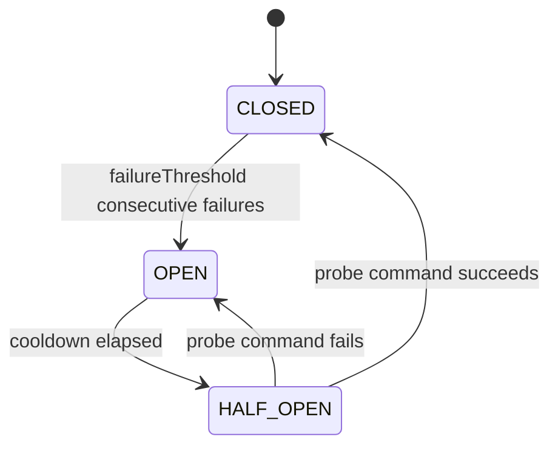

# Retry and Resilience

## When to use

The retry policy handles transient `OptimisticLockException` conflicts that arise when two concurrent commands target the same aggregate. Configure it based on your expected concurrency level.

The circuit breaker (`CircuitBreakerCommandInterceptor`) protects downstream systems from cascading failures: if commands repeatedly fail, it stops accepting new commands temporarily.

Do **not** use retry for business logic failures (`DomainException`, `ValidationException`) — these are not transient and should propagate immediately.

Do **not** lower `failureThreshold` too aggressively in low-traffic services — a single flaky test can open the circuit unnecessarily.

## How it works

### RetryPolicy

Applied by `VirtualThreadCommandBus` to transient concurrency failures only: `OptimisticLockException` and `LockException` (a timed-out aggregate-lock acquisition; `LocalStripedLocker`'s `LockAcquisitionException` is a subtype). Other exceptions are not retried.

`RetryPolicy` is a record with `maxAttempts`, `initialDelay`, `backoffMultiplier`, and `jitterEnabled`.

Default: `RetryPolicy.DEFAULT` = 3 attempts, 50ms initial delay, 2.0x multiplier, jitter enabled.

`RetryPolicy.delayForAttempt(int attempt)` computes the actual delay for attempt N (1-based) using exponential backoff (`initialDelay * backoffMultiplier^(N-1)`) with optional "equal" jitter — the base delay multiplied by a random factor in `[0.5, 1.5)`. The delay has no explicit cap; bound it through `maxAttempts` and `backoffMultiplier`.

After all attempts are exhausted, the command is published to the `DeadLetterQueue` (if configured) **only if the failure is DLQ-eligible** — see [Dead-letter queue](#dead-letter-queue) below — and the exception propagates either way.

### CircuitBreakerCommandInterceptor

Implements `CommandInterceptor` and is auto-registered in Spring/Quarkus/Micronaut.

State machine: `CLOSED` → `OPEN` (after `failureThreshold` consecutive failures) → `HALF_OPEN` (after `cooldown` elapses) → `CLOSED` (probe success) or `OPEN` (probe failure).

Only failures matching the breaker's failure predicate count toward `failureThreshold`. The
default, `CircuitBreakerCommandInterceptor.INFRASTRUCTURE_FAILURES`, excludes permanent rejections
(`DomainException`, `IllegalArgumentException`, a `SubjectForgottenException` in the cause chain)
and deterministic per-aggregate stored-data failures, so neither a burst of rejected requests nor
one aggregate with a corrupt stored event can open the circuit for the whole bus. The 4-argument
constructor takes a custom predicate and a probe timeout.

In `OPEN` state, `before(ctx)` throws `CircuitBreakerOpenException` immediately. In `HALF_OPEN`
exactly one probe is admitted and every other command is rejected the same way; a probe that has
not reported back within the probe timeout (default 30 s, `DEFAULT_PROBE_TIMEOUT`) is superseded
by a new one.

Thread-safe: uses `AtomicReference.compareAndSet` for state transitions.

`circuitState()` returns the current state name string ("CLOSED", "OPEN", "HALF_OPEN").



### Dead-letter queue

`VirtualThreadCommandBus` publishes a command to the `DeadLetterQueue` (if one is configured)
after retries are exhausted — but **only for infrastructure/transient failures**. Business
rejections are never dead-lettered: a `DomainException` (and its `ValidationException` /
`AuthorizationException` subtypes), an `IllegalArgumentException`, or a failure with a
`SubjectForgottenException` anywhere in its cause chain (a command against a crypto-shredded
subject) propagates to the caller without ever reaching the DLQ. Replaying a correctly-rejected
command later would blindly re-append it — this classification exists specifically to prevent
that. The same holds for a keyed command whose decider rejected it while the inbox lookup that
would show whether its key was already recorded failed: the bus propagates the lookup failure with
the rejection attached as a suppressed exception (see
[idempotency](idempotency.md#how-it-works)) and never dead-letters it, whatever `dlqEligible` says,
because a replay could only repeat the recorded outcome or re-run the rejected decision.

This is controlled by a `Predicate<Throwable> dlqEligible` on the bus and is overridable via
`Builder.dlqEligible(...)` if your application defines custom exception types that need different
treatment. The default, `VirtualThreadCommandBus.DEFAULT_DLQ_ELIGIBLE`, is
`CommandFailureClassification.DLQ_ELIGIBLE`: it shares its permanent-rejection definition with the
circuit breaker's `INFRASTRUCTURE_FAILURES`, with one deliberate difference — a deterministic
per-aggregate stored-data failure (`EventDeserializationException` or `UnknownEventTypeException`
in the cause chain) **is** dead-lettered (the entry's `errorType` marks it), but does **not** count
toward the breaker's threshold.

A configured `deadLetterQueue` requires an `objectMapper` on the builder — `build()` throws
`IllegalArgumentException` otherwise, rather than deferring to a later NPE on the publish path
that would mask the original command failure. Pass
`DeadLetterRetryRunner.createObjectMapper(cryptoEngine)`, as the auto-configurations do: an
application `ObjectMapper` without the crypto-shredding module would store `@Encrypted` command
fields as plaintext. If payload serialization itself fails (for example the
crypto module's fail-fast `CryptoOperationException`), the bus records a metadata-only entry — a
JSON `null` payload plus the command type and error metadata — instead of losing the failure; it
never falls back to `command.toString()`, which would re-emit `@Encrypted` PII. Such an entry has no
command to replay: the retry runner logs a WARN naming it metadata-only, never hands it to the bus,
and records a failed attempt so it ages toward discard like an unresolvable command type.

**A command type must round-trip through that `ObjectMapper`.** This is the one place the framework
serializes a command: the bus writes the failed command as JSON, and the retry runner rebuilds it
with `readValue(payload, commandClass)` on every replay. A `record` command round-trips by default.
A plain class needs a default constructor, or a constructor or factory method annotated
`@JsonCreator`, together with readable properties; a component Jackson does not write comes back
`null` or zero. Nothing checks this when the command is registered, and the two ways it goes wrong
look different. A command the mapper cannot **write** is recorded metadata-only, as above. A command
it can write but cannot **rebuild** is stored normally, and then every replay cycle fails to read it:
nothing is executed, the runner records a failed attempt, and the entry spends its retries until it
is exhausted. Give the runner a mapper configured like the bus's;
`DeadLetterRetryRunner.createObjectMapper(cryptoEngine)` builds one that both sides can share.

The auto-configured `DeadLetterRetryRunner` (Spring/Quarkus/Micronaut) periodically retries
DLQ entries:

- It learns command types from the same `DeciderRegistration` provider that feeds the command
  bus's decider registry, so entries resolve to their command class out of the box — manual
  `Builder.registerCommand(...)` is only needed for advanced/manual wiring. A decider registered by
  its sealed command root (`OrderCommand.class`) covers every command of the hierarchy, because
  `registerCommand` also registers each permitted subclass of a sealed class; the concrete commands
  of a non-sealed supertype must be registered one by one on a runner you build. An entry whose
  command type still can't be resolved records a failed attempt and ages toward discard like any
  other failure, instead of sitting at the front of the oldest-first retry batch forever.
- Replay is idempotent whenever the bus reports `supportsIdempotentExecution()` (true when a
  `CommandInbox` is configured): the entry re-executes via `CommandBus.execute(command, key)` under
  the command's **original** `IdempotencyKey` when it ran keyed (persisted on the entry, column
  `dead_letter_queue.idempotency_key`), and under the deterministic synthetic key
  `new IdempotencyKey("dlq-replay:" + commandId)` only when it originally ran unkeyed — the
  constructor, not `of`, because the command id is read back from storage and so goes through the
  decode door (see [Idempotency › The IdempotencyKey](idempotency.md#the-idempotencykey)). Preferring the
  original key is what lets a cross-instance duplicate replay **and** the client's own at-least-once
  redelivery of the same command collapse onto the same `command_inbox` row, so the events are
  produced exactly once — a replay under a synthetic key would let the client's redelivery miss the
  inbox and re-execute the handler. This matters because the DLQ's `FOR UPDATE SKIP LOCKED` claim is
  released before the command re-executes, so another instance could in principle claim and replay
  the same entry concurrently. Buses without an inbox fall back to the unkeyed `execute(command)`,
  logging one WARN.
- With a `SubscriptionLeadership` configured (`Builder.leadership(...)`; the Spring, Quarkus and
  Micronaut integrations pass in the single-active-consumer leadership bean when one exists), only
  the leader replica polls, under the consumer name `dead-letter-retry`. `build()` rejects real
  leadership paired with a bus that has no inbox (`IllegalArgumentException`): the leadership gate
  makes one replica poll, but it does not fence a stale leader out of a batch it already fetched, so
  only the inbox key prevents a double execution. The on-demand `retry(CommandId)` path below is not
  leadership-gated.
- The backing `dead_letter_queue` table is part of the Flyway baseline schema shipped in
  `streamrune-postgres` (`V001__streamrune_baseline.sql`); Flyway is its only provisioner.
- `@Encrypted` command fields are encrypted before the payload is stored in `dead_letter_queue`
  (only the command record's own `@Encrypted` components: a command that carries personal data
  without the annotation is stored as plaintext — see
  [GDPR erasure](gdpr-erasure.md#dead-lettered-commands-are-encrypted-only-when-the-command-carries-encrypted)),
  and an entry for a since-forgotten subject is never re-executed with redacted data: the runner
  detects the `[REDACTED]` marker (the scan recurses into nested `@Encrypted` records), logs a WARN
  and records a failed attempt, so the entry ages toward discard under the retry policy. A command
  component on a path to an `@Encrypted` field that the runner cannot read (its accessor throws, or
  the runtime may not reflect on it) fails closed the same way: a WARN that the entry "cannot be
  checked for crypto-shredded PII", a failed attempt, never a replay. On the module path, open the
  command package to the StreamRune runtime as well as to Jackson. The
  `streamrune.dead-letter.retention-max-age` property (default 30 days) auto-configures a
  `DeadLetterRetentionSweeper` for any `DeadLetterQueue` bean that prunes entries older than the
  window — see "Retention and GDPR" in `docs/guide/production.md`.
- `streamrune.dead-letter.enabled=false` turns off only this automatic runner. The bus still
  dead-letters into the queue bean, `retry(CommandId)` still works, and the retention sweeper still
  prunes: the sweeper is switched off by a zero or negative `retention-max-age`, never by this
  property.

A replay runs as the request that issued the command: the runner rebinds the user, correlation id
and trace id recorded on the entry, so the replayed events keep the original correlation and an
authorization check sees the original user. An entry for a command that ran with no context bound
(a startup task, a background job) replays with no context bound.

For an on-demand single retry (e.g. an operator clicking "Retry" in an admin UI), call
`retry(CommandId)` — it re-dispatches that one entry immediately, bypassing the per-entry backoff
window, and returns `true` if a matching entry was found. The replay runs on a fresh virtual thread
that `retry` waits for, so it carries exactly what a scheduled replay carries. Nothing the calling
thread has bound reaches it — not the admin request's user, correlation id, baggage or captured
authorities, not a saga-dispatch marker, not an inheritable thread-local — so the replayed events and
the audit row never name the operator as the actor of a command they did not issue. A failure to
record the outcome on the entry is rethrown to the caller. Retrying an entry that already exhausted
its retries and failing again logs a WARN; `streamrune.dlq.exhausted` and the terminal ERROR fire
only once, when the entry first runs out of retries. The background loop is controlled with
`start()` / `close()` (`close()` is restartable; `isRunning()` reports whether the poll thread is
active):

```java
DeadLetterRetryRunner runner = DeadLetterRetryRunner.builder()
    .deadLetterQueue(deadLetterQueue)
    .commandBus(commandBus)
    .objectMapper(objectMapper)
    .registerCommand(PlaceOrder.class)  // keyed by PlaceOrder.class.getName()
    .build();
runner.start();                       // background virtual-thread poll loop
boolean found = runner.retry(CommandId.of("cmd-123"));  // on-demand single retry
runner.close();                       // stop the loop
```

`registerCommand(Class)` keys each class by its **fully-qualified name** (`Class#getName()`) —
the same name the bus persists on each dead-letter row — so an entry resolves by one exact lookup
and two commands sharing a simple name in different packages never collide. The key cannot be
chosen by hand. Registering a sealed class also registers every class it permits, recursively. An
entry whose type names no registered class records a failed attempt and executes nothing.

In a GraalVM native image that expansion works only for a sealed type registered for reflection:
the image reports any other sealed type as sealed with no permitted subclasses, and
`registerCommand` refuses it with an `IllegalStateException` instead of registering the root alone
(which would leave every concrete command of the hierarchy unresolvable). Register the sealed root
and each nested sealed level — see [Quickstart §10, GraalVM Native Image](../../QUICKSTART.md#10-graalvm-native-image).

### Projection dead-letter replay

When a projection batch fails, the runner writes the offset range to a projection DLQ rather than
blocking the read model. `ProjectionDeadLetterReplayer` is the recovery half: once the underlying
cause is fixed, an operator re-reads each dead-lettered range from the event store and re-runs it
through the projection. There is no background loop — replay is explicit and operator-driven,
because a batch that failed deterministically would only re-fail on a schedule.

Construct it directly (no builder) with the event store, the dead-letter store and **the
`AtomicBatchProcessor` the projection's runner commits through**, and call
`replay(ProjectionName, Projection, ProjectionDeliveryMode, int maxEntries)` with the delivery mode
the projection is registered with. It replays up to `maxEntries` entries oldest-range-first and
returns a `ReplayResult(int replayed, int failed, int fenced)`. A range none of whose events is left
in the event store is discarded without processing (crypto-shredding does not empty a range — the
erased subject's events replay with `[REDACTED]` fields). The projection's offset checkpoint is
never moved — replay fills the hole behind it.

**Replay is serialized with the live runner.** Each range runs through
`AtomicBatchProcessor.executeReplay`, which takes the lock a live batch takes: on
`JdbcProjectionRepository`, the projection's `projection_offset` row, `FOR UPDATE`. A replay and a
live batch of one projection therefore never run at the same time, in one process or across
replicas, and a replay is safe while the runner is live. The lock is what protects a
read-modify-write projection (`findById` → change a field → `save`): without it both sides can read
a row before either saves it, and one of the two writes is lost. **Idempotency does not prevent
that** — neither side applies anything twice; one side's read is stale.

Inside the lock the projection is handed what a live batch of its registration is handed
([delivery mode](../concepts.md#delivery-modes--what-a-projection-promises)):

| registration | what the replay hands the projection | a failure part-way |
|---|---|---|
| `TRANSACTIONAL_LOCAL`, `EXTERNAL_EFFECT` | the replay transaction's repository; a `BaseProjection` writes through it | rolls the whole range back |
| `AT_LEAST_ONCE_IDEMPOTENT` | `null`; the projection writes through its own repository while the replay holds the lock | leaves the writes made so far |

**A processor without that lock is refused.** `AtomicBatchProcessor.nonAtomicAtLeastOnce()` holds no
per-projection lock, so `replay` throws an `IllegalStateException` for it before it reads an entry —
the fail-safe choice, because beside a live batch the unlocked replay is exactly the lost update
above. For such a registration stop the projection's runner and call
`replayWithRunnerStopped(ProjectionName, Projection, int maxEntries)`: it feeds each range with no
lock and no transaction, and the method name is your statement that nothing else is processing the
projection, in this process or any other. Nothing verifies it. `replayWithRunnerStopped` is in turn
refused on a processor that serializes replays, where `replay` gives the same result with the
runner live or stopped. Under `nonAtomicAtLeastOnce()` a dead-letter entry can only come from a
projection failure, never from a checkpoint-save failure.

**`process` must still be idempotent, under every delivery mode.** That covers what the lock does
not — re-application and order:

- Replay is at-least-once. For each entry it commits the range first and discards the entry second:
  - a crash **before the replay commits** leaves the entry queued; a transactional registration's
    range rolled back, an at-least-once registration's writes so far stand, and the next replay
    applies the whole range;
  - a crash **after the replay commits and before the entry is discarded** (or a failed discard)
    leaves the range applied and the entry queued, so the next replay applies the range a second
    time and then discards the entry;
  - a crash **after the discard** leaves nothing to do.

  The checkpoint is written at none of these points, so a rerun converges on the range applied and
  no entry.
- Replay is out of order: the runner already applied later events when it moved past the range, so
  the projection sees an older event after a newer one.

Each range is fed through `Projection#processDeadLetterReplay(List, ProjectionRepository)`, which
reports whether the projection applied anything, and an entry is discarded only when it did:

- `replayed` — the feed succeeded (or the range's events are not in the event store) and the entry
  was discarded;
- `failed` — the feed threw; the entry is kept for a later replay, and the remaining entries are
  still attempted;
- `fenced` — the feed returned normally but applied **nothing**, because a self-fencing projection
  (`WindowedProjection`, which dedups on the highest offset it has accumulated) had already moved
  its fence past the range. The entry is kept, not discarded, with a WARN naming the remedy: replay
  it from a fresh process (the fence is per-JVM) before the live runner advances again, or discard
  it deliberately.

The default `processDeadLetterReplay` calls `process(batch, repository)` and reports `true`. **A
projection wrapper or decorator must override it and forward to its delegate's
`processDeadLetterReplay`** (the shipped `TracingProjectionDecorator`,
`ValidatingProjectionDecorator` and `CacheAwareProjection` do) — a wrapper that inherits the default
reaches only the delegate's `process`, reports "applied" for a wholly fenced range, and the replayer
discards the range's only record.

```java
ProjectionDeadLetterReplayer replayer =
    new ProjectionDeadLetterReplayer(
        eventStore, projectionDeadLetterStore, jdbcRepo); // the runner's atomicProcessor

ProjectionDeadLetterReplayer.ReplayResult result =
    replayer.replay(
        ProjectionName.of("order_summary"),
        orderSummaryProjection,
        ProjectionDeliveryMode.TRANSACTIONAL_LOCAL, // as registered
        100);
// result.replayed(), result.failed(), result.fenced()
```

### Saga dead-letter replay

Saga poison events are quarantined by the `SagaRunner` (the saga is FAULTED) rather than failing the
subscription. `SagaDeadLetterReplayer` replays quarantined events once a fix has shipped. It decides
only from what the stores recorded and never un-faults a saga row itself: it re-feeds the event
through the runner, a FAULTED row is cleared only by that feed's own successful state write, and an
entry is discarded only on `REPLAYED` (the feed succeeded, or the event was moot because the saga
row is already terminal). A feed that faults again re-records the fault and keeps the entry
(`STILL_POISON`). Like the projection replayer it is manual and
operator-triggered, with no polling loop.

- `replayAll(SagaId)` drains every entry of the saga in offset order — its own entries plus any
  null-saga entries already resolved to it — and returns one `ReplayOutcome` per drain step, in the
  order attempted (a deferred entry that is retried after a start entry lands appears twice). A
  correlated entry that is ahead of the saga's genesis (no saga row yet, or the start event not
  applied) is deferred (`SAGA_ROW_PENDING` — metered as `streamrune.saga.replay_deferred`, never as
  `streamrune.saga.replayed`) and fed once a start entry is replayed in the same drain; any other
  outcome than `REPLAYED` stops the drain, so nothing is ever fed ahead of a blocker. If deferred
  entries are left at the end — the start event is still poison or was discarded, its live
  redelivery has not completed, or the saga row was deleted — the drain logs a WARN and keeps them:
  re-run `replayAll` once the genesis lands, or discard them. An entry over a deliberately deleted
  saga row stays quarantined until you discard it.
- `replay(SagaId, GlobalOffset)` replays one entry and is refused with `OLDER_ENTRY_PENDING` while an
  older entry of the same saga is still pending. Pass a `null` `SagaId` for a null-saga
  (correlate-poison) entry — one whose saga could not be identified when it was quarantined. The
  replayer resolves its target through the runner's routers and answers `TARGET_PENDING` when that
  target is FAULTED, genesis-pending or has an older entry pending; drain the target with
  `replayAll`, and the entry is applied at its offset position.
- The `force` overloads, `replay(SagaId, GlobalOffset, true)` and `replayAll(SagaId, true)`, bypass
  only the two key-age refusals (`STALE_REDRIVE_BLOCKED`, `STALE_COMPENSATION_BLOCKED`), after you
  have reconciled; they never bypass ordering (`OLDER_ENTRY_PENDING`, `SAGA_ROW_PENDING`). Both
  refusals are active only when the builder's `inboxRetentionMaxAge` is set to your
  `streamrune.inbox.retention-max-age`; unset (or zero/negative) they are inert. `force` is your
  at-least-once acknowledgement for the saga and also reaches the step executor, whose own key-age
  guard then resumes a stale compensation episode instead of refusing it — a compensation whose
  inbox key was already pruned executes again (see the saga guide).
- `discard(SagaId, GlobalOffset)` removes an entry explicitly and, once the saga has no entry left,
  clears its dead-letter shield. It is the remedy for `EVENT_NOT_FOUND` (the event store can no
  longer read the entry's offset); `EVENT_NOT_FOUND`, `ENTRY_NOT_FOUND` and the `STALE_*` refusals
  leave the saga row unchanged.
- A `FAULTED` saga with no entry left has nothing to drain, and no automatic driver selects a
  `FAULTED` row. `resumeFaulted(SagaId)` resumes a compensation episode the compensation-retry
  sweeper or the timeout runner gave up on; `compensateFaulted(SagaId)` compensates a saga a forward
  step faulted once its poison entry was discarded — the claim its timeout would have made. A
  `discard` that leaves such a row logs a WARN naming the remedy (see the saga guide).

The complete outcome set is `REPLAYED`, `STILL_POISON`, `ENTRY_NOT_FOUND`, `EVENT_NOT_FOUND`,
`STALE_REDRIVE_BLOCKED`, `STALE_COMPENSATION_BLOCKED`, `TARGET_PENDING`, `SAGA_ROW_PENDING` and
`OLDER_ENTRY_PENDING`; see the [saga guide's replay-outcome table](saga.md) for each outcome's entry
disposition and remedy.

```java
SagaDeadLetterReplayer replayer = SagaDeadLetterReplayer.builder()
    .sagaDeadLetterStore(sagaDeadLetterStore)
    .sagaStore(sagaStore)
    .eventStore(eventStore)
    .sagaRunner(sagaRunner)
    .inboxRetentionMaxAge(Duration.ofDays(7))  // = streamrune.inbox.retention-max-age
    .build();

SagaDeadLetterReplayer.ReplayOutcome outcome =
    replayer.replay(SagaId.of("order-fulfillment-42"), GlobalOffset.of(9876));

List<SagaDeadLetterReplayer.ReplayOutcome> outcomes =
    replayer.replayAll(SagaId.of("order-fulfillment-42"));
```

For how sagas quarantine poison events and the `FAULTED` state machine that produces these entries,
see the [Saga guide](saga.md).

## Quick example

```java
// Custom RetryPolicy: 5 attempts, 100ms initial, 1.5x backoff, no jitter
RetryPolicy policy = new RetryPolicy(5, Duration.ofMillis(100), 1.5, false);

// Compute delay for attempt 3: 100ms * 1.5^2 = 225ms
Duration delay = policy.delayForAttempt(3);

// Circuit breaker: open after 3 failures, recover after 10 seconds
CircuitBreakerCommandInterceptor cb =
    new CircuitBreakerCommandInterceptor(3, Duration.ofSeconds(10));

String state = cb.circuitState(); // "CLOSED" | "OPEN" | "HALF_OPEN"
```

## Full example

```java
RetryPolicy retryPolicy = new RetryPolicy(
    5,                        // maxAttempts
    Duration.ofMillis(100),   // initialDelay
    2.0,                      // backoffMultiplier
    true                      // jitterEnabled
);

CircuitBreakerCommandInterceptor circuitBreaker =
    new CircuitBreakerCommandInterceptor(
        5,                        // failureThreshold
        Duration.ofSeconds(30)    // cooldown
    );

VirtualThreadCommandBus commandBus = VirtualThreadCommandBus.builder()
    .eventStore(eventStore)
    .locker(locker)
    .retryPolicy(retryPolicy)
    .snapshotPolicy(SnapshotPolicy.everyNEvents(100))
    .interceptors(circuitBreaker)
    .build();

try {
    commandBus.execute(new PlaceOrder(orderId, items));
} catch (CircuitBreakerOpenException e) {
    throw new ServiceUnavailableException("Command bus temporarily unavailable");
}
```

## Configuration

| Property | Spring | Quarkus | Micronaut | Default |
|---|---|---|---|---|
| Max retry attempts | `streamrune.retry-max-attempts` | `streamrune.retry-max-attempts` | `streamrune.retry-max-attempts` | 3 |
| Initial delay (ms, plain `long`) | `streamrune.retry-initial-delay-ms` | `streamrune.retry-initial-delay-ms` | `streamrune.retry-initial-delay-ms` | 50 |
| Backoff multiplier | `streamrune.retry-backoff-multiplier` | `streamrune.retry-backoff-multiplier` | `streamrune.retry-backoff-multiplier` | 2.0 |
| CB failure threshold | `streamrune.circuit-breaker-failure-threshold` | `streamrune.circuit-breaker-failure-threshold` | `streamrune.circuit-breaker-failure-threshold` | 5 |
| CB cooldown (`Duration`) | `streamrune.circuit-breaker-cooldown` | `streamrune.circuit-breaker-cooldown` | `streamrune.circuit-breaker-cooldown` | 30s |

All three integrations bind the same keys (Spring `StreamRuneProperties`, Quarkus
`StreamRuneQuarkusProperties`, Micronaut `StreamRuneMicronautProperties`). The auto-configured bus
always enables jitter; `jitterEnabled` has no property.

Spring example:

```properties
streamrune.retry-max-attempts=5
streamrune.retry-initial-delay-ms=100
streamrune.retry-backoff-multiplier=1.5
streamrune.circuit-breaker-failure-threshold=3
streamrune.circuit-breaker-cooldown=10s
```

## Caveats

- Retry only applies to `OptimisticLockException` and `LockException`. Domain exceptions propagate immediately.
- Business rejections (`DomainException`, `ValidationException`, `AuthorizationException`,
  `IllegalArgumentException`) are never dead-lettered, even with a `deadLetterQueue` configured —
  see [Dead-letter queue](#dead-letter-queue) above.
- `jitterEnabled=true` (default) applies equal jitter (a random factor in `[0.5, 1.5)` around the base delay). Disable jitter only in tests where deterministic timing matters.
- `CircuitBreakerCommandInterceptor` is stateful and singleton — do not instantiate multiple instances accidentally.
- A `cooldown` of `Duration.ZERO` is valid (immediately allows a probe after opening) — useful for testing but risky in production.
- Circuit breaker state is in-memory — it resets on application restart.
- `circuitState()` is string-based — parse carefully if building dashboards.
