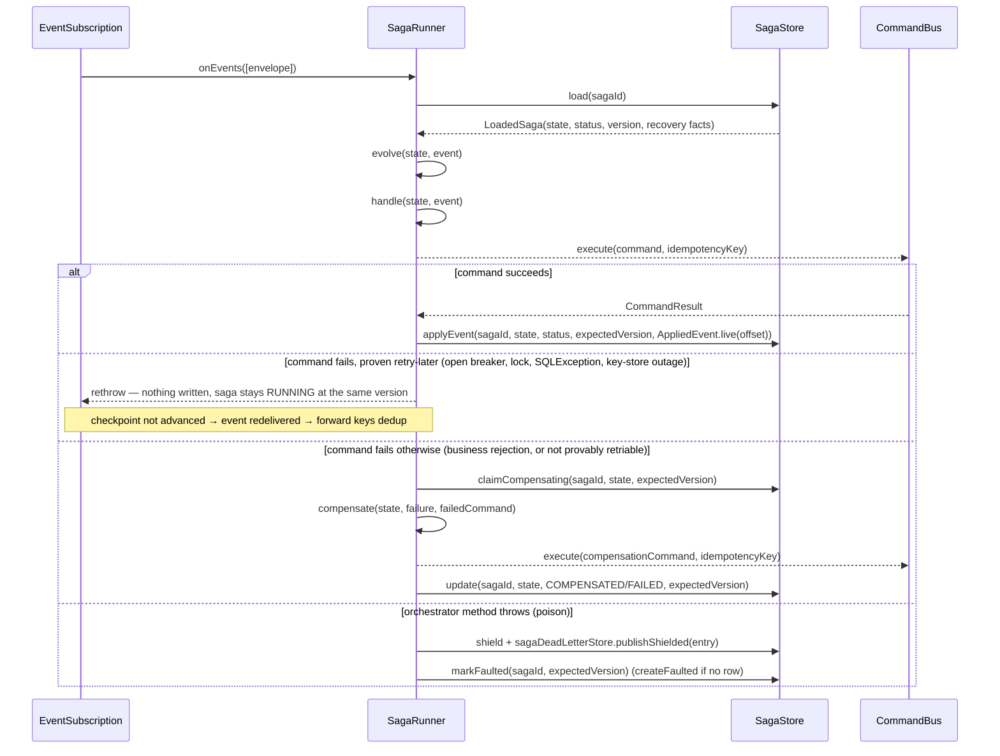

# Saga

## When to use

Use sagas when a business process spans multiple aggregates and must coordinate their state changes via commands — for example, an order checkout that creates a payment, reserves inventory, and sends a notification, where each step is a separate aggregate.

Use sagas when you need compensating transactions: if a step fails (or the saga times out waiting for one), prior steps must be undone in a predictable way.

Do **not** use sagas for simple within-aggregate operations (a single decider handles those).

Do **not** use sagas as a replacement for projections — sagas emit commands, not read models.

## How it works

A saga is driven by `SagaRunner` (in `streamrune-runtime`), which adapts a `SagaOrchestrator` into an `EventListener` you register with an `EventSubscription`.

For each incoming `EventEnvelope`, `SagaRunner` calls `SagaOrchestrator.isStartEvent(event)` to decide whether to create a new saga, or `SagaOrchestrator.correlate(event)` to route the event to an already-running one.

- **Start event:** the runner calls `extractSagaId`, `initialState` and `evolve`, then — **before** any command is dispatched — inserts the saga's row with `SagaStore.createGenesisPending` (version 1, `genesis_applied = FALSE`, holding the evolved state and status), calls `handle`, dispatches the commands, and commits the genesis with `SagaStore.applyEvent`, which sets `genesis_applied = TRUE`. A redelivered start event is routed on what the row records — an applied genesis is a no-op, a genesis-pending row is re-driven from `initialState`, and commands that already ran dedup in the command inbox. If the insert itself loses a race to a concurrent delivery of the same start event, it throws `OptimisticLockException`, and the runner reloads the row and routes the same way. A start event whose `evolve` already yields a terminal status has nothing to dispatch and is written complete with `SagaStore.create`.
- **Correlated event:** the runner loads the saga via `SagaStore.load` and either applies the event — `evolve`, then `handle`, then the dispatch, persisted via `SagaStore.applyEvent`, a compare-and-swap keyed on the saga's `version` — or, when the saga cannot consume it yet, **holds** it (see [Held events](#held-events)). A stale view (lost the race to another writer) makes `applyEvent` throw `OptimisticLockException`, which propagates out of the listener so the subscription retries the batch against fresh state.

Terminal sagas — `COMPLETED`, `COMPENSATED`, `FAILED` — silently ignore further events. A `FAULTED` (quarantined) saga processes nothing either, but its later correlated events are recorded in the dead-letter store instead of dropped, so a replay can apply them once the fault is fixed (see [Held events](#held-events)). A saga in `COMPENSATING` never re-runs forward logic: a correlated event resumes its compensation episode instead — see [Timeout-driven compensation](#timeout-driven-compensation-and-compensating) below.

Each saga-issued command is dispatched via `CommandBus.execute(command, key)` with a deterministic idempotency key derived from the triggering event's global offset and the command's position in the dispatch list. If a correlated event is redelivered (at-least-once broker/subscription semantics) after its write committed, the runner skips it outright — the row records the highest offset applied to the saga (`last_applied_offset`). If it is redelivered before its write committed (a retried batch, a crash), the command bus finds each already-dispatched key recorded in the command inbox and returns the prior result without re-running the handler or re-persisting events — see [Effectively-once dispatch](#effectively-once-dispatch).

**Correlation:** non-start events are routed to the correct saga by reading `event.metadata().correlationId().value()` — `SagaRunner` sets the command's correlation ID to the saga ID automatically when dispatching, so events produced by that command carry it back.



## Quick example

```java
// Minimal saga: on OrderPlaced, dispatch ReserveInventory
public class OrderSaga implements SagaOrchestrator<OrderSaga.State> {

    public record State(SagaStatus status, String orderId) implements SagaState {
        @Override public SagaStatus status() { return status; }
    }

    @Override public Class<State> stateType() { return State.class; }

    @Override
    public State initialState(SagaId sagaId) {
        return new State(SagaStatus.STARTED, null);
    }

    @Override
    public boolean isStartEvent(EventEnvelope event) {
        return event.event() instanceof OrderPlaced;
    }

    @Override
    public SagaId extractSagaId(EventEnvelope event) {
        OrderPlaced e = (OrderPlaced) event.event();
        return SagaId.of("order-saga-" + e.orderId());
    }

    @Override
    public Optional<SagaId> correlate(EventEnvelope event) {
        String corrId = event.metadata().correlationId().value();
        return corrId.startsWith("order-saga-")
            ? Optional.of(SagaId.of(corrId))
            : Optional.empty();
    }

    @Override
    public State evolve(State state, EventEnvelope event) {
        if (event.event() instanceof OrderPlaced e)
            return new State(SagaStatus.RUNNING, e.orderId());
        return state;
    }

    @Override
    public List<SagaCommand> handle(State state, EventEnvelope event) {
        if (event.event() instanceof OrderPlaced e)
            // An id derived from a stored event or saga state: the constructor, not the ingress factory of()
            return List.of(SagaCommand.of(new ReserveInventory(e.orderId()), new AggregateId(e.orderId())));
        return List.of();
    }

    @Override
    public List<SagaCommand> compensate(State state, Throwable failure, SagaCommand failed) {
        return List.of(SagaCommand.of(new CancelOrder(state.orderId()), new AggregateId(state.orderId())));
    }
}
```

## Full example

Wiring the saga to a subscription:

```java
// The mapper is an explicit argument on purpose: pass your CryptoEngine and @Encrypted saga-state
// fields are encrypted at rest and inside GDPR forget scope. Pass null and they are stored as
// PLAINTEXT — see GDPR erasure › Saga state is encrypted too.
SagaStore sagaStore =
    new PostgresSagaStore(dataSource, PostgresSagaStore.createObjectMapper(cryptoEngine));
SagaDeadLetterStore sagaDeadLetterStore = new PostgresSagaDeadLetterStore(dataSource);
CommandBus commandBus = /* your VirtualThreadCommandBus */;
OffsetStore offsetStore = /* your offset store */;

SagaRunner<OrderSaga.State> runner = SagaRunner.<OrderSaga.State>builder()
    .orchestrator(new OrderSaga())
    .sagaStore(sagaStore)
    .commandBus(commandBus)
    .sagaDeadLetterStore(sagaDeadLetterStore)   // required — build() throws NullPointerException without it
    .build();

PollingEventSubscription subscription = PollingEventSubscription.builder()
    .subscriptionName("order-saga-subscription")
    .eventStore(eventStore)
    .offsetStore(offsetStore)
    .listener(runner.asEventListener())
    .config(SubscriptionConfig.DEFAULT)
    .fetchSize(100)
    .build();

subscription.start();
```

`sagaDeadLetterStore(...)` is a required builder field — `build()` throws `NullPointerException` if it is omitted, because every orchestrator-logic exception must have somewhere to be quarantined (see [Failure model](#failure-model-poison-events-and-faulted)).

State class Jackson serialization requirement:

```java
public record State(
    @JsonProperty("status") SagaStatus status,
    @JsonProperty("orderId") String orderId
) implements SagaState {
    @JsonCreator
    public static State create(
        @JsonProperty("status") SagaStatus status,
        @JsonProperty("orderId") String orderId
    ) { return new State(status, orderId); }

    @Override public SagaStatus status() { return status; }
}
```

If your saga only needs the functional core (state evolution, command decisions, compensation) without owning routing, implement `SagaDecider<S>` instead of `SagaOrchestrator<S>` and configure routing on the builder:

```java
SagaRunner<OrderSaga.State> runner = SagaRunner.<OrderSaga.State>builder()
    .decider(new OrderSagaDecider())
    .startWhen(event -> event.event() instanceof OrderPlaced)
    .extractSagaId(event -> SagaId.of("order-saga-" + ((OrderPlaced) event.event()).orderId()))
    .correlateBy(event -> Optional.of(SagaId.of(event.metadata().correlationId().value()))
        .filter(id -> id.value().startsWith("order-saga-")))
    .sagaStore(sagaStore)
    .commandBus(commandBus)
    .sagaDeadLetterStore(sagaDeadLetterStore)
    .build();
```

`SagaDecider` also carries the optional `timeout()` used by `SagaTimeoutRunner` (below); `SagaOrchestrator` has no timeout concept of its own.

## Lifecycle statuses

| Status | Terminal? | Halted? | Meaning |
|---|---|---|---|
| `STARTED` | No | No | Initial state immediately after the start event is processed. |
| `RUNNING` | No | No | One or more steps are in progress. |
| `COMPLETED` | Yes | Yes | All steps succeeded. Persisted when the orchestrator's own `state.status()` reaches `COMPLETED` (see below); a `handle()` that returns no commands does not by itself complete a saga. `handle()` is not called for the event whose `evolve` reaches a terminal status, so a command returned there is never dispatched — emit a saga's last command from a non-terminal state. |
| `COMPENSATING` | No | **No** (but the event path never re-runs `evolve`/`handle` on it) | Framework-set to claim ownership of a compensation episode *before* dispatching any compensation command — by whichever path drives compensation: the correlated-event path and the start-event path in `SagaRunner`, or `SagaTimeoutRunner`. An orchestrator whose `evolve` yields a state with `status() == COMPENSATING` enters the episode the same way: the forward write that persists it stamps the episode (`episode_version`, `episode_claimed_at`) exactly as a claim does, so every `COMPENSATING` row carries its claim. Not one of the `SagaStore.update` terminal statuses, so it can still be written to — this is what allows a crashed or transiently-failing episode to be re-driven. Still returned by `SagaStore.findTimedOut` and by `SagaStore.findCompensating` (recovery). The event path never re-runs forward `evolve`/`handle` on a `COMPENSATING` saga, but a redelivered correlated event *resumes* its compensation episode (see below); a `SagaCompensationRetrySweeper` re-drives it automatically even with no timeout runner and no redelivered event. |
| `COMPENSATED` | Yes | Yes | Framework-set after `compensate()` returned a non-empty list and every compensation command dispatched successfully. |
| `FAILED` | Yes | Yes | Framework-set when `compensate()` returned an **empty** list, or when at least one compensation command threw. An empty compensate result is not "nothing went wrong" — it is classified `FAILED`, not `COMPENSATED`, because there was an unrecovered primary failure with no undo. |
| `FAULTED` | No | Yes | Framework-set when an orchestrator pure-logic method (`isStartEvent`, `correlate`, `extractSagaId`, `initialState`, `evolve`, `handle`, `compensate`) throws, and by the automatic give-up paths (see [Operations notes](#operations-notes)). On the event path the triggering event is quarantined in the `SagaDeadLetterStore`; the saga stops processing events and timeout sweeps, and the row records the status the fault replaced (`pre_fault_status`). Unlike the three terminal statuses, `FAULTED` is *not* protected by the store's terminal guard, so a replayed step's own successful write — or the terminal write of an operator's [`resumeFaulted`](#resuming-a-give-up-fault-resumefaulted), or the claim of an operator's [`compensateFaulted`](#compensating-a-stranded-forward-fault-compensatefaulted) — can still move it — see [Operations notes](#operations-notes). |

The saga-store row's `status` column — not `state.status()` as the orchestrator last saw it — is authoritative. The framework may persist a status the domain state's own `evolve` never observed (e.g. `COMPENSATED` after a compensation the orchestrator only found out about via `compensate`'s return value).

## Recovery facts on the saga row

Recovery never infers a saga's situation from the shape of its row. Five facts on `saga_state` are written by the code that establishes them and only read by everyone else; `LoadedSaga` exposes each of them:

| Column | Written by | Meaning |
|---|---|---|
| `genesis_applied` | the start event's commit (`applyEvent` on the start path; `create` for a start that is already terminal) | `TRUE` once the start event's forward step — `evolve`, `handle` and the whole dispatch loop — has committed; never cleared again. `FALSE` from the genesis-pending insert until then. |
| `pre_fault_status` | the fault write (`markFaulted`) | The status a fault replaced — what a replay resumes from. `NULL` unless the row is `FAULTED`, and `NULL` for a fault of a genesis-pending forward step (there is nothing to resume: a replayed start re-evolves from `initialState`); `COMPENSATING` for a faulted compensation episode. Every other compare-and-swap write clears it. |
| `dead_letter_pending` | set with every dead-letter entry recorded for the saga; cleared only by the dead-letter store's conditional clear | The **shield**: the saga owns at least one dead-letter entry (named, or as the resolved target of a null-saga entry). While it is set, live correlated events are held behind the backlog instead of applied. |
| `last_applied_offset` | every event write (`applyEvent`), live or replayed; never lowered | The highest global offset ever applied to the saga. A live correlated event at or below it is a redelivery and is skipped. |
| `last_replayed_offset` | `applyEvent` on a replay feed | The offset the last replay feed applied. A replay of exactly that offset is the rerun of a feed whose write already committed, and is skipped. |

The genesis-pending row exists so that no command of a saga is ever dispatched before the saga has a row: it is inserted before the first forward command, and its status is the evolved `STARTED`/`RUNNING`, so a start whose dispatch never completes is still visible to `SagaTimeoutRunner` and bounded by the saga's `timeout()`. The episode columns (`episode_version`, `episode_claimed_at`) identify the current compensation episode — see [Effectively-once dispatch](#effectively-once-dispatch) and [Automatic compensation recovery](#automatic-compensation-recovery).

### Held events

A correlated event for a known saga that cannot consume it yet is **held**: recorded in the `SagaDeadLetterStore` under the saga's id — the entry and the shield in one durable write — never processed and never dropped. `SagaRunner` decides in this order:

1. **No row:** held as `BEFORE_START` only when the saga already owns a dead-letter entry of this runner's saga type (the [row-less residual](#the-row-less-residual)). An event for a saga that never started is dropped silently, so the store is not flooded with unrelated traffic.
2. **At or below `last_applied_offset`** (and the row is not `COMPENSATING`): dropped as a redelivery — before any hold, so an event that was already applied is never recorded as a new entry.
3. **`FAULTED`:** held behind the fault.
4. **Terminal** (`COMPLETED`/`COMPENSATED`/`FAILED`): dropped silently — the saga is done and can never consume it.
5. **`COMPENSATING`:** the claimed episode is resumed; the event itself is never consumed, so ordering cannot be violated.
6. **Genesis pending** (`genesis_applied = FALSE`): held as `GENESIS_PENDING`.
7. **Shielded** (`dead_letter_pending = TRUE`): held as `BACKLOG_PENDING`.
8. Otherwise the event is applied.

| Hold reason | Why the event cannot be consumed yet |
|---|---|
| `GENESIS_PENDING` | The start event's dispatch loop has not committed. Applying the event first would be lost when the start is re-driven from `initialState`. |
| `BACKLOG_PENDING` | The saga owns older quarantined entries; applying a newer event before them would reorder its history. |
| `BEFORE_START` | There is no row, but the saga owns a dead-letter record: its start could not produce an initial state. |

A held entry's `errorType` is `org.streamrune.runtime.SagaEventHeldException` and its message names the reason; every hold increments `streamrune.saga.event_held` (tagged `saga.type` and `hold.reason`) and logs a `WARNING`. The `FAULTED` hold is recorded as `org.streamrune.runtime.SagaSkippedWhileFaultedException` and counted by its own `streamrune.saga.skipped_while_faulted`. Both are also counted in `streamrune.saga.quarantined`. Held events are drained oldest-first by `SagaDeadLetterReplayer.replayAll(sagaId)` once the blocker is gone — see [Replaying quarantined events](#replaying-quarantined-events).

Start events are never held: a live start over a `FAULTED` or terminal row is skipped, a redelivered start over an applied genesis is a no-op, a start over a `COMPENSATING` row resumes the episode, and a start over a genesis-pending row re-drives it (commands that already ran dedup on their forward keys).

### The row-less residual

On the event path a poison writes its dead-letter entry first and only then faults the row — creating the row directly as `FAULTED`, from `initialState`, when there was none — so an event-path fault never leaves a `FAULTED` row without its entry. One case leaves an entry and no row at all: the start event poisons and `initialState()` itself throws (or returns `null`), or the initial state cannot be written because its conversion fails deterministically. The runner logs a `WARNING` and the saga stays row-less. For such a saga:

- its later correlated events are held as `BEFORE_START`;
- retention never prunes its entries, and they are counted in `streamrune.saga.faulted_backlog`;
- `replayAll(sagaId)` feeds the start entry first — correlated entries are deferred until it lands — and the row it creates is born shielded, as is a row created by a live redelivery of the start event.

## Failure model: poison events and FAULTED

Exceptions thrown by `isStartEvent`, `correlate`, `extractSagaId`, `initialState`, `evolve`, `handle`, or `compensate` are treated as **poison events**, not transient failures:

1. The triggering event is quarantined into `SagaDeadLetterStore` — **metadata only** (saga id/type, event offset/type, exception class name and message, fault timestamp). The event payload is never copied there; `event_stream` stays the framework's single crypto-governed, shreddable source of truth for GDPR purposes. To inspect the offending event, read the event store at the entry's `eventOffset`.
2. The saga is marked `FAULTED` — the row records the status the fault replaced (`pre_fault_status`) — and stops processing: it leaves the timeout sweeps, and its later correlated events are held behind the fault (recorded, not processed — see [Held events](#held-events)).
3. The runner moves on to the next event in the batch — a poison event does not block the subscription (no head-of-line blocking) and does not retry.

A **`null` return** from `extractSagaId` or `correlate` is classified exactly the same way. Both are contract violations — `extractSagaId` has no "ignore" signal (`isStartEvent` already claimed the event), and `correlate`'s one and only "not mine" signal is `Optional.empty()`, never a bare `null` — and both are ordinary user bugs (a metadata lookup that comes back `null` on a malformed producer event). The runner null-checks the router outputs inside the poison classification, so the violation is quarantined as a *null-saga* entry and the batch continues; without that check the `null` flowed downstream and the resulting failure (an NPE laundered into an infrastructure-classified store exception, or thrown outside the poison wrapper entirely) was retried forever — a permanently wedged saga subscription.

Because there is no retry, **orchestrator authors are responsible for treating transient errors (network blips, timeouts calling out to another service inside `evolve`/`handle`) as retryable inside their own logic**, or designing them out entirely (e.g. only touching in-memory state and letting `CommandBus` — which does have its own retry policy — own the I/O). A transient exception that escapes an orchestrator method permanently faults the saga.

This is distinct from **infrastructure failures**: exceptions from `SagaStore` reads and writes (`load`, the row inserts, the compare-and-swap writes) and from the dead-letter store are *not* poison — they propagate out of the listener so the subscription does not advance its offset and retries the whole batch.

> **State-conversion failures are the one exception.** A store can fail for two very different reasons, and lumping them together is a Critical either way. `PostgresSagaStore` therefore raises `SagaStateSerializationException` — deliberately **not** an `EventStoreException` — when it cannot convert saga state to or from its stored form, and the runner splits it by cause:
>
> | Cause anywhere in the chain | Verdict | Why |
> |---|---|---|
> | `SubjectForgottenException` | **poison** | the subject was crypto-shredded; the engine refuses to re-encrypt until an operator calls `reinstate` |
> | `CryptoOperationException` (bare) or `SQLException` | **infrastructure** | a bare `CryptoOperationException` is a crypto engine reporting a backend or key-level failure — a key-store/Vault/AWS KMS outage, a policy refusal an operator can reverse, a disabled or wrong key; `SQLException` is a JDBC blip. Neither is a verdict on the saga state itself, so retrying is the correct answer |
> | `CryptoMappingException` | **poison** | a deterministic crypto verdict. `CryptoShreddingModule` raises it for mapping failures — an `@Encrypted` component whose `subjectId` is still `null` (the natural shape of a partially-populated saga state mid-flow), a shape that cannot be encrypted without leaking plaintext, a record whose constructor rejects the `[REDACTED]` tombstone — and the shipped crypto engines raise it for a verdict on the blob they were handed: too short, an unsupported format or key/envelope version, an authentication-tag failure, AWS KMS `InvalidCiphertextException`, a Vault HTTP 400 that positively identifies invalid ciphertext |
> | `IOException` / `UncheckedIOException` | **poison** | a plain Jackson mapping defect — an unmappable shape, an unknown enum constant |
> | anything else | **infrastructure** | never permanently quarantine on a failure that could not be *proven* deterministic |
>
> Outage evidence (a bare `CryptoOperationException` or an `SQLException`) outranks a mapping marker, because Jackson wraps a property writer's exception into a `JsonMappingException` (an `IOException`) — deciding on the outermost frame alone would mis-bin every key-store outage as poison and dead-letter a whole subscription's events during a routine credential rotation. Conversely, without the split a *deterministic* conversion failure propagated forever: the offset never advanced, no event was quarantined, no saga was `FAULTED`, and the subscription still reported itself healthy while every saga of every type on it stopped advancing.
>
> A poison verdict here behaves like any other poison — event quarantined, saga `FAULTED`, batch continues. The one asymmetry: if the state cannot be converted at all, the `FAULTED` row write cannot be performed either. The quarantine entry and the saga's shield are already durable, so the runner logs a `WARNING` naming the saga and moves on rather than re-wedging the subscription on a write that can never succeed.

### Forward-command dispatch failures are classified before anything is undone

A **forward** command failing does *not* automatically mean "undo the business flow". Compensating on any exception at all would let a momentary infrastructure blip cancel and refund a perfectly healthy order — silently, and irreversibly (`COMPENSATED` is both terminal and halted, so no redelivery, timeout sweep or compensation sweep ever revisits the saga). The clearest case is the framework's own default `CircuitBreakerCommandInterceptor` bean: `CircuitBreakerOpenException` means the command was rejected in `before()` and **never attempted**, so compensating on it would undo a flow in which nothing failed, with no command-DLQ entry (the breaker throws before the bus's DLQ publish, and saga-owned dispatch suppresses it anyway), no saga dead-letter entry, and a compensation metric indistinguishable from a legitimate business compensation.

The failure is now split:

- **Proven retry-later** → the saga is **left exactly as it was** — still `RUNNING`, same version, no compensation claimed, nothing written (on a fresh start event, the genesis-pending row inserted before the first dispatch stays as it is — it is what keeps the saga visible to `SagaTimeoutRunner`) — and the failure **propagates** out of the listener. The subscription checkpoint does not advance, the event is redelivered, and the re-drive re-dispatches under the *same* deterministic forward keys, so indices that already committed dedup in the command inbox and only the failed index re-runs. A `WARNING` naming the saga, the command and the index is logged on every attempt. If the outage outlives the saga's configured `timeout()`, `SagaTimeoutRunner` compensates it on **your** deadline rather than on the first blip. The proven-retry-later set — every member of which the framework already classifies as transient elsewhere:

  | Evidence anywhere in the cause chain | Why it is retry-later |
  |---|---|
  | `CircuitBreakerOpenException` | rejected in `before()`; the command never ran, and the breaker's own cooldown bounds the wait |
  | `SagaCommandVetoedException` (a user interceptor's `before()` returned `false`) | the *same* event as the row above, spelled differently: an admission gate refused the command. Nothing was attempted, nothing was decided, nothing was touched — see [Veto semantics](#veto-semantics-a-veto-decides-nothing) |
  | `CommandBusClosedException`, `CommandBusOverloadedException` | the bus refused *admission* — it is shutting down, or its `executeAsync` in-flight budget is exhausted; nothing was attempted |
  | `OptimisticLockException`, `LockException` | the command bus's own retry ladder already calls both transient and retries them |
  | `SQLException` | JDBC: connection reset, pool exhaustion, statement timeout, failover — the same marker the state-conversion and projection-read classifiers key on |
  | `CryptoOperationException` (bare, i.e. not `CryptoMappingException`) | an engine-raised backend or key-level failure — a Vault/AWS KMS/key-store outage, a policy refusal an operator can reverse, a disabled or wrong key — not a verdict on the command |

- **Everything else** → the unchanged **claim-first compensation** branch: claim `COMPENSATING`, call `compensate()`, dispatch the undo, terminalize. This covers the intended case — a business rejection (`DomainException`/`IllegalArgumentException`) — *and* every failure the framework cannot **prove** retriable: a `SubjectForgottenException` (crypto-shredded subject, permanent), an `EventStoreException` wrapping a Jackson mapping defect, a plain `NullPointerException` out of a buggy command handler.

**Why the default is "compensate", not "retry" — deliberately the opposite of the compensation path's rule.** The two paths ask the same question but pay very different prices for the same mistake. On the compensation path "transient" means *retry the episode*: mis-binning a deterministic failure costs one saga, and even that is bounded by `SagaCompensationRetrySweeper`'s age-based give-up, so that path can afford the generous rule "everything that is not a business rejection is transient". On the forward path "transient" means *propagate*, and propagation is the only way to get an event redelivered — but nothing bounds it: the resilient poll loop retries the identical batch with capped backoff forever, so mis-binning a deterministic failure wedges **every listener on that subscription**, with nothing dead-lettered. That is exactly the head-of-line class the poison-isolation and state-conversion fixes exist to prevent. Compensating and terminalizing is halted, durable and operator-visible; a wedge is none of those. So the forward classifier proves only the direction that *changes* behaviour, and permanent evidence anywhere in the chain outranks every retry-later marker.

**Cost, stated plainly.** The subscription checkpoints per *batch*, so a propagated retry-later failure redelivers the events that preceded it in the batch. That is the framework's existing at-least-once behaviour on every path that already propagates (a CAS conflict on the saga row, any `SagaStore` infrastructure failure, a transient state-conversion failure) — the commands of those earlier events dedup on their own forward keys, and their state advance dedups on the row's recorded `last_applied_offset` — a redelivered event at or below it is skipped before `evolve` runs. `evolve` still re-runs for any event whose write did not commit, so keep it a pure fold over the event.

`compensate()` returning an **empty list** is a deliberate classification, not a shortcut: it means `FAILED`, even if "nothing to undo" was the correct domain answer (e.g. the failed step had no side effects yet). Only a non-empty list whose every command dispatches successfully reaches `COMPENSATED`. If your saga has legitimate no-op compensation paths, model that explicitly and be aware the saga will land in `FAILED`.

Compensation-command dispatch failures (as opposed to a throwing `compensate()` method) are classified, not blindly swallowed:

- **All compensation commands succeed** → `COMPENSATED` (terminal).
- **A compensation command fails *deterministically*** (a business rejection — `DomainException`/`IllegalArgumentException`, which can never succeed on retry) → `FAILED` (terminal). A permanent failure dominates: it is better to terminalize than to retry a business rejection forever.
- **A compensation command is *vetoed* by a `CommandInterceptor`** (`before()` returning `false` — a maintenance-mode gate, kill switch, or rate limiter) → the saga is **left `COMPENSATING`**, exactly like a transient failure. The bus returns a `VETOED` `CommandResult` *without throwing*; saga dispatch inspects the result and surfaces it as `SagaCommandVetoedException`. A veto is **never** counted as success — the undo did not run, so reporting `COMPENSATED` would be silent money loss (no inbox row, no DLQ entry, and the terminal guard would forever prevent a re-drive) — and it is **not** terminalized `FAILED` either, because a veto refuses to *admit* the command rather than rejecting the *business*; see [Veto semantics](#veto-semantics-a-veto-decides-nothing). A veto is **not** poison — the triggering *event* is fine, the *command* was refused — so nothing is quarantined.
- **A compensation command fails only *transiently*** (an infra/`EventStoreException`, a connection blip, pool exhaustion) → the saga is **left `COMPENSATING`, not force-`FAILED`**, so the undo (refund, stock release) is never abandoned on a momentary blip. The episode is re-driven — under the *same* episode-scoped idempotency key, so already-succeeded compensations dedup and only the failed one re-runs — until it durably succeeds. See [Automatic compensation recovery](#automatic-compensation-recovery) for the paths that re-drive it.

A throwing `compensate()` method itself, however, *is* poison — a compensation decision that cannot even be computed is a deterministic orchestrator bug, not a per-command failure to tolerate.

### Compensation completeness: compensate from state, with cancel/void semantics

`compensate(state, failure, failedCommand)` is handed the saga **state** and the **failed** command — never a list of "these forward commands already ran". `state` reflects only what `evolve` has applied so far, so it can legitimately **exclude a forward command that already executed**:

- **Multi-command step.** `handle()` returned `[ChargePayment, ReserveStock]`; `ChargePayment` executed and committed, then `ReserveStock` failed. `state` was captured *before* the loop dispatched anything, so it does not record that `ChargePayment` succeeded — and `failedCommand` is `ReserveStock`, not `ChargePayment`.
- **In-flight confirmation.** A forward command committed but its confirmation event (`PaymentCharged`) is still in flight — not yet `evolve`d — when a **timeout** or a **crash-resume** computes compensation from the persisted state.

In both cases a compensation that **conditions on state** — `if (state.charged) refund()` — silently skips the undo, and the customer stays charged for a cancelled order: silent, permanent, and invisible (the saga terminalizes `COMPENSATED`). This is inherent to state-sourced, timeout/resume-driven compensation and is **not** something the runner can fix by inspecting the dispatch loop, because the resume, timeout, and sweeper re-drive paths recompute compensation from `state` alone (under the shared episode-scoped key) and have no such loop.

**Write compensation as cancel/void, not conditional undo.** Emit a `CancelPayment`/`CancelPaymentIntent` that the target aggregate handles **idempotently** — a refund if the charge landed, a no-op if it did not — so the undo is correct whether or not the forward step actually ran. This keeps `compensate` a pure function of `state` (the same list on every resume/timeout/sweep re-drive, so the shared idempotency keys dedup) *and* covers the already-executed-but-unrecorded step.

The framework's "no missed compensation" guarantees are about **race coordination between the concurrent re-drivers of one episode** (exactly one terminal write wins; the rest dedup / OLE-skip) — they hold **only for the steps recorded in `state`**. Making the compensation *list itself* complete for an in-flight or same-loop forward command is the orchestrator's responsibility, discharged by the cancel/void discipline above.

## Timeout-driven compensation and COMPENSATING

`SagaTimeoutRunner` polls `SagaStore.findTimedOut` on a virtual thread for sagas of a given `SagaType` that have exceeded `SagaDecider.timeout()` and drives them to a terminal status, independent of the event stream.

**The deadline is absolute.** For a `STARTED`/`RUNNING` saga, `findTimedOut` measures age from the row's `created_at`, not from its last activity — a multi-step saga that keeps receiving events still times out once it has been non-terminal past its deadline. Time spent `FAULTED` counts toward that deadline too: a `FAULTED` row is skipped by the runner while it is faulted, but a saga replayed after sitting faulted longer than its `timeout()` and left `RUNNING` by the replay is picked up by the next poll and compensated. Replay promptly, or expect a late replay of a long-faulted saga to end in compensation rather than completion. Conversely, a deadline never compensates a saga *while* it is `FAULTED`: neither this runner nor `SagaCompensationRetrySweeper` selects a `FAULTED` row, so only an operator call moves it — `replayAll`, [`resumeFaulted`](#resuming-a-give-up-fault-resumefaulted) or [`compensateFaulted`](#compensating-a-stranded-forward-fault-compensatefaulted).

**A stuck compensation backlog cannot hold back a deadline.** Each poll takes up to `batchSize` sagas (default 50) from `findTimedOut`, which serves two populations in their own order — forward timeouts, oldest start first, and `COMPENSATING` re-picks, idle longest first — and interleaves them, so each gets half the batch when both are backlogged and either takes the slots the other leaves unused. During a downstream outage, episodes whose compensation keeps failing transiently write nothing on each re-drive and stay the oldest rows in the table; they still get only their half, so forward timeouts keep at least half of every poll and a saga that overruns its deadline is claimed in deadline order instead of completing forward once the outage lifts.

`timeout()` is an `Optional`, and a saga without one has no `SagaTimeoutRunner` at all — `SagaTimeoutRunner.Builder.build()` refuses a decider whose `timeout()` is empty, because there is no deadline to poll against. That is fine for a saga whose every outcome arrives as an event, and `SagaCompensationRetrySweeper` still recovers a stuck `COMPENSATING` row — but it is **not** fine for a saga running in an application that registers a veto-style `CommandInterceptor`: see [Veto semantics](#veto-semantics-a-veto-decides-nothing) for why such a saga needs a configured `timeout()` to stay bounded.

**A failing poll backs off.** When the poll itself fails — the saga store is unreachable, a statement is refused — the runner logs it and retries after `pollInterval`, then after twice as long for each further consecutive failure (jittered, capped at one minute, or at `pollInterval` when that is longer), the same capped backoff the outbox relay and the other background loops use. An outage therefore costs a handful of attempts a minute, not a spinning thread and a stack trace per spin. `consecutiveFailures()` counts the streak, and the `saga-timeout:<saga type>` health component reads `DEGRADED` while it is above zero and `DOWN` if the thread died. `pollInterval` must be positive (default 30 seconds).

**Claim-first ownership:** for each timed-out saga, the runner first CAS-writes the saga to `COMPENSATING` *before* dispatching any compensation command. This eliminates orphaned compensation: previously, if compensation dispatched first and then lost a race writing the terminal status, the already-executed compensation commands would be orphaned (run against live aggregates but never reconciled in the saga record). With claim-first, losing the claim CAS means *no* compensation commands were dispatched for that attempt at all.

Once the claim succeeds, the runner calls `SagaDecider.compensate` with a `SagaTimeoutException`, dispatches the resulting commands (same shared classification logic as the event path — `COMPENSATED` or `FAILED`), and persists the terminal status at the claimed version.

**Crash recovery:** if the runner crashes after claiming but before the terminal write lands, the saga stays `COMPENSATING` and is re-picked by `findTimedOut` on a later poll (it is deliberately not halted). On resume, the runner recognizes the saga is already `COMPENSATING`, does not re-claim, and reuses the *same* episode version for its idempotency keys — so redispatch is effectively-once: commands that already ran on the crashed attempt short-circuit via the command inbox, and only genuinely unexecuted commands run.

**Interaction with the event path:** once a saga is `COMPENSATING`, `SagaRunner`'s correlated-event path never re-runs forward logic on it — no `evolve`, no `handle` — because the saga is past its forward phase. But it does **not** simply ignore the event: a redelivered correlated event *resumes* the compensation episode, re-dispatching compensation at the saga's current version under the shared episode-scoped key and terminal-CAS-writing the result. This is what lets a saga whose compensation-episode owner crashed (or transiently failed) before the terminal write reach a terminal status on redelivery, even with no timeout runner. This is an explicit status check in `SagaRunner`, not the general `isHalted()` guard, because `COMPENSATING` must still be eligible for `findTimedOut`/`findCompensating` (recovery) while being ineligible for further forward advancement.

If `compensate()` itself throws on the timeout path, there is no triggering event to quarantine (there's no event — only an internal timeout signal), so the runner marks the saga `FAULTED` directly.

## Automatic compensation recovery

A `COMPENSATING` saga whose compensation has not yet durably completed — because its owner crashed between the claim and the terminal write, or because a compensation command failed transiently — is re-driven to a terminal status automatically, without operator intervention. Three paths can re-drive the *same* episode, all coordinating through the shared episode-scoped idempotency key and a terminal version-CAS (exactly one wins; the others dedup / OLE-skip, so a re-drive of the same episode is never double-dispatched or dropped — a race-coordination guarantee, distinct from whether the compensation *list* covers an already-executed forward step, which is the cancel/void concern in [Compensation completeness](#compensation-completeness-compensate-from-state-with-cancelvoid-semantics)):

1. **Redelivered correlated event** — `SagaRunner` resumes the episode whenever a further correlated event happens to arrive.
2. **`SagaTimeoutRunner`** — re-picks the `COMPENSATING` row via `findTimedOut` once the timeout interval elapses again. Only exists for a saga whose `SagaDecider.timeout()` is present.
3. **`SagaCompensationRetrySweeper`** — a leadership-gated background sweeper that periodically queries `SagaStore.findCompensating` for stuck `COMPENSATING` sagas and re-drives their compensation. This is the recovery path for a saga with **no timeout configured** (empty `timeout()`), which therefore has no `SagaTimeoutRunner`, and for which no further correlated event may ever arrive (the triggering event's offset already advanced). Without it, a no-timeout saga that hits a single transient compensation failure would stay `COMPENSATING` forever with the undo abandoned.

The sweeper is auto-wired in the Spring/Quarkus/Micronaut integrations — one per `SagaRunner` bean — and is enabled by default (`streamrune.saga.compensation-retry-enabled=true`). Setting the knob to `false` switches the re-drive off but keeps the sweeper running in *sampling-only* mode, because it is the sole emitter of the `streamrune.saga.compensating` and `streamrune.saga.faulted_rows` gauges — only the saga kill switch (`streamrune.saga.enabled=false`) removes it entirely. It re-drives on a configurable interval (`streamrune.saga.compensation-retry-interval`, default 60s) and bounds retries: a compensation stuck past a give-up horizon (`streamrune.saga.compensation-retry-give-up-after`, default 1h) is terminalized `FAULTED` (with a metric + log) rather than looping forever, so a permanently-failing (poison) compensation is quarantined for operator attention instead of retried indefinitely — once the cause is fixed, [`resumeFaulted(sagaId)`](#resuming-a-give-up-fault-resumefaulted) resumes it. Because it re-drives under the same episode-scoped key, a compensation-capable saga recovers automatically from a transient compensation failure — **no manual replay is needed**.

> **Dwell invariant — `compensation-retry-give-up-after` must be strictly less than `inbox.retention-max-age`.** Effectively-once compensation across a resume depends on the *succeeded* compensation's inbox key surviving until the episode terminalizes. If a `COMPENSATING` episode is allowed to dwell longer than the inbox retention window, the `InboxRetentionSweeper` prunes that key first; the next resume then re-dispatches the already-succeeded compensation, the inbox misses, and it **re-executes** — a double refund / double stock release. The give-up horizon (which caps dwell) must therefore stay strictly below the inbox retention window (defaults 1h ≪ 7d are safe). The auto-configs validate this at startup and log a loud `WARNING` with the exact values if it is violated. **If you switch the re-drive off** (`compensation-retry-enabled=false`, sampling-only mode) while relying on a `SagaTimeoutRunner` to drive compensation, set `SagaTimeoutRunner.Builder.maxCompensatingDwell` to an equivalent bound (below inbox retention) — otherwise the timeout runner re-drives a poison compensation forever, with no dwell cap, and the episode can outlive the inbox window.

> **Key-age guard on the automatic re-drive paths.** The dwell bounds above hold only while the drivers actually run — a *deployment-wide outage* longer than the inbox retention window (or a give-up horizon misconfigured at/above it, which the boot validator deliberately only `WARN`s about) can leave a `COMPENSATING` episode whose succeeded-compensation inbox keys were pruned while nothing was running. The automatic re-drive paths therefore apply the *same* key-age check the operator-facing replayer uses (`STALE_COMPENSATION_BLOCKED`), anchored on the same fault-cycle-immutable `episode_claimed_at` (which every write that enters `COMPENSATING` stamps; a row in an episode without it is refused with `SagaUnstampedCompensationEpisodeException` and nothing is dispatched, never measured from `updated_at`): when the episode's age exceeds the inbox retention window, the **sweeper** (auto-wired with `streamrune.inbox.retention-max-age`) CAS-FAULTs it via the give-up path **without dispatching anything** — deliberately overriding the one-free-re-drive-after-restart grant — and the **timeout runner's** `COMPENSATING` resume pre-checks the age *before* dispatch and FAULTs likewise (set `SagaTimeoutRunner.Builder.inboxRetentionMaxAge`; timeout runners are application-declared, so this wiring is your responsibility, like `maxCompensatingDwell`). The FAULTED saga is quarantined for operator reconciliation: verify which compensations actually executed before any forced resume, and treat the episode's dedup keys as expired — then resume it with [`resumeFaulted(sagaId, true)`](#resuming-a-give-up-fault-resumefaulted).
>
> **The event path is guarded too, and it is guarded by default.** A correlated (or start) event redelivered after such an outage *resumes* the claimed episode, and that resume has **no leadership gate** — it runs on every replica (as `SagaTimeoutRunner` does), so it is among the likeliest of the four to fire, not a residual corner. It applies the same pre-dispatch key-age check on the same `episode_claimed_at` anchor and, when the episode cannot be proven fresh, **quarantines the triggering event and marks the saga `FAULTED` without dispatching anything**. Raising it as poison rather than a bare CAS-FAULT is deliberate: this is the only member of the set that *has* a triggering event, and that event would otherwise be dropped behind an advancing subscription checkpoint and be unrecoverable. The fault write records `pre_fault_status = COMPENSATING` on the saga row, which arms `SagaDeadLetterReplayer`'s own `STALE_COMPENSATION_BLOCKED` guard on the same anchor, so a plain replay is refused until you reconcile. A **forced** replay (`replayAll(sagaId, true)`) is your acknowledgement of at-least-once for that saga, and it is the one path that passes this event-path guard as well: the step executor resumes the episode instead of refusing it, with a `WARNING` naming the saga and a `streamrune.saga.forced_stale_resume` sample (see [Replaying quarantined events](#replaying-quarantined-events)). A live event and a non-forced replay cannot carry that acknowledgement, so for them the guard is unchanged. Unlike `SagaTimeoutRunner`, you do **not** wire this yourself: the Spring, Quarkus and Micronaut auto-configurations push `streamrune.inbox.retention-max-age` onto every `SagaRunner` bean at startup, and it is not gated on the sweeper's enable knob. Set `SagaRunner.Builder.inboxRetentionMaxAge` only to override that (a hand-wired runner outside those integrations must set it, or the guard stays inert). Deployments without the sweeper and without a guarded timeout runner remain exposed to the *out-of-band* outage hazard and should replay such episodes only through `SagaDeadLetterReplayer`, whose stale guard refuses them. **One convention for the knob everywhere:** a zero/negative `inbox.retention-max-age` means inbox pruning itself is disabled — keys are never swept and can never go stale — so *every* consumer of the value (the sweeper, the timeout runner, the event path, `SagaDeadLetterReplayer`, and the boot validator) normalizes it to guard-inert; pass your deployment's raw value verbatim, disabled-pruning included, and nothing spuriously blocks or warns.

## Effectively-once dispatch

Every saga command dispatch — forward commands from `handle()`, event-path compensation from `compensate()`, and timeout-path compensation — goes through `CommandBus.execute(command, key)` with a deterministic `IdempotencyKey`:

- **Forward commands:** keyed by `saga:<correlationId>:<triggerOffset>:<index>` — scoped to the triggering event's global offset, so redelivery of that event dedupes correctly.
- **All compensation commands** — start-event path, correlated-event path, `SagaTimeoutRunner`, and `SagaCompensationRetrySweeper` alike — keyed by `saga:<correlationId>:episode:<episodeVersion>:comp:<index>`, a single **shared, episode-scoped** keyspace. `<episodeVersion>` is the saga-store version at which the compensation episode was claimed (`COMPENSATING` persisted). Every path that can drive the *same* episode feeds the same `episodeVersion` into this key, so a genuine double-delivery across paths dedups in the command inbox instead of double-executing the side effect (no double refund / double stock release). A crash-and-resume — or a sweeper re-drive — of the same episode reuses the same version and therefore the same keys; a genuinely new episode claims a new version and gets fresh keys.

If you grep `command_inbox` during an incident, compensation commands carry the `:episode:` form.

The command inbox (`CommandInbox`, backed by `PostgresCommandInbox` in production) records the key atomically with the event append. If a redelivered event or a retried batch causes the runner to attempt the same dispatch again, the bus finds the key already recorded and returns the prior result without re-running the handler or re-persisting events. This is what makes saga command dispatch *effectively-once* despite at-least-once event delivery.

Inbox rows are pruned by a background `InboxRetentionSweeper`; the recommended (and Spring/Quarkus/Micronaut auto-configured) retention window is **7 days**, chosen to comfortably exceed realistic broker redelivery and subscription-replay horizons. Do not shrink this below your actual redelivery window — a pruned key can no longer prevent a genuine duplicate.

## Concurrency

Saga writes are CAS-protected end to end:

- `SagaStore.createGenesisPending` — the executor's first write for a fresh saga, made before any forward command is dispatched — atomically inserts at `version = 1`; a second insert of the **same saga type** for the same `sagaId` throws `OptimisticLockException` rather than silently overwriting. `SagaRunner` treats this as expected (two listeners racing on the same start event): it reloads the row and routes on its recorded facts. The losing attempt has dispatched nothing yet — the insert precedes every dispatch — and if it re-drives a genesis-pending row, the commands the winner already ran dedup in the command inbox. An insert of a **different** saga type for the same `sagaId` is a cross-type id collision (see the `SagaId` note under Operations) and throws a distinct `SagaTypeCollisionException` (naming both types) that is *not* swallowed.
- `SagaStore.update`, `applyEvent`, `claimCompensating` and `markFaulted` are compare-and-swaps on `version`, refused outright when the stored status is terminal (`COMPLETED`, `COMPENSATED`, `FAILED`). Any mismatch — wrong version, terminal row, or missing row — throws `OptimisticLockException`.
- A conflict on a *correlated* event's write is not swallowed: it propagates out of the listener like an infrastructure failure, so the subscription retries the whole batch against fresh state. Because the command inbox already recorded whatever the losing attempt dispatched, the retry does not double-dispatch, and if the winning writer applied the same event the retry skips it on `last_applied_offset`.

Saga **command dispatch** is protected by the command inbox, and the guarantee the bus gives is stronger than the pre-execution lookup alone:

- **A duplicate keyed dispatch receives the recorded outcome, whenever it arrives.** `CommandBus.execute(command, key)` consults the inbox at three points, and every one of them reaches the same verdict: **(1)** before the aggregate lock — the fast path for a redelivery whose original has already committed; **(2)** again **under the aggregate lock**, before any state is loaded, on every attempt of the bus's retry loop — so a duplicate serialized behind the original's lock (two replicas on `PgAdvisoryLocker`, or two threads in one JVM) returns `IDEMPOTENT_REPLAY` the moment it acquires the lock, without running the decider; **(3)** when a keyed command's `Decider.guard`/`decide` throws, before the failure propagates — so a decider that rejects the duplicate *because the original already applied it* ("order already confirmed") is answered with the original's result, not its rejection. Two dispatches that both reach `EventStore.appendWithKey` commit at most one; the claim loser receives the committed result.
- **Why a saga depends on this.** A forward command's business rejection is classified as permanent and compensates the flow (see [Forward-command dispatch failures](#forward-command-dispatch-failures-are-classified-before-anything-is-undone)). Without (2) and (3), the lock-serialized duplicate of a succeeded `ConfirmOrder` read as a rejection, and the saga refunded and cancelled an order that was confirmed. With them, the duplicate completes as a replay; the saga's own `applyEvent` CAS then loses to the winner's write, the batch retries, and the redelivered event is skipped on `last_applied_offset`. The same holds for the sweeper and the event path resuming one compensation episode concurrently: the loser's compensation commands replay instead of being rejected, so a fully executed compensation is never recorded as `FAILED`.
- **An unreadable inbox at the moment of a keyed rejection is reported as unknown, not as the rejection.** If lookup (3) itself fails, the bus propagates the lookup failure with the rejection attached as a suppressed exception, and it is never dead-lettered. `SagaCommandDispatch.isRetryLater` classifies it as retry-later, the event is redelivered, and the redelivery either finds the key or earns the rejection again — the flow is never compensated on a verdict the bus could not verify.
- **The guarantee does not depend on the locker.** With `PgAdvisoryLocker` the duplicate is answered by lookup (2) before any decider runs. With `LocalStripedLocker` on each replica the lock serializes nothing across processes, and the duplicate is answered by lookup (3) or by the claim-loser branch instead; either way its decider run appends nothing. What the guarantee does depend on is **one shared `CommandInbox` behind every replica that dispatches saga commands** — the same `command_inbox` table as the event store (the integrations wire `PostgresCommandInbox` whenever a `DataSource` is present, and a bus without an inbox refuses keyed dispatch outright).

As a result, concurrent listeners for the same saga type are safe, but a single subscription per saga type remains the recommended and most efficient topology — concurrent listeners only add CAS conflicts, batch retries and inbox hits, not correctness risk.

### Saga subscriptions are not leadership-gated — and do not need to be

`SagaRunner` is an `EventListener` over whatever subscription you give it, and neither `PollingEventSubscription` nor `HybridEventSubscription` takes a `SubscriptionLeadership`: a saga runner wired on every replica runs on every replica. The lease that gates projection runners, `DeadLetterRetryRunner` and `SagaCompensationRetrySweeper` is deliberately **not** part of the saga delivery path, and the saga's correctness does not rest on it — it rests on the CAS-protected saga row, the shared command inbox and the bus guarantee above, none of which assume a single consumer. A lease could not carry that guarantee anyway: a leader paused past its TTL resumes as a second consumer, which is exactly the duplicate these mechanisms absorb. Running every replica therefore costs duplicate deliveries that dedup, not double side effects. If you want one active consumer per saga type for efficiency, choose it by deployment topology (one replica hosts the saga subscriptions); do not expect the framework to elect one, and do not build a saga's correctness on the assumption that it did.

## Authorization and saga-dispatched commands

**Saga-dispatched commands run as the system principal, not as an end user.** A saga's commands — both forward commands and, critically, **compensation** commands like `RefundPayment` — are dispatched from a subscription poll thread, a `SagaTimeoutRunner` thread, or the `SagaCompensationRetrySweeper` thread. None of these bind a `StreamRuneContext` user: there is no logged-in user driving a timeout or a crash-resume. A saga acts as the **system**.

This matters when you combine sagas with [annotation-based authorization](authorization.md) (`@RequireRole` / `@RequirePermission` + `AnnotationAuthorizationInterceptor`). Those per-user gates exist to authorize **user-initiated** commands. If they also gated saga-dispatched compensation, every compensation would be rejected `Authentication required` on the unauthenticated saga thread, `compensateAndClassify` would classify the rejection as permanent, and the saga would be terminalized `FAILED` — **the refund would never issue, with no DLQ entry and no obvious error** (it looks like a legitimate business rejection). That is a fail-closed authorization interaction that silently abandons compensation across every saga.

To prevent it, `SagaCommandDispatch` binds `StreamRuneContext.SAGA_OWNED` around every saga-issued command, and `AnnotationAuthorizationInterceptor` **honors that marker as the trusted saga-system principal**: a saga-dispatched command bypasses the per-user role/permission check. This is the default and is what makes compensation survive.

- **Opt-out:** construct `new AnnotationAuthorizationInterceptor(resolver, /* honorSagaSystemPrincipal= */ false)` to enforce per-user authz even for saga-dispatched commands. If you do, **your saga commands must not be `@RequireRole`/`@RequirePermission`-gated**, or their compensation will fail closed as described above — apply your own `Decider.guard`/domain-level checks to saga commands instead.
- The bypass is scoped strictly to `SAGA_OWNED` dispatch; ordinary `bus.execute(...)` on an unauthenticated thread still fails closed.
- **Ownership checks in `Decider.guard` see the same saga.** `guard` runs for every saga-dispatched command, and the command carries no user. `Authorization.requireOwner(...)` therefore denies it — with a message naming the cause — and the denial is a permanent rejection: a forward command compensates the flow, a compensation leaves the saga `FAILED` with its undo never run. For every command a saga sends to an owned aggregate, forward or compensation, call `Authorization.requireOwnerOrSaga(state.ownerId())`, which admits the owner or a saga dispatch and otherwise denies exactly like `requireOwner`. Keep `requireOwner` for commands no saga may ever issue. To branch yourself, `StreamRuneContext.isSagaDispatch()` reports whether a saga dispatched the current command; both live in `streamrune-core`, so a domain module needs nothing else. A saga acts with the system's authority, so authorize the user command that starts its flow — a saga that takes its target from an event payload acts on whichever aggregate the payload names.

### Veto semantics: a veto decides nothing

**Veto-style interceptors still apply to saga commands.** Among interceptors, `SAGA_OWNED` is honored only by the two authorization interceptors — every *other* user interceptor (a maintenance-mode gate, kill switch, or rate limiter whose `before()` returns `false`) runs against saga-dispatched commands too and can veto them. The bus returns a `VETOED` `CommandResult` without throwing; saga dispatch inspects the result and surfaces it as a `SagaCommandVetoedException`, so a veto is never mistaken for success.

**What a veto means.** A veto refuses to *admit* the command. The domain never saw it, so there is no business answer; no infrastructure was touched, so there is no health evidence. It is the same event as a `CircuitBreakerOpenException` — the framework's own interceptor refusing in `before()` — differing only in that the breaker throws where a user interceptor returns `false`. So every consumer **abstains**:

| Consumer | What it does with a veto |
|---|---|
| `CircuitBreakerCommandInterceptor` | neither closes the circuit nor resets `failureCount`; the probe slot is handed back so the next request probes immediately |
| Saga **forward** dispatch | leaves the saga exactly as it was (`RUNNING`, same version, nothing claimed, nothing written) and propagates, so the subscription redelivers |
| Saga **compensation** dispatch | leaves the episode `COMPENSATING` for the resume paths; never `COMPENSATED`, never terminal `FAILED` |
| Command DLQ eligibility | not reached — the bus *returns* a veto rather than throwing, so no failure path runs |

The alternative — treating a veto as a permanent business rejection — is what a single maintenance window costs: every saga that received an event during it is terminally `FAILED`, with the forward side effects that already committed applied and the undo, vetoed by the same gate, never run. Retry-later is bounded instead: the forward wedge lasts until the saga's configured `timeout()`, at which point `SagaTimeoutRunner` compensates on **your** deadline, and a compensation left `COMPENSATING` is bounded by `SagaCompensationRetrySweeper`'s age-based give-up → `FAULTED`. Nothing is lost and nothing is executed twice; a lifted gate drains everything.

> **Requirement: a saga exposed to veto-style interceptors MUST configure `SagaDecider.timeout()`.**
>
> That sentence above — "the forward wedge lasts until the saga's configured `timeout()`" — is the whole bound, and `timeout()` is an `Optional`. Without one there is no `SagaTimeoutRunner` for the saga type, so the chain that makes a forward veto *safe* has no first link:
>
> `timeout()` → `SagaTimeoutRunner` claims `COMPENSATING` → the redelivered event resumes compensation, which returns normally so the checkpoint advances and the subscription un-wedges → `SagaCompensationRetrySweeper`'s `giveUpAfter` (anchored on the fault-cycle-immutable `episode_claimed_at`, so re-drives cannot reset the clock) → `FAULTED`.
>
> With no `timeout()` and a veto that never lifts — an indefinitely suspended tenant, a feature flag left off, a kill switch nobody remembers — the forward path redelivers the same batch at poll cadence **forever**: every listener on that subscription is head-of-line blocked, nothing is dead-lettered, and the only signal is a `WARNING` per redelivery plus growing subscription lag. Unlike `CircuitBreakerOpenException`, whose cooldown/probe cycle guarantees eventual admission attempts against a recovered downstream, a user veto has no self-healing bound. Note that `SagaCompensationRetrySweeper` does **not** cover this case: it re-drives sagas that are already `COMPENSATING`, and a forward-vetoed saga never gets there.
>
> Nothing is lost and nothing is corrupted — the wedge is fully recoverable the moment the gate lifts — but it is unbounded, so treat `timeout()` as mandatory for any saga type running in an application that registers a vetoing `CommandInterceptor`. The alternative, and the better one where it applies, is to exempt saga-owned dispatches from the gate entirely (next section).
>
> **Why this is a documented requirement rather than an enforced one.** There is no honest place to enforce it. Requiring `timeout()` on *every* saga would refuse to start applications whose sagas are correctly event-driven and never see a veto — the `SagaCompensationRetrySweeper` exists precisely to recover those. Detecting "veto-exposed" at wiring time is not possible: whether a `CommandInterceptor.before()` ever returns `false` for a saga-owned command is a runtime property of that interceptor and that command, and the only conservative approximation ("any user interceptor is registered ⇒ every saga needs a timeout") would reject a large share of correct configurations. And bounding the redelivery inside the executor — give up after *N* vetoes — would put the decision back inside the veto, which this design deliberately avoids: the give-up action is compensation, the same gate vetoes that too, and the saga terminalizes `FAILED` with its undo never run. That is the defect, restored.

**A load-shedding gate should exempt saga-owned dispatches.** A saga is not new inbound traffic — it is work the system already accepted and is obliged to finish (and, when compensating, obliged to *undo*). Shedding it does not reduce load so much as defer it into a redelivery loop that will keep re-offering the same commands and hold the subscription's head of line. If your gate is about admission control, skip saga-owned commands:

```java
public final class MaintenanceModeInterceptor implements CommandInterceptor {
    @Override
    public boolean before(CommandContext ctx) {
        // Saga-owned dispatches are already-accepted work; shedding them only defers it.
        if (StreamRuneContext.isSagaDispatch()) {
            return true;
        }
        return !maintenanceMode.isOn();
    }
}
```

The framework deliberately does **not** bypass user interceptors for saga commands: a kill switch that genuinely must stop a saga-issued command is a legitimate configuration, and it now costs a bounded, recoverable stall instead of an irreversible terminalization.

## Operations notes

- **`FAULTED` requires operator action, and `SagaDeadLetterReplayer` (below) drives it:** it feeds the quarantined events back through the same step executor live delivery uses, whose own successful write clears the fault — the replayer never un-faults a row itself. Query `SagaDeadLetterStore.findAll(limit)` / `findBySaga(sagaId)` for quarantine entries, or `SagaStore.findByStatus(sagaType, SagaStatus.FAULTED, limit)` to enumerate *all* faulted sagas (including the automatic faults, which have no quarantine entry — see below). `FAULTED` is intentionally not protected by the terminal-write guard, so a replayed step's write — or the terminal write of a [`resumeFaulted`](#resuming-a-give-up-fault-resumefaulted) resume — can update it.
- **Automatic faults have no quarantine entry.** When `compensate()` throws on the timeout runner's or the compensation sweeper's path, when `SagaCompensationRetrySweeper` gives up, or when the sweeper or `SagaTimeoutRunner` refuses a stale episode (see [Automatic compensation recovery](#automatic-compensation-recovery)), there is no triggering event to quarantine — the saga goes straight to `FAULTED` with nothing in `SagaDeadLetterStore`, so `replayAll` has nothing to feed for it. `SagaStore.findByStatus` enumerates these sagas and the per-type `streamrune.saga.faulted_rows` gauge counts them; `SagaDeadLetterReplayer.resumeFaulted(sagaId)` resumes their compensation episode — see [Resuming a give-up fault](#resuming-a-give-up-fault-resumefaulted). No database repair is needed.
- **Discarding a forward fault's entry leaves nothing to drain.** A forward fault owns the dead-letter entry of the event that faulted it; once you `discard` that entry (its event can no longer be read, or the business process was cancelled out-of-band), the row stays `FAULTED` with nothing left for `replayAll`, and no automatic driver selects a `FAULTED` row. The discard logs a `WARNING` naming the remedy; `SagaDeadLetterReplayer.compensateFaulted(sagaId)` compensates the saga — see [Compensating a stranded forward fault](#compensating-a-stranded-forward-fault-compensatefaulted).
- **Terminal sagas are never deleted automatically.** `COMPLETED`/`COMPENSATED`/`FAILED` rows accumulate in `saga_state`; clean up stale rows periodically according to your own retention policy if row count matters. **Remove a saga's dead-letter entries before you delete its row** — deleting the row does not release them. Over a terminal row, `replayAll(sagaId)` discards every entry as moot — except one whose event can no longer be read (`EVENT_NOT_FOUND`; the remedy is `discard`) or whose router still throws (`STILL_POISON`; fix the router or `discard` it); either stops the drain. A named entry left behind a deleted row is kept by retention until you discard it (it looks exactly like the [row-less residual](#the-row-less-residual)), is counted in `streamrune.saga.faulted_backlog`, and makes the runner hold that saga id's later correlated events as `BEFORE_START`. A drain treats such entries differently by kind: a correlated entry is deferred as `SAGA_ROW_PENDING` on every drain, but a **start entry is not deferred** — the drain feeds it (unless the key-age guard refuses it as `STALE_REDRIVE_BLOCKED`), and because the row is absent, the step executor's create-first genesis re-evolves the start event from `initialState`, creates a fresh row and restarts the saga, dispatching its start commands. The same applies to rows your application removes with `SagaStore.delete`.
- **`SagaId` must be deterministic**, derived from the start event's business identifiers (e.g. `"order-saga-" + orderId`). Random IDs break start-event idempotency — a redelivered start event would create a second saga instead of being recognized as a duplicate.
- **Two different saga types must not derive the same `SagaId`.** `saga_state` is keyed by `saga_id` alone, so if an `OrderFulfillmentSaga` and an `OrderRefundSaga` both used `SagaId.of(orderId)` they would collide. This is now detected loudly: the second type's row insert throws `SagaTypeCollisionException` naming both types (its `load`/`update` are also `saga_type`-scoped, so it can never read or overwrite the first type's state). Give each type a distinct id prefix — e.g. `"fulfillment-" + orderId` vs `"refund-" + orderId`.
- **Saga state (`S extends SagaState`) must be Jackson-serializable** — annotate constructors with `@JsonCreator` and parameters with `@JsonProperty`. Missing annotations surface as deserialization failures at runtime, not at compile time.
- **`evolve` re-runs whenever a delivery's write did not commit.** The runner dedups a committed event — a redelivered correlated event at or below the row's `last_applied_offset` is skipped before `evolve` runs — but a delivery whose write never landed (a proven retry-later forward failure, a CAS conflict, a crash before the write) is evaluated again from the stored state, and a genesis-pending start is re-driven from `initialState`. Keep `evolve` a pure function of the state and the event, and tolerant of a late event older than one it has already applied (see [Replaying quarantined events](#replaying-quarantined-events)).

## Replaying quarantined events

`SagaDeadLetterReplayer` (in `streamrune-runtime`) is the operator-triggered tool for draining a saga's dead-letter entries — its poison events and the events held behind them — once a fix has shipped. Deliberately **no polling runner**: poison failures are deterministic orchestrator bugs that do not resolve themselves by retrying — see the [operations runbook](../production.md#operations-runbook-faulted-sagas) for the full detect → inspect → fix → replay → verify workflow. No integration auto-configures the replayer; build it beside the runner it feeds:

```java
SagaDeadLetterReplayer replayer = SagaDeadLetterReplayer.builder()
    .sagaDeadLetterStore(sagaDeadLetterStore)
    .sagaStore(sagaStore)
    .eventStore(eventStore)
    .sagaRunner(runner)                         // the SagaRunner<S> instance wired to the live subscription
    .inboxRetentionMaxAge(inboxRetentionMaxAge) // streamrune.inbox.retention-max-age; unset = both key-age guards inert
    .metrics(metrics)                           // optional; defaults to StreamRuneMetrics.NOOP
    .build();

List<SagaDeadLetterReplayer.ReplayOutcome> outcomes = replayer.replayAll(sagaId); // the drain, oldest first
SagaDeadLetterReplayer.ReplayOutcome outcome = replayer.replay(sagaId, eventOffset); // one entry
replayer.replayAll(sagaId, true);                        // force, after reconciling a STALE_* refusal
boolean removed = replayer.discard(sagaId, eventOffset); // abandon one entry
replayer.compensateFaulted(sagaId);                      // compensate a forward fault with no entry left
```

**The replayer never un-faults.** It decides from recorded facts only — the entry's saga id and first-replay anchor, and the saga row's [recovery facts](#recovery-facts-on-the-saga-row) — and feeds each event through `SagaRunner` into the same step executor live delivery uses, against the row as it stands. A `FAULTED` row is cleared only by that step's own successful write: a faulted compensation episode resumes (the row records `pre_fault_status = COMPENSATING`), a faulted genesis-pending row is re-driven from `initialState` by its start entry, and any other row runs the event's forward step. A feed that poisons again re-records the fault through the runner's normal poison handling; the replayer writes no saga status of its own.

**The drain (`replayAll`)** plans the saga's named entries of this replayer's saga type, together with the null-saga entries already resolved to the saga, oldest offset first; a null-saga entry at the same offset as a named one is discarded first — the named entry is the record. A colliding foreign type's entries are skipped rather than fed through the wrong orchestrator. Then, entry by entry:

- `REPLAYED` → the next entry.
- `SAGA_ROW_PENDING` → the entry is **deferred**, not fed: it is a correlated entry whose saga has no row yet, or whose genesis is not applied (and which is not in a claimed compensation). A start entry is never deferred — over an absent row, including one you deleted, it is fed and creates the row (see [Operations notes](#operations-notes) on deleting saga rows). If a start entry lands during the pass, the deferred entries are fed again, oldest first, once the pass has finished — unless the drain stopped at a blocker.
- anything else → the drain **stops**. Nothing is fed ahead of a blocker — feeding a later event to a saga that never consumed an earlier one corrupts its state. A `WARNING` names the blocker and how many entries stay quarantined behind it, and the saga's shield keeps holding its live correlated events.

Deferred entries still pending at the end — no start entry landed in this drain because the start event is still poison, was discarded, or its live redelivery has not completed, or because the saga row was deleted, or because the drain stopped at a blocker before the deferred entries could be retried — are logged with a `WARNING` and stay quarantined. Finally the drain clears the saga's shield if, and only if, no entry of the saga is left. The returned list holds one outcome per attempt, in attempt order, so a deferred entry that is later fed appears twice. A proven retry-later failure during a feed (an open circuit breaker, a JDBC blip) and every infrastructure failure propagate out of `replay`/`replayAll` as exceptions; re-run the drain once the cause clears. Every durable write the drain makes is a single statement, and a crash between any two of them converges when you re-run it.

**A single `replay`** runs the same step for one entry. It is refused with `OLDER_ENTRY_PENDING` while an older entry of the same saga — named or resolved — is still pending.

**Null-saga entries** — the router could not name a saga when the event arrived — are replayed with `replay(null, eventOffset)`. The replayer routes the event through the runner's (fixed) routers. If it now routes to no saga, the entry is discarded (`REPLAYED`). Otherwise the resolved target is stamped on the entry (`target_saga_id`) and the target's shield is set **before** any refusal or feed, so a refused or interrupted entry keeps its retention protection. A target that is `FAULTED`, genesis-pending, row-less with a dead-letter record of its own, or has an older entry pending answers `TARGET_PENDING`; `replayAll(targetSagaId)` then folds the entry in at its causal position.

**A named entry is always fed to the saga it records.** If the fixed router routes the event elsewhere (or nowhere), the replayer logs a `WARNING` and still feeds the recorded saga — the router only decides start event versus correlated event.

| Outcome | Meaning | Entry afterwards | What to do |
|---|---|---|---|
| `REPLAYED` | The event was fed and the step succeeded — or the feed was moot: the saga is already terminal, the event was already applied, or a null-saga entry now routes to no saga. | Discarded via the type-scoped `SagaDeadLetterStore.discard`. | — |
| `STILL_POISON` | The feed poisoned again (the router or the orchestrator still throws) and the fault was re-recorded, or the step made no durable progress — the row is still `FAULTED` after the feed (for example a resumed compensation that failed transiently before its first write). | Kept; the row stays `FAULTED`. | Fix and re-run `replayAll`; the next drain retries. |
| `ENTRY_NOT_FOUND` | No dead-letter entry **of this replayer's saga type** exists for the given `(sagaId, eventOffset)` — a colliding entry owned by a different saga type is invisible here. | — | Drain a foreign type's entry through that type's own replayer. |
| `EVENT_NOT_FOUND` | The event store cannot read the entry's offset (pruned or archived). Nothing was fed and the row is unchanged. | Kept. In a drain it is a blocker, and the saga's shield keeps holding its live correlated events. | `discard` the entry. If that was the poison entry of a forward fault and none is left, the saga stays `FAULTED` with nothing to drain: [`compensateFaulted(sagaId)`](#compensating-a-stranded-forward-fault-compensatefaulted). |
| `STALE_REDRIVE_BLOCKED` | The entry's first replay attempt (`first_replay_started_at`, stamped once, immediately before the entry's first feed, and never moved) is older than the inbox retention window. A prior attempt's forward command-inbox keys may already be pruned, so a re-drive could re-execute an already-committed forward command (a duplicate charge). The anchor proves an attempt *started*, not that it dispatched — deliberately conservative. | Kept. | Verify in the command inbox / downstream systems which forward commands executed, reconcile, then `replayAll(sagaId, true)` (or `replay(sagaId, eventOffset, true)` when it is the oldest entry). |
| `STALE_COMPENSATION_BLOCKED` | The saga row is `FAULTED` with `pre_fault_status = COMPENSATING`, and its episode claim (`episode_claimed_at`, which every write that enters `COMPENSATING` stamps) is older than the inbox retention window: resuming could re-execute an already-succeeded compensation (a double refund). | Kept. | Reconcile the partial compensation — find out which compensations actually executed downstream — then `replayAll(sagaId, true)`. `force` is your acknowledgement of at-least-once for this saga: it lifts this refusal **and** is passed to the step executor, whose own event-path key-age guard (armed on every `SagaRunner` bean by the integrations from `streamrune.inbox.retention-max-age`) then resumes the episode instead of refusing it. Every compensation command of the episode is re-dispatched under its original key, and one whose inbox key was already pruned **executes again** — reconcile with that in mind, or make the downstream compensation idempotent. The executor logs a `WARNING` naming the saga and counts `streamrune.saga.forced_stale_resume`. |
| `TARGET_PENDING` | A null-saga entry resolved to a saga that is `FAULTED`, genesis-pending, row-less with a dead-letter record of its own, or has an older entry pending ahead of it. The target is stamped on the entry and shielded. | Kept, and protected from retention. | `replayAll(targetSagaId)`. |
| `SAGA_ROW_PENDING` | Deferred, not fed: a correlated entry whose saga has no row, or whose genesis is not applied (and which is not in a claimed compensation). Not a replay attempt — counted by `streamrune.saga.replay_deferred`, never by `streamrune.saga.replayed`. | Kept. | In a drain it is fed once the pass has finished, if the saga's start entry landed during it and the drain did not stop at a blocker; if none lands, fix (or replay) the start event, or `discard` it. |
| `OLDER_ENTRY_PENDING` | `replay` refused: an older entry of the same saga is pending and must be applied first. | Kept. | `replayAll(sagaId)`, or `discard` the older entry if it must be skipped. |

**`force`** (`replay(sagaId, eventOffset, true)`, `replayAll(sagaId, true)`) overrides only the two key-age refusals, `STALE_REDRIVE_BLOCKED` and `STALE_COMPENSATION_BLOCKED`, and belongs after you have verified what already executed. It never overrides ordering (`OLDER_ENTRY_PENDING`, `SAGA_ROW_PENDING`). Neither of the replayer's two refusals is active unless the replayer is built with `inboxRetentionMaxAge`; zero or negative — inbox pruning disabled, so no key can go stale — leaves them inert, like unset. `force` is also carried through the feed to the step executor as your per-saga acknowledgement of at-least-once: its event-path key-age guard, which still refuses a stale compensation resume from a live event or a non-forced replay, lets a forced one through (see `STALE_COMPENSATION_BLOCKED` above). A forward re-drive has no executor-side key-age guard, so for `STALE_REDRIVE_BLOCKED` the replayer's refusal is the only one. If the process dies in the middle of a forced resume — some compensations executed, the terminal write not yet made — the row stays `FAULTED` over the same episode and a plain rerun is refused again; a forced rerun re-dispatches under the same keys, so the compensations the crashed attempt executed dedup on the keys it just wrote and only the rest run.

**Concurrency with live delivery.** The live subscription can keep running while you drain. While the saga owns an entry, its live correlated events are held behind the backlog (or the fault) instead of applied, and the shield is cleared only by the dead-letter store's conditional clear — serialized against the runner's hold — once no entry of the saga is left. Run one drain per saga at a time: concurrent drains cannot corrupt the saga (every saga-row write is a compare-and-swap), but a drain that loses a race on the row can surface an `OptimisticLockException` from `replay`/`replayAll`, with that feed's row write not committed. Re-run the drain: commands the lost feed dispatched dedup in the command inbox, and a feed whose write did commit is recognized through `last_replayed_offset` and its entry discarded as moot.

**Out-of-order feeds.** Because live correlated events are held behind a saga's backlog, a drain applies a saga's events in offset order — with two exceptions that hand `evolve` an event older than one the saga has already applied: a deferred correlated entry (its offset is below the saga's start entry, and it is fed after the genesis and after the pass's later entries), and a null-saga entry (its router could not name the saga when the event arrived, so nothing held the saga's later events behind it). Keep `evolve` tolerant of such a late event. The replayer does not feed one silently: when the saga's `last_applied_offset` is already past the entry's offset, it logs a `WARNING` naming the saga and both offsets, so an out-of-order `REPLAYED` can be told from a causally ordered one. An offset equal to the entry's own is not a later event: a drain that crashed between the feed and the discard applied it, and the rerun dedups it and discards the entry without a warning.

Every outcome except `SAGA_ROW_PENDING` is recorded via `streamrune.saga.replayed` (tagged `saga.type` and `outcome`); deferrals are counted by `streamrune.saga.replay_deferred` (tagged `saga.type`) instead. Both use the same exception-safe metrics wrapper as `SagaRunner`. A forced resume that actually overrode the executor's key-age guard is also counted, on the `SagaRunner`'s metrics, by `streamrune.saga.forced_stale_resume` (tagged `saga.type`) — every sample should match a reconciliation someone performed.

## Resuming a give-up fault (`resumeFaulted`)

The compensation-retry sweeper and the timeout runner fault a compensation episode **without a dead-letter entry** when they give up on it — past the give-up horizon, over a stale episode, or when `compensate()` throws on their resume — because they have no triggering event to quarantine. The row is `FAULTED` with `pre_fault_status = COMPENSATING`, and `replayAll` has nothing to feed. `SagaDeadLetterReplayer.resumeFaulted` is the operator operation for exactly that shape:

```java
SagaDeadLetterReplayer.ResumeOutcome outcome = replayer.resumeFaulted(sagaId); // after fixing the cause
replayer.resumeFaulted(sagaId, true); // force, after reconciling a STALE_COMPENSATION_BLOCKED refusal
```

It fabricates no entry and writes no un-fault. It resumes the episode through the step executor's own compensation resume — the one the sweeper uses — at the row's current version and under the episode's durable compensation keys, so a compensation an earlier attempt committed dedups in the command inbox and only the rest run. Every compensation episode carries that stamp (`episode_version`, `episode_claimed_at`): the write that enters `COMPENSATING` stamps it in the same statement — a claim, or the forward path persisting an evolved `SagaState.status()` of `COMPENSATING` — and no later write touches it (the episode stamp rule, `SagaStore.claimCompensating`). A row in an episode *without* the stamp is a saga-store contract violation: `resumeFaulted` and the drain refuse it with `SagaUnstampedCompensationEpisodeException` before anything is dispatched or written, rather than guess the keys from a row version a fault has moved (which would re-execute a committed compensation) or the key age from a last write the fault refreshed. Only the resume's own terminal write (`COMPENSATED`, or `FAILED` when a compensation is rejected permanently) clears the fault.

| Outcome | Meaning | Saga row afterwards | What to do |
|---|---|---|---|
| `RESUMED` | The episode ran to its terminal write. | `COMPENSATED` or `FAILED`; `pre_fault_status` cleared. | A live correlated event that arrived during the resume (one a dispatched compensation emitted, for example) was held behind the fault: the replayer re-reads the saga's backlog after the terminal write and logs a `WARNING` naming `replayAll(sagaId)` when entries exist. Run it: it discards them as moot on the terminal row and clears the shield. (A hold that lands after that read is reported by its own `WARNING`, which names `replayAll` too.) |
| `STILL_POISON` | `compensate()` still throws, or the terminal write cannot convert the saga state. | `FAULTED`. When `compensate()` threw, re-faulted in place (`pre_fault_status` kept, no entry written); when the terminal write cannot convert the state, unchanged — nothing is written. | Fix the orchestrator, deploy, resume again. |
| `NO_PROGRESS` | A compensation failed transiently or was refused admission (open circuit breaker, closing bus, interceptor veto), or the terminal write lost a race to a concurrent writer after the compensations were dispatched, so the resume wrote nothing durable. | `FAULTED`, unchanged by this resume. The sweeper never re-drives a `FAULTED` row, so nothing retries it for you. | Resume again once the cause has cleared; a rerun dedups every compensation that already executed. |
| `STALE_COMPENSATION_BLOCKED` | The episode's claim (`episode_claimed_at`) is older than the inbox retention window, so a succeeded compensation's dedup key may already be pruned and a resume could re-execute it (a double refund). Refused by the replayer's own `inboxRetentionMaxAge` or, for a replayer built without it, by the step executor's key-age guard. | Unchanged; nothing dispatched. | Reconcile which compensations actually executed downstream, then `resumeFaulted(sagaId, true)`. `force` reaches the executor's key-age guard as your at-least-once acknowledgement: a `WARNING` names the saga, `streamrune.saga.forced_stale_resume` counts it, and a compensation whose key was pruned **executes again**. |
| `SAGA_NOT_FOUND` | No saga row of this replayer's type exists for the id. | — | — |
| `NOT_FAULTED` | The row is live, `COMPENSATING` (the sweeper's and the timeout runner's to re-drive) or terminal. | Unchanged. | — |
| `FORWARD_FAULT` | The row faulted in a forward step (`pre_fault_status` is `NULL`, `STARTED` or `RUNNING`). Such a fault owns the dead-letter entry of the event that caused it until that entry is discarded. | Unchanged. | `replayAll(sagaId)`; once its entry was discarded and nothing is left to drain, [`compensateFaulted(sagaId)`](#compensating-a-stranded-forward-fault-compensatefaulted). |
| `ENTRIES_PENDING` | Dead-letter entries are pending for the saga (named, or null-saga entries resolved to it) — for example a live correlated event held behind the fault. Ordering belongs to the drain. | Unchanged. | `replayAll(sagaId)`: its first feed resumes the same episode under the same keys. |

`force` lifts only `STALE_COMPENSATION_BLOCKED`; every other refusal stands. Every outcome is logged (ids sanitized) and counted by `streamrune.saga.resume_faulted` (tagged `saga.type` and `outcome`), refusals included.

**Crash convergence.** The resume writes nothing durable before its terminal write except the inbox keys of the compensations it executes. If the process dies after some compensations committed and before the terminal write, the row stays `FAULTED` over the same episode — same version, same claim instant, so a stale episode is still refused without `force` and the crash forges no license. Rerun the same call: the compensations the crashed attempt committed dedup on the keys it wrote, the rest run, and the terminal write lands. A compensation runs a second time only if its key had already been pruned, which only a forced resume can reach. Run it like a drain — one recovery action per saga at a time.

## Compensating a stranded forward fault (`compensateFaulted`)

A forward fault owns the dead-letter entry of the event that faulted it, and `replayAll` is its remedy. Once you `discard` that entry — its event can no longer be read (`EVENT_NOT_FOUND`), or the business process was cancelled out-of-band — the row is `FAULTED` with `pre_fault_status` `NULL`, `STARTED` or `RUNNING` and no entry left, and nothing advances it: `replayAll` has nothing to feed, `resumeFaulted` answers `FORWARD_FAULT`, the live path holds the saga's later correlated events behind the fault, and neither `SagaTimeoutRunner` nor `SagaCompensationRetrySweeper` selects a `FAULTED` row, so its `timeout()` never compensates it. Its forward side effects stay in place. The discard says so: when it leaves a `FAULTED` row with no entry, it logs a `WARNING` naming the remedy (and `streamrune.saga.faulted_rows` keeps counting the row). There are two ways out:

- **Compensate it** with `SagaDeadLetterReplayer.compensateFaulted(sagaId)`, below. This is the only way out for a saga that faulted before its genesis was applied: no start event is left to land it.
- **Move it forward without the discarded event.** A later correlated event of the saga is held behind the fault when it arrives; `replayAll(sagaId)` then feeds it to the saga's forward step, whose own write clears the fault. `evolve` sees that event without the discarded one, so this is right only when the saga can proceed without it.

```java
SagaDeadLetterReplayer.CompensateOutcome outcome = replayer.compensateFaulted(sagaId);
```

It does what the saga's timeout would have done, from the faulted row: a compare-and-swap claim to `COMPENSATING` at the row's version — which stamps a fresh compensation episode (`episode_version`, `episode_claimed_at`) and clears `pre_fault_status` — then `compensate()` over the persisted state and the dispatch of its commands under the new episode's keys. A forward fault belongs to no episode, so the keys are new: no forward command is re-dispatched, nothing dedups against an earlier attempt, and there is no key-age refusal and no `force`, however long the row sat faulted. `compensate()` receives the state as it was before the event that faulted it, an internal marker as `failure` and `null` as `failedCommand`. A forward command the faulting step dispatched before its fault is not in that state; the cancel/void discipline of `compensate()` (see *Compensation completeness* above) covers it, exactly as on the timeout path.

| Outcome | Meaning | Saga row afterwards | What to do |
|---|---|---|---|
| `TERMINAL` | The claim and the episode's terminal write committed. | `COMPENSATED` or `FAILED`; `pre_fault_status` cleared. | Verify downstream. A live correlated event held behind the fault while the call ran is reported by a `WARNING` naming `replayAll(sagaId)`, which discards it as moot. |
| `COMPENSATING` | The claim committed, but a compensation failed transiently or was refused admission, or the terminal write lost a race to a concurrent writer. | A stamped `COMPENSATING` episode. | Nothing: like every claimed episode it is re-driven under the same keys by the compensation-retry sweeper, the timeout runner and the saga's correlated events. |
| `POISON` | `compensate()` threw on the new episode — or the claim could not convert the saga state. | `FAULTED` inside the new episode (`pre_fault_status = COMPENSATING`, no entry) — the give-up shape. When the claim could not convert the state, unchanged. | Fix the orchestrator, then [`resumeFaulted(sagaId)`](#resuming-a-give-up-fault-resumefaulted); for a conversion failure, fix it and call `compensateFaulted` again. |
| `CLAIM_LOST` | A concurrent writer moved the row between the load and the claim. | Whatever that writer left; nothing was dispatched. | Look at the row again before deciding again. |
| `SAGA_NOT_FOUND` | No saga row of this replayer's type exists for the id. | — | — |
| `NOT_FAULTED` | The row is live (bounded by its own `timeout()`), `COMPENSATING` (its re-drivers own it) or terminal. | Unchanged. | — |
| `COMPENSATION_FAULT` | The row faulted inside a compensation episode (`pre_fault_status = COMPENSATING`). A fresh claim would key a new episode and re-execute every compensation the faulted one already committed. | Unchanged. | `resumeFaulted(sagaId)`, which resumes it under its own keys. |
| `ENTRIES_PENDING` | Dead-letter entries (named, or null-saga entries resolved to the saga) are pending — events the saga never consumed. | Unchanged. | `replayAll(sagaId)` — a fed event moves the saga forward again — or `discard` each entry deliberately, then compensate. |

Every outcome is logged (ids sanitized) and counted by `streamrune.saga.compensate_faulted` (tagged `saga.type` and `outcome`), refusals included.

**Crash convergence.** Before the claim commits nothing is written: rerun the call. Once it commits the row is an ordinary claimed `COMPENSATING` episode — a rerun answers `NOT_FAULTED` and dispatches nothing — and its automatic re-drivers resume it at that version under the same episode keys: a compensation the crashed call executed dedups in the command inbox, the rest run, and the terminal write lands. (With the compensation-retry sweeper switched off and no `timeout()`, only a redelivered correlated event re-drives it — the same as any crashed claim.) A `compensate()` that throws faults the row inside the new episode, which `resumeFaulted` then owns. Two concurrent calls race on the claim's compare-and-swap: one wins, the other dispatches nothing (`CLAIM_LOST`). Run it like a drain — one recovery action per saga at a time.

## Discarding and retention

`SagaDeadLetterReplayer.discard(sagaId, eventOffset)` abandons a single quarantined entry — the remedy for `EVENT_NOT_FOUND`, or for an entry whose business process was cancelled out-of-band — and, when the saga (for a null-saga entry: its resolved target) owns no entry afterwards, clears its shield so its live correlated events are applied again. `sagaId` nullness is significant: `null` matches only entries whose stored `saga_id` is also `null` (SQL `IS NOT DISTINCT FROM`), never a row with a non-null saga id at the same offset. The removal is scoped to the replayer's saga type: the replayer discards through the store's type-scoped `SagaDeadLetterStore.discard(sagaId, sagaType, eventOffset)`, which removes the entry only when its stored type matches, so a cross-type `SagaId` collision can never let one type's tooling delete another type's quarantine record. Calling that store method directly removes the entry but leaves the shield set; after discarding that way, run `replayAll(sagaId)`, which ends with the same conditional clear. A discard that leaves a `FAULTED` saga with no entry left logs a `WARNING` naming the remedy for its shape — [`compensateFaulted`](#compensating-a-stranded-forward-fault-compensatefaulted) for a forward fault, [`resumeFaulted`](#resuming-a-give-up-fault-resumefaulted) for a fault inside a compensation episode — because nothing else will ever advance it.

**Null-saga entries can accumulate duplicate rows on PostgreSQL.** When `sagaId` could never be identified (e.g. `correlate`/`extractSagaId` itself threw), the entry's `saga_id` column is `NULL`. SQL's standard NULL-distinct semantics mean the idempotent-upsert-on-publish does *not* dedupe across repeated failed replays at the same offset — each re-quarantine can insert an additional row instead of updating one. `discard(null, eventOffset)` removes *all* matching null-saga rows at once; the duplicates of an entry nobody has resolved also age out through retention (below). This divergence from the in-memory test double is deliberate and accepted — see `PostgresSagaDeadLetterStoreTest`.

A background `SagaDeadLetterRetentionSweeper` prunes `saga_dead_letters` rows **first** faulted before `streamrune.saga.dead-letter-retention-max-age` (default **7 days**), auto-configured across Spring, Quarkus, and Micronaut alongside the inbox/outbox sweepers whenever the framework's own PostgreSQL-backed store (`PostgresSagaDeadLetterStore`) is auto-configured — sagas enabled and a `DataSource` bean present. The cutoff compares `first_faulted_at`, which every re-quarantine keeps, not the `faulted_at` a failed replay refreshes — so a still-poison replay cannot extend an entry's life by another window.

**Recovery handles are never pruned, whatever their age.** The sweep skips:

- a named entry whose saga row (of the entry's type) is `FAULTED` or shielded (`dead_letter_pending`) — the saga still needs the entry to recover, and its shield holds the saga's live traffic behind it;
- a named entry whose saga has **no row** — the [row-less residual](#the-row-less-residual), or an entry left behind a deleted row (discard it explicitly);
- a null-saga entry the replayer has resolved to a target (`target_saga_id`) — unconditionally, whatever the target's status, until a successful replay discards it.

Any other entry ages out normally — in practice an unresolved null-saga entry nobody has replayed yet (retention eventually wins over records nobody has attempted to recover). A named entry never ages out while its saga has a row: every named entry is written together with its row's shield (a row created after the entry is born shielded), and the shield stays set until no entry of the saga is left, even when the row is terminal. A leftover entry over a terminal row therefore stays protected and counted until `replayAll(sagaId)` discards it as moot or you `discard` it. The protected population is reported by the `streamrune.saga.faulted_backlog` gauge, which the sweeper samples once per sweep — **alert on any sustained nonzero value**: each unit is a business event waiting on an operator. The gauge is not sampled while retention is disabled (max age zero or negative), because the sweeper then never runs.

This window **must not exceed** `streamrune.inbox.retention-max-age` (default 7 days): a replay re-derives the original command-inbox dedup keys, so a dead-letter that outlives those keys can re-execute an already-succeeded compensation on replay (a double refund). The boot-time `SagaRetentionValidator` **fails fast** on a config that violates this. A protected entry can still outlive the inbox window, which is what the replayer's two key-age guards are for: `STALE_COMPENSATION_BLOCKED` measures the saga row's episode claim (`saga_state.episode_claimed_at`, stamped by the `COMPENSATING` claim and untouched by fault writes — the earliest moment any of the episode's dedup keys can have been written), and `STALE_REDRIVE_BLOCKED` measures the entry's first replay attempt (`first_replay_started_at`); neither ever measures the entry's resettable `faulted_at`. Beyond correctness this window is also a GDPR storage-limitation concern: keep it long enough for operators to notice, investigate, and act, but never longer than the inbox window.

`SagaStore.findByStatus(sagaType, status, limit)` enumerates saga IDs currently in a given lifecycle status (newest-updated first) — used above to find `FAULTED` sagas, including the automatic faults that never got a quarantine entry.

## Configuration

Sagas need a `SagaStore` and a `SagaDeadLetterStore`; Spring, Quarkus, and Micronaut all auto-configure PostgreSQL-backed implementations when a `DataSource` bean is available:

| Framework | Property | Default | Effect |
|---|---|---|---|
| Spring | `streamrune.saga.enabled` | `true` | Registers `PostgresSagaStore` / `PostgresSagaDeadLetterStore` beans (only if you haven't supplied your own, and a `DataSource` bean exists). |
| Quarkus | `streamrune.saga.enabled` (via `StreamRuneQuarkusProperties.saga().enabled()`) | `true` | Same. |
| Micronaut | `streamrune.saga.enabled` | `true` | Same (`@Requires(property = "streamrune.saga.enabled", ...)`). |

`SagaRunner` and `SagaTimeoutRunner` themselves are **not** auto-configured — they need an application-supplied `SagaOrchestrator`/`SagaDecider`, so you wire them explicitly (see [Full example](#full-example)) and register the resulting `EventListener`/poller with your own subscription and lifecycle management. Neither is `SagaDeadLetterReplayer` (see [Replaying quarantined events](#replaying-quarantined-events)); what the integrations do wire is one `SagaCompensationRetrySweeper` per `SagaRunner` bean (see [Automatic compensation recovery](#automatic-compensation-recovery)).

Command-inbox retention (shared with all effectively-once command dispatch, including sagas) is auto-configured via `InboxRetentionSweeper`, swept hourly:

| Framework | Property | Default |
|---|---|---|
| Spring | `streamrune.inbox.retention-max-age` | `7d` |
| Quarkus | `streamrune.inbox.retention-max-age` (via `StreamRuneQuarkusProperties.inbox().retentionMaxAge()`) | `PT168H` |
| Micronaut | `streamrune.inbox.retention-max-age` | `7d` |

Do not shrink this below your actual redelivery window — a pruned key can no longer prevent a genuine duplicate. Zero or negative disables pruning.

Saga dead-letter retention is auto-configured via `SagaDeadLetterRetentionSweeper`, also swept hourly, whenever the framework's own `PostgresSagaDeadLetterStore` is auto-configured. Supplying your own `SagaDeadLetterStore` bean replaces that default and, with it, the framework's sweeper — retention for a store you own is yours to enforce (Quarkus logs a `WARN` naming this case):

| Framework | Property | Default |
|---|---|---|
| Spring | `streamrune.saga.dead-letter-retention-max-age` | `7d` |
| Quarkus | `streamrune.saga.dead-letter-retention-max-age` (via `StreamRuneQuarkusProperties.saga().deadLetterRetentionMaxAge()`) | `PT168H` |
| Micronaut | `streamrune.saga.dead-letter-retention-max-age` | `7d` |

This window **must not exceed** `streamrune.inbox.retention-max-age` (a mid-compensation dead-letter that outlives its inbox dedup keys re-executes an already-succeeded compensation on replay — a double refund). The boot-time `SagaRetentionValidator` **fails fast** on a config that raises it above the inbox window (or disables dead-letter pruning while inbox pruning is on), and `SagaDeadLetterReplayer` refuses at runtime to resume a faulted compensation whose episode claim (`saga_state.episode_claimed_at`, which every write that enters `COMPENSATING` stamps; a row in an episode without it is refused with `SagaUnstampedCompensationEpisodeException`, never measured from `updated_at`) is older than the inbox window (`STALE_COMPENSATION_BLOCKED`). It is therefore both a correctness bound and a GDPR storage-limitation concern — see [Discarding and retention](#discarding-and-retention) above.

Saga-specific metrics (see `docs/guide/production.md` for the full framework list): `streamrune.saga.quarantined` (every dead-letter entry written), `streamrune.saga.faulted` (transitions into `FAULTED` — alert on this to detect new faults), `streamrune.saga.skipped_while_faulted` (correlated events held because their saga was already `FAULTED`) and `streamrune.saga.event_held` (correlated events held for a `hold.reason` — see [Held events](#held-events)) — both strict subsets of `quarantined`, so `quarantined − skipped_while_faulted − event_held` isolates genuine poison (plus the event path's stale-compensation refusals, recognizable by the entry's error type `org.streamrune.runtime.SagaStaleCompensationEpisodeException`) while those two measure the blast radius of a known fault or backlog — `streamrune.saga.compensation` (tagged by outcome), `streamrune.saga.compensation_retries`, `streamrune.saga.cas_conflicts`, `streamrune.saga.replayed` (tagged by `ReplayOutcome`), `streamrune.saga.replay_deferred`, `streamrune.saga.forced_stale_resume` (forced replays and forced `resumeFaulted` calls that resumed a stale compensation episode at-least-once), `streamrune.saga.resume_faulted` (tagged by `ResumeOutcome`), `streamrune.saga.compensate_faulted` (tagged by `CompensateOutcome`), `streamrune.saga.dead_letters_swept`, and the gauges `streamrune.saga.compensating`, `streamrune.saga.timed_out`, `streamrune.saga.faulted_rows` (per type: every `FAULTED` row, including automatic faults with no entry) and `streamrune.saga.faulted_backlog` (fleet-wide: the dead-letter entries retention protects). Related: `streamrune.inbox.replay_hits`, `streamrune.inbox.swept_rows`.

How quickly `SagaRunner` picks up new events is the polling interval of the subscription you register it with — the `SubscriptionConfig` you build that subscription with (`SubscriptionConfig.DEFAULT`, used in the [Full example](#full-example), polls every 5 s with up to 1 s of jitter). The integrations' polling property configures only the subscriptions of the auto-configured projections, not an application-wired saga subscription; to keep the two in step, pass the value yourself, e.g. `new SubscriptionConfig(true, Duration.ofMillis(pollingIntervalMs), Duration.ofMillis(pollingJitterMs))`. The key is a plain millisecond `long` in all three integrations:

| Framework | Property | Default |
|---|---|---|
| Spring | `streamrune.polling-interval-ms` | `5000` |
| Quarkus | `streamrune.polling-interval-ms` | `5000` |
| Micronaut | `streamrune.polling-interval-ms` | `5000` |

Flyway: `saga_state` and `saga_dead_letters`, with their indexes, are created by the event store's baseline migration (`V001__streamrune_baseline.sql`, Flyway location `classpath:db/streamrune-migration`, in `streamrune-postgres`). The partial index `idx_saga_state_created_timeout` backs `findTimedOut`'s forward timeouts and `idx_saga_type_status_updated` its `COMPENSATING` re-picks (and `findCompensating`); `idx_saga_dead_letters_retention` backs the retention sweep.

## Caveats

- `SagaRunner` processes events sequentially within a batch and is designed for single-subscription-per-saga-type operation; see [Concurrency](#concurrency) for what happens if you run more than one.
- Compensation-command dispatch failures are **classified, not swallowed**, and do **not** always drive the saga to a terminal state on their own. Every compensation command succeeding → `COMPENSATED`; a *deterministic* business rejection (`DomainException`/`IllegalArgumentException`) or an empty `compensate()` list → terminal `FAILED`; but a *transient* failure (infra/`EventStoreException`) **or an interceptor *veto*** (surfaced as `SagaCommandVetoedException`, which is deliberately not a `DomainException`) → the saga is **left `COMPENSATING`** and re-driven under the same episode-scoped idempotency keys, bounded by `streamrune.saga.compensation-retry-give-up-after` → `FAULTED` (see [Automatic compensation recovery](#automatic-compensation-recovery) and [Veto semantics](#veto-semantics-a-veto-decides-nothing)). A `COMPENSATING` backlog is therefore an operational state to watch, not a self-clearing transient. Separately, a *throwing* `compensate()` method is a different failure mode — poison → `FAULTED` (see [Failure model](#failure-model-poison-events-and-faulted)).
- `SagaCommand.of(command, aggregateId)` takes a typed `AggregateId`, not a raw `String`. Build it with `new AggregateId(...)`, not `AggregateId.of(...)`. A saga derives every target from an event or its stored state, which is data already inside the system. `of` is the ingress factory, and it refuses a control character or an id longer than 255 characters, so it would throw inside `handle()` or `compensate()` and quarantine the event as poison. With the constructor, the command reaches your id extractor, which applies `of`. A refused id then fails that one dispatch with `IllegalArgumentException`: a forward command is compensated and a compensation command ends `FAILED`, as for any business rejection. To refuse such a value before any money moves, check it where it enters, for example a product id in an order line that a saga later routes a command to. A target id the saga derives by adding a prefix to a value needs that much headroom below 255 at the point where the value enters; two aggregate types that share an id value need no prefix, because the aggregate type keeps their streams apart.
- The target aggregate type of a `SagaCommand` is its command's registration: the saga carries only the `AggregateId`, and the bus routes the command to the type its command class was registered under. A saga that derives its id from the triggering event uses `event.aggregateId()` (or the typed `event.streamId()`), never the stream's text.
- A saga type with no `SagaDecider.timeout()` has no upper bound on a forward-command veto: the triggering batch is redelivered at poll cadence until the gate lifts, blocking the subscription's head of line. Configure `timeout()` on any saga exposed to veto-style interceptors, or exempt saga-owned dispatches from the gate — see [Veto semantics](#veto-semantics-a-veto-decides-nothing).
