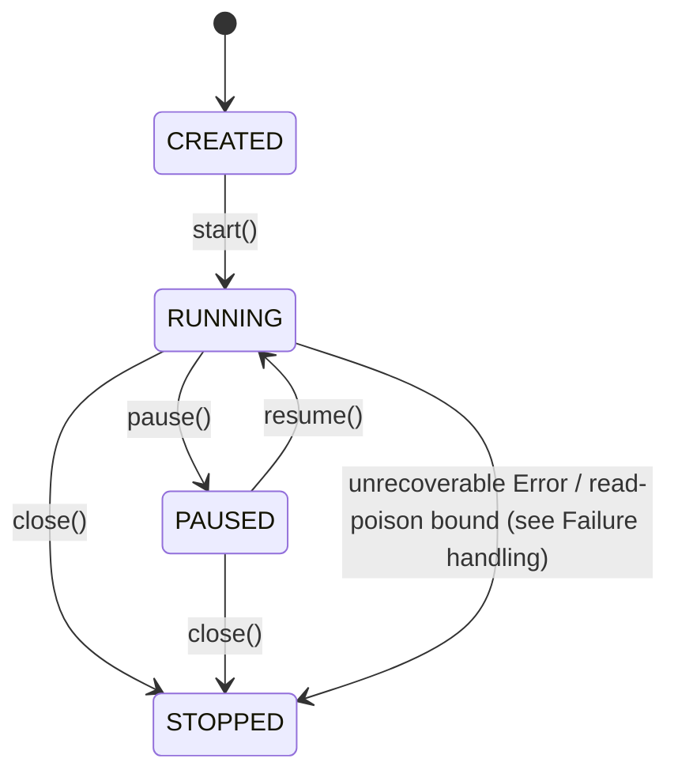

# Subscription Lifecycle

## When to use

Use `SubscriptionLifecycle.pause()` / `resume()` when you need controlled back-pressure: during a maintenance window, a downstream flush, or a rate-limit enforcement.

Use `close()` for permanent shutdown — the subscription cannot be resumed after `close()`.

Do **not** pause subscriptions for long periods — accumulated events will be delivered in a burst on `resume()`.

Do **not** use `SubscriptionLifecycle` if you just want to stop permanently — use `EventSubscription.close()` instead.

## How it works



`SubscriptionLifecycle` extends `EventSubscription` with `pause()`, `resume()`, and `state()`.

`SubscriptionLifecycleState` values: `CREATED`, `RUNNING`, `PAUSED`, `STOPPED`.

`PollingEventSubscription` implements `SubscriptionLifecycle`. Uses `AtomicReference<SubscriptionLifecycleState>` for thread-safe state transitions.

`pause()` interrupts the polling virtual thread. One extra batch may be delivered after `pause()` returns — callers must tolerate at-least-once delivery.

`pause()` and `close()` interrupt the polling thread to cut its sleep or a read short, never a delivery: the listener call and the checkpoint save that follows it run with the interrupt held back, and it is delivered once the page is done. On a virtual thread an interrupt fails every blocking socket call made while the flag is set, so an interrupt landing in the delivery would fail the listener's own database writes (a projection runner commits its batch there) and the checkpoint save, and the page would be delivered again. `close()` waits for the delivery in flight (up to 30 seconds). `PostgresNotificationSubscription.close()` and `StreamEventSubscription.close()` hold their interrupt back the same way. The projection runners stop the same way: `ContinuousProjectionRunner.close()`, `MultiProjectionRunner.stop()` and `ScheduledProjectionRunner.stop()` let a batch being committed, an error strategy's dead-letter write or checkpoint advance, the takeover epoch stamp and the leadership resign finish before the interrupt reaches the thread, so a batch in flight commits instead of being skipped or dead-lettered and the lease is released at once instead of expiring at its TTL.

`resume()` starts a new virtual thread named `streamrune-poll-{subscriptionName}`.

`close()` uses `AtomicReference.set()` (not CAS) — wins regardless of concurrent `pause()` calls. Transitions to `STOPPED` permanently.

## Failure handling

A transient error during a poll — an event-store hiccup, a listener throwing a `RuntimeException` — does **not** stop the subscription. The poll loop is a `ResilientPollLoop`: it logs the failure, sleeps with capped exponential backoff plus jitter, and retries. The subscription stays `RUNNING` throughout; the offset is not advanced past the failed batch, so the retry re-delivers it.

A transient poll error never moves the subscription to `STOPPED`, so there is **no** need for an external watchdog that restarts it after a `RuntimeException`. `STOPPED` is entered in exactly three ways:

- **`close()`** — the normal, terminal shutdown.
- **An unrecoverable `java.lang.Error`** escaping the poll loop (an `AssertionError`, a `LinkageError` from a missing dependency, a `StackOverflowError`). It is not retryable, so the subscription logs it at ERROR and stops terminally rather than leaving a dead poll thread that still reports `RUNNING`.
- **The read-poison bound, when enabled.** With `Builder.readPoisonBound(n)` set above `0`, `n` consecutive *deterministic* read failures at the same checkpoint — an event that can never be deserialized, such as an unregistered type or a corrupt payload — stop the subscription, and `readPoisonError()` returns the `ProjectionReadPoisonException` naming the cause. The default is `0`: a standalone `PollingEventSubscription` retries such a read forever. The projection runners opt in (`ContinuousProjectionRunner` passes its own read-poison limit, 5 by default), so a poisoned event halts the projection and turns its health `DOWN` instead of stalling silently.

`start()` accepts only a `CREATED` subscription, so a `STOPPED` `PollingEventSubscription` cannot be restarted — fix the cause and build a new instance.

The per-stream `StreamEventSubscription` applies the same bound **by default** (`StreamEventSubscription.DEFAULT_READ_POISON_BOUND`, 5; `readPoisonBound(0)` disables it). After a bound stop its `isRunning()` is `false` and `readPoisonError()` reports the cause; unlike `PollingEventSubscription` it may be `start()`ed again once the offending event is repaired (a fresh start resets the poison streak). It is not a `SubscriptionLifecycle`, so it cannot be registered with `SubscriptionHealthContributor` — a standalone `StreamEventSubscription` has no health surface; monitor `isRunning()`, `readPoisonError()` and `consecutiveFailures()` yourself.

To surface a "degraded but still running" status, read `consecutiveFailures()`: it returns the number of consecutive failed poll cycles (`0` when the last cycle succeeded). A sustained non-zero value means the subscription is retrying and downstream events are lagging — alert on it, but do not restart the subscription.

```java
int failures = sub.consecutiveFailures();
if (failures > 0) {
    log.warn("Subscription '{}' degraded: {} consecutive failures (still RUNNING, retrying)",
        "order-projection", failures);
}
```

## Quick example

```java
PollingEventSubscription sub = PollingEventSubscription.builder()
    .subscriptionName("order-projection")
    .eventStore(eventStore)
    .offsetStore(offsetStore)
    .listener(events -> process(events))
    .config(SubscriptionConfig.DEFAULT)
    .fetchSize(100)
    .build();

sub.start(); // CREATED → RUNNING

sub.pause(); // RUNNING → PAUSED
System.out.println(sub.state()); // SubscriptionLifecycleState.PAUSED

sub.resume(); // PAUSED → RUNNING

sub.close(); // RUNNING → STOPPED
```

## Full example

```java
SubscriptionConfig config = SubscriptionConfig.pollingOnly(Duration.ofSeconds(2));

PollingEventSubscription sub = PollingEventSubscription.builder()
    .subscriptionName("inventory-saga-subscription")
    .eventStore(eventStore)
    .offsetStore(offsetStore)
    .listener(runner.asEventListener())
    .config(config)
    .fetchSize(50)
    .build();

sub.start();

// In a health-check callback:
if (downstreamUnavailable()) {
    if (sub.state() == SubscriptionLifecycleState.RUNNING) {
        sub.pause();
    }
} else {
    if (sub.state() == SubscriptionLifecycleState.PAUSED) {
        sub.resume();
    }
}

// Register with JVM shutdown hook:
Runtime.getRuntime().addShutdownHook(new Thread(sub::close));
```

## Configuration

```java
// Default: LISTEN/NOTIFY enabled, 5s polling, 1s jitter
SubscriptionConfig.DEFAULT

// Polling-only, custom interval
SubscriptionConfig.pollingOnly(Duration.ofSeconds(3))

// Full constructor
new SubscriptionConfig(
    true,                      // listenNotifyEnabled
    Duration.ofSeconds(5),     // pollingInterval
    Duration.ofSeconds(1)      // pollingJitter
)
```

All three integrations bind the **same** keys — `StreamRuneQuarkusProperties`'s class javadoc states this explicitly ("the same keys as the Spring and Micronaut integrations, so configuration is portable across runtimes"). `pollingIntervalMs`/`pollingJitterMs` are plain millisecond `long`s on all three (no `ms`/duration-string suffix), kebab-cased to `polling-interval-ms`/`polling-jitter-ms`:

| Setting | Spring | Quarkus | Micronaut | Default |
|---|---|---|---|---|
| Polling interval | `streamrune.polling-interval-ms=5000` | `streamrune.polling-interval-ms=5000` | `streamrune.polling-interval-ms: 5000` | 5000ms |
| Polling jitter | `streamrune.polling-jitter-ms=1000` | `streamrune.polling-jitter-ms=1000` | `streamrune.polling-jitter-ms: 1000` | 1000ms |
| Health lag threshold (lag at which a running subscription reads `DEGRADED`; lag never reads `DOWN`) | `streamrune.subscription.health.lag-threshold=1000` | `streamrune.subscription.health.lag-threshold=1000` | `streamrune.subscription.health.lag-threshold: 1000` | 1000 events |

## Caveats

- At-least-once delivery: one extra batch may be delivered after `pause()` returns. Listeners must be idempotent.
- After `resume()`, there is a brief window where both old and new threads may deliver duplicate events.
- `close()` is terminal — create a new instance if you need to restart.
- Calling `pause()` when not `RUNNING`, or `resume()` when not `PAUSED`, throws `IllegalStateException`.
- The LISTEN/NOTIFY hybrid mode is the default. Use `SubscriptionConfig.pollingOnly()` only if `pg_notify` is not available (e.g., PgBouncer in transaction pooling mode) — it disables push and falls back to polling. `pollingOnly()` addresses only the push path; there is nothing else to fix here, since single-active-consumer leadership does not depend on a session-stable route to Postgres — it is a DB-clocked lease (not a session-scoped advisory lock) and is correct under any pooling mode, including PgBouncer transaction mode. See the [Multi-replica leadership](#multi-replica-leadership-and-standby) section and the production guide, whose PgBouncer note also covers the pooler settings that are not about leadership (prepared statements, session-level settings, schema migration).
- A transient poll error keeps the subscription `RUNNING` (logged + retried with backoff), so `state()` alone will not reveal a degraded subscription. Monitor `consecutiveFailures()` for that — and `readPoisonError()` if you enabled the read-poison bound.

## Multi-replica: leadership and standby

`PollingEventSubscription`'s `SubscriptionLifecycleState` (above) tracks whether *this instance* is paused, running, or stopped — it says nothing about whether more than one instance is safe to run for the same name. Projection runners (`ContinuousProjectionRunner`/`MultiProjectionRunner`, `ScheduledProjectionRunner`) layer a second, orthogonal state — `ProjectionState` — on top for exactly that: single-active-consumer coordination across replicas.

`ProjectionState` adds `STANDBY` alongside `PENDING`/`CATCHING_UP`/`LIVE`/`ERROR`/`STOPPED`: a runner reports `STANDBY` whenever another instance currently holds the lease for its projection/subscription name, meaning this runner does not read, process, or advance the offset. It periodically retries `SubscriptionLeadership.tryAcquire(name)` at poll-interval cadence and takes over automatically — at most `lease-ttl` after the current leader stops renewing (default 15s; see the production guide). A `STANDBY` runner is still registered with `SubscriptionHealthContributor` (it maps to `RUNNING` for lifecycle purposes, like a `SLEEPING` scheduled projection): its health reflects the **shared** checkpoint lag, so a standby is `UP` while some leader is keeping up and `DEGRADED`, with the lag in its health detail, once the subscription falls behind everywhere — whether it is frozen or its leader is still replaying a backlog. Lag never turns the health check `DOWN` (see [Health checks](../production.md#health-checks)); alert on `streamrune.subscriptions.lag`.

Leadership is acquired and re-checked at multiple points, not just once at startup:

- Before catch-up begins, and again before each catch-up batch commits.
- Before subscribing to live events, and again before each live batch commits.
- Before a SKIP or DLQ error-strategy checkpoint advance — these move the offset *forward*, which the monotonic offset guard (see `production.md`) cannot reject on its own; the epoch fence inside `executeAtomically` is what actually stops a stale leader's commit from landing, so a superseded leader is not allowed to advance past events the new leader never saw.

If any of these re-checks finds leadership lost, the runner abandons the in-flight batch **without committing** and drops to `STANDBY` — the next leader re-reads from the last committed checkpoint, safe under the framework's at-least-once contract. With the default `SubscriptionLeadership.NOOP` (single-instance deployments, or `streamrune.subscription.single-active-consumer.enabled=false`), every leadership check trivially succeeds, so this adds no behavior change for a single instance.

See [Multi-replica deployment](../production.md#multi-replica-deployment) in the production guide for the DB-clocked lease and epoch-fencing mechanics, the `lease-ttl` failover bound, and how to disable it.

## Related guides

| Guide | What it covers |
|---|---|
| [retry-and-resilience.md](retry-and-resilience.md) | `RetryPolicy`, circuit breaker, and the command dead-letter queue |
| [saga.md](saga.md) | Sagas — a common driver of an event subscription |
| [outbox.md](outbox.md) | Transactional outbox and its own resilient poll loop |
| [../production.md](../production.md#multi-replica-deployment) | Multi-replica deployment: single-active-consumer leadership, offset-reset path, outbox-FAILED runbook |
