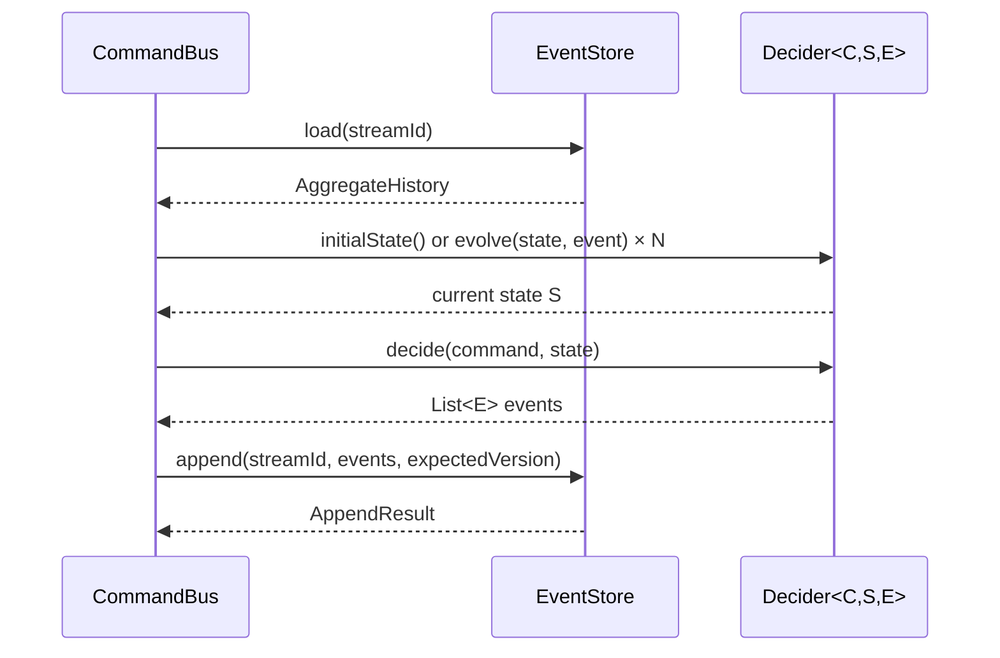
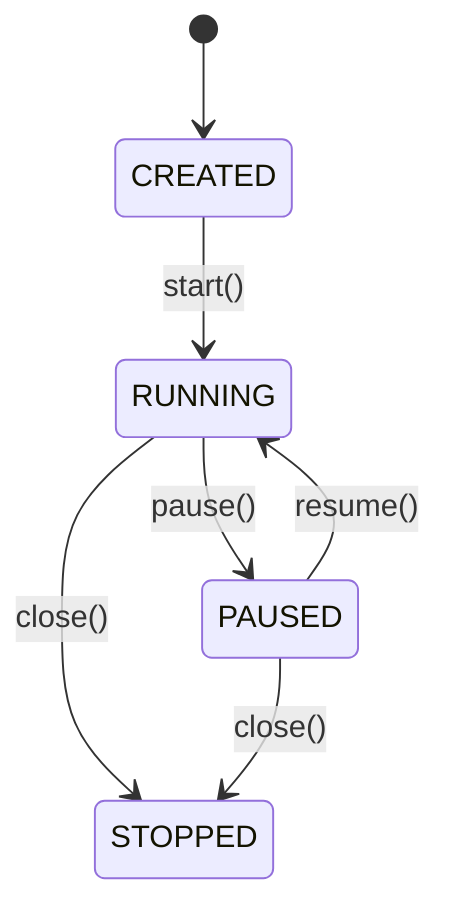

# StreamRune API Reference

StreamRune exposes its public API in three layers: **core contracts** (interfaces and records in
`streamrune-core` that you implement or receive), **value types** (typed wrappers that appear as
parameters and return values), and **extension points** (interfaces you optionally implement for
snapshotting, schema migration, interception, and subscriptions). The runtime entry-point is the
`StreamRune` facade in `streamrune-runtime`, which wires everything together through a fluent
builder. Persistence is provided by `streamrune-postgres` (`PostgresEventStore` /
`PostgresEventStoreFactory`).

## Section 1: Overview

```mermaid
graph TD
    App["Your Application"]
    SR["StreamRune facade\n(CommandBus)"]
    CB["VirtualThreadCommandBus"]
    D["Decider&lt;C,S,E&gt;"]
    ES["EventStore"]
    PG["PostgresEventStore"]
    Proj["Projections\n(PollingEventSubscription)"]

    App -->|execute(command)| SR
    SR --> CB
    CB -->|load + decide + append| ES
    CB --> D
    ES --> PG
    PG -->|LISTEN/NOTIFY| Proj
```

---

## Section 2: Core Contracts

### 2.1 EventStore

`EventStore` is the persistence abstraction for append-only event streams with optional snapshots.
You rarely call it directly — `VirtualThreadCommandBus` (via `StreamRune`) handles all
`load`/`append`/`saveSnapshot` calls on your behalf. You interact with it directly only when
building custom projections or subscription runners.

| Method | Signature | When to use |
|---|---|---|
| `load` | `AggregateHistory load(StreamId streamId)` | Default load; uses any stored snapshot regardless of schema version. |
| `load` (versioned) | `AggregateHistory load(StreamId streamId, int expectedSnapshotVersion)` | Use when snapshot schema versioning is active (i.e., `SnapshotPolicy.everyNEvents(n, version)`). Pass the current `snapshotVersion`; mismatching snapshots are silently dropped and all events are replayed instead. Pass `0` to skip version check (equivalent to the single-arg overload), or `EventStore.IGNORE_SNAPSHOT` (`-1`) to read no snapshot at all; that is what `SnapshotPolicy.never()`, the default, uses. |
| `append` | `AppendResult append(StreamId streamId, List<EventEnvelope> events, Version expectedVersion)` | Always — called by the command bus after `Decider.decide()`. Throws `OptimisticLockException` on version conflict (SQLSTATE 23505 in Postgres). |
| `saveSnapshot` | `void saveSnapshot(StreamId streamId, Version version, AggregateState state)` | Saves snapshot without schema version (defaults to version 1 in Postgres). |
| `saveSnapshot` (versioned) | `void saveSnapshot(StreamId streamId, Version version, AggregateState state, int snapshotVersion)` | Use alongside `SnapshotPolicy.everyNEvents(n, version)` to tag the snapshot with its schema version. |
| `readGlobalStream` | `List<EventEnvelope> readGlobalStream(GlobalOffset afterOffset, int maxCount)` | Used by projections and subscriptions to consume the global event log. |
| `readStream` | `List<EventEnvelope> readStream(StreamId streamId, Version afterVersion, int maxCount)` | Used when replaying a single aggregate stream without loading its snapshot. |

`AppendResult` is a nested record:

```java
record AppendResult(List<GlobalOffset> globalOffsets, Version finalVersion)
```

> **Note:** you rarely call `EventStore` directly; the `VirtualThreadCommandBus` (via `StreamRune`) does.

---

### 2.2 Decider\<C, S, E\>

`Decider` is the pure function contract at the heart of the framework — no I/O, no side effects,
no mutable state. It replaces traditional stateful aggregates with three simple functions that the
command bus calls in sequence. All business logic lives here.

| Type parameter | Constraint | Recommendation |
|---|---|---|
| `C` | Command type | Sealed interface with one record per command variant |
| `S` | `extends AggregateState` | Immutable record; registered in `SimpleEventTypeRegistry` for snapshots |
| `E` | `extends DomainEvent` | Sealed interface with one record per event variant |

```java
S initialState();
List<E> decide(C command, S state);
S evolve(S state, E event);
```



- `initialState()`: called by the command bus for a brand-new stream (no events, no snapshot).
- `decide()`: evaluates the command; throw a domain exception to reject; return an empty list for a
  no-op command.
- `evolve()`: called once per event to fold state; called for both snapshot replay and new events.
  Must be deterministic and side-effect-free.

---

### 2.3 CommandBus

`CommandBus` is the synchronous command dispatcher. `StreamRune` implements this interface — use
`StreamRune` directly in application code rather than depending on `CommandBus` directly.

```java
record CommandResult(
    List<? extends DomainEvent> events,
    StreamId streamId,
    Version finalVersion,
    List<GlobalOffset> globalOffsets,
    List<EventEnvelope> envelopes,
    String shortCircuitedBy,
    ShortCircuitReason reason)
```

`reason` is a discriminator explaining why the handler did or did not run — never `null`:

- `ShortCircuitReason.NONE` — the command executed normally; `events`/`envelopes` are what it produced.
- `ShortCircuitReason.VETOED` — an interceptor's `before()` rejected the command; nothing ran, no events. This is a genuine rejection — map it to `403`/`409`.
- `ShortCircuitReason.IDEMPOTENT_REPLAY` — a prior keyed execution already persisted these events; this call re-ran nothing but the outcome is the original success. **Not a rejection** — map it to `200`/`2xx`, never `409`. A redelivered command (broker redelivery, saga resume, DLQ replay) short-circuits this way.

Three convenience predicates read `reason()` for you: `shortCircuited()` (`reason() != NONE`), `vetoed()`, and `idempotentReplay()`. `shortCircuitedBy` is a human/diagnostic label only (the interceptor name, or the idempotency key value) — branch on `reason()`/the predicates, not on that string.

For async dispatch, use `AsyncCommandBus.executeAsync(C command)` which returns
`CompletableFuture<CommandResult>`. `VirtualThreadCommandBus` implements both `CommandBus` and
`AsyncCommandBus`. `executeAsync` is bounded by an in-flight admission budget
(`streamrune.max-in-flight-async-commands`): past that budget it returns
an already-FAILED future carrying `CommandBusOverloadedException` instead of queuing unbounded
work — treat it as a retry-later signal, the same as `CommandBusClosedException`. A command frees
its slot before its future completes, so a caller that resubmits as soon as the previous future
completes (or from a stage chained on it) is never refused by its own finished command. Cancelling
the returned future (or a caller-applied timeout) never cancels or rolls back a command that has
already committed; it only affects whether the caller observes the result — the command keeps its
slot until it actually finishes.

---

### 2.4 AggregateHistory

`AggregateHistory` is the result of loading an aggregate stream from the event store. It bundles
the latest snapshot state (if any) with all events that occurred after that snapshot, so the
command bus can reconstruct the current aggregate state by first applying the snapshot and then
replaying subsequent events.

When `snapshotState` is `null`, either no snapshot has ever been saved for this stream, or a
snapshot exists but its stored schema version did not match the `expectedSnapshotVersion` passed to
`EventStore.load(StreamId, int)`. In the latter case, all events from the beginning of the stream
are included in the `events` list.

```java
record AggregateHistory(
    AggregateState snapshotState,     // null if no snapshot or version mismatch
    List<EventEnvelope> events,       // events after the snapshot (all events if no snapshot)
    Version version,                  // latest version of the stream
    Version lastSnapshotVersion)      // Version.initial() if no snapshot
```

> **Note:** you rarely construct this directly. The command bus reads it from `EventStore.load()`.
>
> `AggregateHistory.empty()` returns a history with no snapshot, no events, and version 0.

---

### 2.5 EventEnvelope

**Unit of storage.** Wraps a domain event with its positional metadata. `globalOffset` is
`GlobalOffset.initial()` when built before append; the store-assigned value is in
`AppendResult.globalOffsets`. You encounter this in every projection and subscription handler.

Exact record signature: `record EventEnvelope(GlobalOffset globalOffset, StreamId streamId, Version version, EventType eventType, DomainEvent event, EventMetadata metadata)`

`aggregateType()` and `aggregateId()` return the two parts of `streamId()`.

---

## Section 3: Value Types

### StreamId

`record StreamId(AggregateType aggregateType, AggregateId aggregateId)`

The typed identity of one stream: the aggregate type plus the aggregate id. `value()` and
`toString()` show it as `<type>:<id>` (for example `order:ord-42`) — the form used in Java, JSON,
logs and the Kafka message key. The database stores no such text: every stream-keyed table keeps
the two parts in the columns `aggregate_type` and `aggregate_id`.

| Member | Meaning |
|---|---|
| `of(AggregateType, AggregateId)` | The one way application code builds a stream id. Refuses an id of more than 255 characters, so an over-long id fails where the pair is built, before any interceptor runs. |
| `aggregateType()`, `aggregateId()` | The two parts. |
| `value()` | `<type>:<id>` — also the JSON form (a plain string). |
| `parse(String)` | The decode door for `<type>:<id>` text read back from JSON or a Kafka key; it splits at the first `:` (a type never contains one) and is not for application ingress. |

Two aggregate types may use the same id value: `StreamId.of(PRODUCT, AggregateId.of("p-1"))` and
`StreamId.of(INVENTORY, AggregateId.of("p-1"))` are two streams, with their own versions, locks,
snapshots, dead-letter rows and outbox ordering. You encounter `StreamId` in every `EventStore`
method and in `CommandResult`.

### AggregateType

`record AggregateType(String value)`

The name an aggregate's decider is registered under, such as `order` or `inventory`. `of(String)`
validates the syntax `[a-z][a-z0-9_]{0,31}` — a lowercase letter, then lowercase letters, digits
and underscores, at most 32 characters, no `:` — and is the door to use for a constant:
`static final AggregateType ORDER = AggregateType.of("order");`. The canonical constructor is the
decode door for values read back from storage. A type name is permanent: renaming it renames the
streams. You encounter `AggregateType` in `StreamRune.builder().register(...)`, in
`EventEnvelope.aggregateType()`, in `CommandContext.aggregateType`, and in `AuditEntry`.

### Where the typed stream appears

| Type | Member |
|---|---|
| `EventEnvelope` | `streamId()`, plus the convenience accessors `aggregateType()` and `aggregateId()` |
| `CommandInterceptor.CommandContext` | the component `aggregateType`, and `streamId()` (`null` when the command has no target aggregate) |
| `AuditEntry` | the nullable component `aggregateType` beside `aggregateId` — `null` for query-origin and subject entries |
| `AggregateLocker` | `acquireLock(StreamId, Duration)` — one lock per typed stream |
| `LockAcquisitionException` | `streamId()` |
| `OutboxEntry` | the `streamId` ordering key (nullable: `null` means no ordering) |
| `DeadLetterQueue` records | one `streamId` component; `aggregateId()` is derived from it |

### Version

`record Version(long value)`

Per-stream monotonically increasing sequence number starting at 0. Used for optimistic locking:
`EventStore.append` checks that `expectedVersion` matches the stored version; mismatches throw
`OptimisticLockException`. `Version.initial()` returns `Version(0)`. You encounter `Version` in
`EventStore.append`, `AggregateHistory`, `EventEnvelope`, and `AppendResult`.

### GlobalOffset

`record GlobalOffset(long value)`

Monotonically increasing sequence number across all streams in the event store, assigned by the
database on insert. Unlike `Version`, which resets per stream, `GlobalOffset` is unique across the
entire store and is guaranteed never to decrease. `GlobalOffset.initial()` returns `GlobalOffset(0)`
and is used as the sentinel value before append. You encounter `GlobalOffset` in
`EventEnvelope.globalOffset`, `AppendResult.globalOffsets`, and `EventStore.readGlobalStream`.

### EventMetadata

`record EventMetadata(EventId eventId, CommandId commandId, TraceId traceId, SpanId spanId, CorrelationId correlationId, CausationId causationId, UserId userId, Instant timestamp, Map<String, String> baggage)`

Causal metadata attached to every persisted event. Built automatically by
`VirtualThreadCommandBus`; propagates OpenTelemetry trace/span IDs and user ID from
`StreamRuneContext` when a request context is bound. You encounter this inside
`EventEnvelope.metadata()` when writing projections or building audit trails.

The PostgreSQL event store keeps it as JSON in the `event_stream.metadata` column and binds it back
to this record on every read. `eventId`, `commandId`, `correlationId` and `timestamp` are required, the other components
are optional (`baggage` defaults to an empty map), and a key the record does not define is refused.
A row written outside the framework — a hand-written `INSERT`, a data migration — with metadata
that does not bind fails every read of its stream and of the global stream.

### AggregateState

Marker interface that all aggregate state classes must implement. The framework casts deserialized
snapshot payloads to this type, so state classes must also be registered in `EventTypeRegistry`.
Implement as an immutable `record` — sealed interfaces with record permits are recommended. You
encounter this as the `S` type parameter on `Decider<C, S, E>` and as
`AggregateHistory.snapshotState()`.

### DomainEvent

Marker interface that all domain event classes must implement. Sealed interfaces with one `record`
per event variant are strongly recommended. Events must be serializable by the configured Jackson
`ObjectMapper`. You encounter this as the `E` type parameter on `Decider<C, S, E>` and inside
`EventEnvelope.event()`.

---

## Section 4: Policies and Extension Points

### 4.1 SnapshotPolicy

Controls when the framework persists aggregate snapshots, reducing replay time for long-lived
aggregates.

```java
// Never snapshot (default)
SnapshotPolicy.never()

// Snapshot every 50 events, schema version 1
SnapshotPolicy.everyNEvents(50)

// Snapshot every 50 events, schema version 2 (after state class changed)
SnapshotPolicy.everyNEvents(50, 2)
```

When `EveryNEvents(n, snapshotVersion)` is active, the command bus saves a snapshot after
accumulating `n` events since the last snapshot. The `snapshotVersion` tag is stored alongside the
snapshot payload; on load, if the stored `snapshotVersion` does not match `expectedSnapshotVersion`,
the snapshot is discarded and the aggregate is rebuilt from all events. Increment `snapshotVersion`
whenever the aggregate state class structure changes (fields added, renamed, or removed) to ensure
stale snapshots are not silently misinterpreted.

---

### 4.2 EventTypeRegistry

Maps string event-type names and aggregate state class names to their Java `Class<?>` counterparts.
Required by `PostgresEventStore` for JSON deserialization — without it, the store cannot map the
`event_type` column value back to the correct Java class.

The default implementation is `SimpleEventTypeRegistry`, built via its fluent builder:

```java
EventTypeRegistry registry = SimpleEventTypeRegistry.builder()
    .registerEvent("OrderPlaced", OrderPlaced.class)
    .registerEvent("OrderCancelled", OrderCancelled.class)
    .registerState("OrderState", OrderState.class)
    .build();
```

Alternatively, use `StreamRune.builder().registerEventType(name, class)` and
`registerStateType(name, class)` which maintain an internal registry automatically.

You encounter this when creating a `PostgresEventStoreFactory` or `PostgresEventStore` directly.
A custom implementation must also implement `registeredTypes()`: building a `PostgresEventStore`
without a `CryptoEngine` lists every registered type to refuse one with an `@Encrypted` field, and
refuses a registry that cannot list its types.

---

### 4.3 CommandInterceptor

Command interceptors execute cross-cutting concerns around each command execution: audit logging,
authorization checks, rate limiting, metrics collection, circuit breaking. `before()` returns a
`boolean`. Returning `false` **vetoes** the command: the command handler never runs, and the bus
returns a `CommandResult` whose `reason()` is `VETOED` and whose `shortCircuitedBy()` names the
vetoing interceptor.

Interceptors registered via `StreamRune.builder().interceptors(...)` run `before` in registration
order, and `after` and `onError` in reverse registration order, like a middleware stack. Which
callbacks an interceptor receives depends on how the command ends:

| The command... | `before()` | `after()` | `onError()` |
|---|---|---|---|
| executes and commits | every interceptor, in order | every interceptor, in reverse, with `ctx.result()` populated (reason `NONE`) | not called |
| is vetoed by an interceptor's `before()` | up to and including the vetoing one | **called**, in reverse, on every interceptor whose `before()` returned `true`, with a `VETOED` result; the vetoing interceptor itself gets no callback | not called: a veto is a decision, not a failure |
| is an idempotent replay | every interceptor, in order | every interceptor, in reverse, with an `IDEMPOTENT_REPLAY` result | not called |
| fails before commit | every interceptor, in order | not called | every interceptor, in reverse |
| has a `before()` that throws | up to the throwing one, whose exception propagates to the caller | not called | in reverse, on the interceptors whose `before()` returned `true`; neither the thrower nor the ones that never ran |

So `after()` does **not** mean "the command executed". Read `ctx.result()` before counting a success
or releasing a resource there: a vetoed command reaches the `after()` of every interceptor
registered ahead of the vetoing one (use `result().vetoed()`, or `reason()`, to tell it apart).
`AuditCommandInterceptor` relies on this to record `VETOED` rows. An exception thrown from `after()`
or `onError()` is logged and swallowed by the bus, and never changes the command's outcome. The full
contract is the javadoc of `CommandInterceptor`.

The `CommandInterceptor` interface provides two static factory methods:
- `compose(first, second)` — creates a new interceptor that chains two interceptors. If either `before()` returns `false` the composed unit vetoes, and the bus treats the whole unit as the vetoing interceptor: neither member receives `after()` for that command.
- `noop()` — returns a no-op interceptor useful as a placeholder or test double.

Built-in implementations provided by `streamrune-runtime` and integrations:
- `AuditCommandInterceptor` — writes one `AuditEntry` per command to an `AuditStore`: `SUCCESS`, `FAILURE`, or `VETOED`.
- `AuthorizationCommandInterceptor` — evaluates a `CommandAuthorizationPolicy` before execution.
- `AnnotationAuthorizationInterceptor` — enforces `@RequireRole` and `@RequirePermission` on the command type.
- `BeanValidationInterceptor` — validates the command with JSR-380 Bean Validation before execution.
- `CircuitBreakerCommandInterceptor` — opens the circuit after a configurable failure threshold.
- `OpenTelemetryCommandInterceptor` — propagates OpenTelemetry trace context.

---

### 4.4 EventUpcaster

```java
public interface EventUpcaster {
    EventType eventType();         // e.g., new EventType("OrderPlaced")
    int currentVersion();          // e.g., 3
    Map<String, Object> upcast(Map<String, Object> eventData, int fromVersion);
}
```

Handles one event type; that one upcaster owns every version step of the type (`UpcasterChain`
refuses a second upcaster for the same type). The chain applies the steps automatically: if the
stored `schema_version` is 1 and `currentVersion()` is 3, `upcast` is called twice (1→2, then 2→3).
On write, the current schema version is recorded in the `schema_version` column; on read, if the
stored version is lower than `currentVersion()`, upcasting is applied before deserialization, and a
stored version above it fails the read. Register on the store
(`PostgresEventStore.builder().upcasters(List.of(...))`), via
`StreamRune.builder().upcasters(List.of(...))` together with an event store factory, or — with the
Spring, Quarkus or Micronaut integration — as `EventUpcaster` beans.

**The stamp records the writer's chain, not the payload.** The version recorded on write is the
`currentVersion()` the writing store's chain has for the type at that moment — 1 when it has no
upcaster for it. An event appended by a release that already had the new field but not yet the
upcaster is stamped 1, and every later read runs the 1→2 step on a payload that already carries the
field. Write every step so it keeps what the payload already has: `putIfAbsent` for a new field
with a default, never an unconditional `put`, which would replace the real value on every read.

---

### 4.5 SnapshotMigration

```java
public interface SnapshotMigration {
    int fromVersion();
    int toVersion();
    AggregateState migrate(AggregateState state);
}
```

Used when you want to migrate existing snapshots in-place rather than simply ignoring them.
Differs from `EventUpcaster` in that it operates on already-deserialized state objects rather than
raw JSON maps, so it is type-safe and avoids a re-serialization round-trip. When both snapshot
migration and event upcasting are needed, upcasting is applied first (to events), then snapshot
migration (to the snapshot state). The interface is defined in `streamrune-core`; migration
instances are applied automatically by the store when a snapshot at `fromVersion()` is loaded.

---

### 4.6 SubscriptionLifecycle

```java
public interface SubscriptionLifecycle extends EventSubscription {
    void pause();   // throws IllegalStateException if not RUNNING
    void resume();  // throws IllegalStateException if not PAUSED
    SubscriptionLifecycleState state();
}
```



State machine: `CREATED → RUNNING → PAUSED → RUNNING → STOPPED`. The `STOPPED` state is terminal;
once stopped, a subscription cannot be restarted. Implemented by `PollingEventSubscription` (pure
polling) and `HybridEventSubscription` (PostgreSQL LISTEN/NOTIFY + polling fallback). Use
`pause()` / `resume()` to temporarily halt event delivery during backpressure or maintenance
windows without losing position — the next `resume()` continues from the last committed offset.

---

## Section 5: Configuration — StreamRune.builder()

The `StreamRune.Builder` is the entry point for wiring the entire framework. Call
`StreamRune.builder()`, configure all components, then call `build()` to obtain a ready-to-use
`StreamRune` instance.

| Method | Description | Default |
|---|---|---|
| `eventStore(EventStore)` | Sets the event store directly. Mutually exclusive with `eventStoreFactory`. | — (required unless `eventStoreFactory` is set) |
| `withEventStore(EventStore)` | Alias for `eventStore()`. | — |
| `eventStoreFactory(EventStoreFactory)` | Sets a factory to lazily create the event store (e.g., `PostgresEventStoreFactory`). | — |
| `eventStoreFactoryProvider(ConfiguredEventStoreFactoryProvider)` | Sets a provider that receives the builder's accumulated settings (type registry, crypto engine, upcasters) and returns the `EventStoreFactory`. `close()` closes the factory it returned when it is `AutoCloseable`. | — |
| `registerEventType(String name, Class<?> eventClass)` | Registers an event class for JSON deserialization by name. | — |
| `registerStateType(String name, Class<?> stateClass)` | Registers a snapshot state class for deserialization by name. | — |
| `register(AggregateType, Class<C>, Function<C,AggregateId>, Decider<C,?,?>)` | Registers a decider for a command type under the aggregate type it belongs to, with a **typed** `AggregateId` extractor function (not a raw `String`). The call refuses (`IllegalArgumentException`) a second registration for the same command type, a command type that overlaps an already-registered one (one is assignable to the other) under a different aggregate type, and a decider instance already registered under a different aggregate type. Several unrelated command roots may share one aggregate type. | — (required per command type) |
| `registerDecider(AggregateType, Class<C>, Function<C,AggregateId>, Decider<C,?,?>)` | Alias for `register()`. | — |
| `locker(AggregateLocker)` | Overrides the default striped in-process locker (`AggregateLocker.acquireLock(StreamId, Duration)` locks one typed stream). | `LocalStripedLocker` with 1024 stripes |
| `lockTimeout(Duration)` | Maximum wait time to acquire an aggregate lock; `null` is rejected at the builder. | `Duration.ofSeconds(5)` |
| `stripeCount(int)` | Stripe count for the default `LocalStripedLocker`. | `1024` |
| `retryPolicy(RetryPolicy)` | Retry policy for `OptimisticLockException`. | `RetryPolicy.DEFAULT` (3 attempts, 50 ms initial, 2× backoff, jitter) |
| `snapshotPolicy(SnapshotPolicy)` | Controls when snapshots are persisted. | `SnapshotPolicy.never()` |
| `cryptoEngine(CryptoEngine)` | Enables field-level encryption via the `@Encrypted` annotation. | none |
| `upcasters(List<EventUpcaster>)` | Event upcasters for schema evolution. Applied on read. | none |
| `interceptors(List<CommandInterceptor>)` | Command interceptors for cross-cutting concerns. | none |
| `interceptors(CommandInterceptor...)` | Varargs convenience form of `interceptors(List)`. | none |
| `asyncTaskWrapper(UnaryOperator<Runnable>)` | Wraps each task `executeAsync` spawns. Runs on the submitting thread, so it can capture thread-bound caller context (such as the current OpenTelemetry context) that does not cross into the new virtual thread. | none |
| `objectMapper(ObjectMapper)` | The Jackson `ObjectMapper` that writes a command as JSON when the bus dead-letters it. Required when `deadLetterQueue` is set. The retry runner rebuilds the command from that JSON on replay, so a command type must round-trip through Jackson (records do by default; see [Dead-letter queue](../guide/advanced/retry-and-resilience.md#dead-letter-queue)). `DeadLetterRetryRunner.createObjectMapper(cryptoEngine)` builds a mapper for both sides. | none (the framework integrations supply one) |
| `deadLetterQueue(DeadLetterQueue)` | Persists commands that fail after all retries. | none |
| `metrics(StreamRuneMetrics)` | Metrics collector (e.g., `MicrometerStreamRuneMetrics`). | `StreamRuneMetrics.NOOP` |
| `registerProjection(String name, Projection, ProjectionDeliveryMode)` | Registers a projection to run via `startProjections()` under its declared delivery mode — `TRANSACTIONAL_LOCAL`, `AT_LEAST_ONCE_IDEMPOTENT` or `EXTERNAL_EFFECT`; required, there is no default (see [Delivery modes](../guide/concepts.md#delivery-modes--what-a-projection-promises)). The runner checks the mode against its `AtomicBatchProcessor` before it reads an event. | none |
| `projectionRunner(ProjectionRunner)` | Sets the projection runner implementation. | none |
| `subscriptionConfig(SubscriptionConfig)` | Sets polling interval and jitter for live subscriptions. | `SubscriptionConfig.DEFAULT` |
| `build()` | Builds the `StreamRune` instance. Throws `IllegalStateException` if neither `eventStore` nor `eventStoreFactory` is configured, or if a registered command type declares `@RequireRole`/`@RequirePermission` and no `AnnotationAuthorizationInterceptor` is among the interceptors (see [Authorization](../guide/advanced/authorization.md#annotation-based-authorization)). | — |

---

## Javadoc

For exhaustive method-level detail, type hierarchies, and record component documentation, see
the generated Javadoc:

```bash
./gradlew javadoc
# Output: build/docs/javadoc/index.html
```

The Javadoc is organized by module:
- `streamrune-core` — all contracts, value types, and extension point interfaces
- `streamrune-runtime` — `StreamRune` facade, `VirtualThreadCommandBus`, and built-in interceptors
- `streamrune-postgres` — `PostgresEventStore`, `PostgresEventStoreFactory`, and Postgres-specific types
