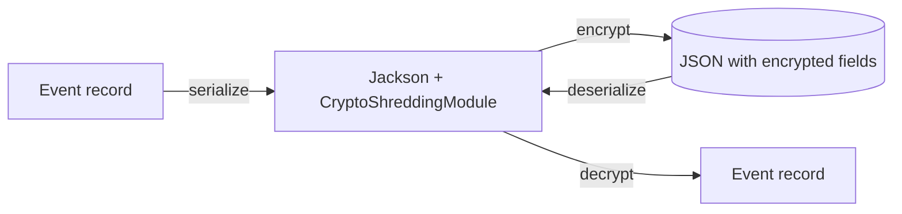

# StreamRune Crypto

Encryption-at-rest support for event payloads with a key per data subject: the Jackson `CryptoShreddingModule`, the `CachedCryptoEngine` decorator and the `ForgottenSubjectStore` tombstone SPI. The `CryptoEngine` SPI, the `@Encrypted` annotation and the crypto exceptions live in `streamrune-core` (`org.streamrune.core.crypto`); key storage comes from a backend module (filesystem, PostgreSQL, Vault, AWS KMS).

## Overview

Annotate PII components of your record events with `@Encrypted`. A Jackson module intercepts serialization and deserialization, encrypting and decrypting automatically; the record's other components read back exactly as they would without the module (a `BigDecimal` keeps its scale, an `Instant` its nanoseconds). When a subject's key is deleted (GDPR "right to be forgotten"), the field reads as `"[REDACTED]"` instead of throwing — enabling event replay to continue. Only a `KeyNotFoundException` from the engine produces `"[REDACTED]"`; every other failure propagates.



## Usage

### 1. Annotate PII fields

```java
public record OrderPlaced(
    String orderId,
    @Encrypted(subjectId = "customerId") String customerEmail,
    @Encrypted(subjectId = "customerId") String customerName,
    String customerId
) implements DomainEvent {}
```

`subjectId` names the record component that holds the data subject id; that subject's key encrypts the field. Both the `@Encrypted` component and the subject-id component must be `String`s, and the subject-id component must not itself be `@Encrypted` — the module rejects a violating record with `CryptoMappingException`.

### 2. Register the module

```java
// InMemoryCryptoEngine is the test double from streamrune-test; it mints a subject's key on the
// first encrypt. In production use a backend module's engine instead.
CryptoEngine engine = new InMemoryCryptoEngine();

ObjectMapper mapper = new ObjectMapper();
mapper.registerModule(new CryptoShreddingModule(engine));
// or new CryptoShreddingModule(engine, metrics) to count redactions in streamrune.crypto.subject_redacted
```

### 3. Serialize and deserialize

```java
OrderPlaced placed = new OrderPlaced("order-1", "alice@example.com", "Alice", "cust-1");
String json = mapper.writeValueAsString(placed);
// customerEmail and customerName are now Base64 ciphertext in the JSON

OrderPlaced restored = mapper.readValue(json, OrderPlaced.class);
// customerEmail and customerName are decrypted automatically
```

### JSON output (before/after)

**Before encryption:**
```json
{
  "orderId": "order-1",
  "customerEmail": "alice@example.com",
  "customerName": "Alice",
  "customerId": "cust-1"
}
```

**After encryption:**
```json
{
  "orderId": "order-1",
  "customerEmail": "base64-ciphertext...",
  "customerName": "base64-ciphertext...",
  "customerId": "cust-1"
}
```

### Crypto shredding (key deletion)

```java
engine.deleteKey(SubjectId.of("cust-1"));
// Now deserializing any event whose @Encrypted fields belong to subject "cust-1"
// returns "[REDACTED]" instead of the actual value
```

Event replay continues even after keys are deleted — critical for GDPR compliance.

### Terminal erasure

`deleteKey` is the GDPR Article 17 operation and is **terminal** on every engine StreamRune ships. After a forget, a subsequent `encrypt(subjectId, …)` throws `SubjectForgottenException` instead of silently minting a fresh key — preventing a retried command or re-imported event from writing new, recoverable PII under a new key for an erased subject. Decrypt of the subject's old ciphertext keeps throwing `KeyNotFoundException` (→ `"[REDACTED]"`), unchanged.

How the tombstone is kept differs per backend:

- `streamrune-filesystem-crypto` and `streamrune-postgres-crypto` delete the subject's key and persist a tombstone themselves.
- `streamrune-vault-crypto` and `streamrune-aws-kms-crypto` record the tombstone in a `ForgottenSubjectStore` that their builders **require** — `build()` throws without one (use the durable `JdbcForgottenSubjectStore` from `streamrune-postgres-crypto`). Vault also deletes its transit key; AWS KMS has no per-subject key to delete.
- `InMemoryCryptoEngine` (streamrune-test) keeps an in-memory tombstone, so tests see the same behaviour.

To legitimately re-register a forgotten subject, lift its tombstone explicitly with `engine.reinstate(subjectId)` — the only re-registration path on every engine; none offers an engine-wide opt-out. In an application, call it through `ForgetSubjectService.reinstate(subjectId, requester)` (in `streamrune-runtime`), which records the reinstate in the audit log as `GDPR_REINSTATE`; the engine method alone writes no audit record. What pre-erasure ciphertext reads as afterwards is backend-specific: filesystem and PostgreSQL keep it `"[REDACTED]"` (the new key is a higher generation), Vault refuses `reinstate` after a completed erasure, and AWS KMS makes it readable again because the shared CMK was never destroyed — see those modules' READMEs.

`CachedCryptoEngine` only caches `decrypt` results, so it passes `SubjectForgottenException` through unchanged and never caches around it; `deleteKey` still evicts all of the subject's cached entries.

## Key Components

| Component | Description |
|---|---|
| `CryptoShreddingModule` | Jackson `SimpleModule` for transparent encrypt/decrypt |
| `CachedCryptoEngine` | Decorator caching `decrypt` results, with a mandatory write-TTL ceiling |
| `ForgottenSubjectStore` | Tombstone SPI used by the Vault and AWS KMS engines; `InMemoryForgottenSubjectStore` is the process-local implementation for tests |
| `InMemoryCryptoEngine` | AES-256-GCM in-memory test engine, keys lost on JVM restart — in `streamrune-test` (`org.streamrune.test`), not this module |
| `Encrypted` | `@Target(RECORD_COMPONENT)` annotation marking `String` components to encrypt — in `streamrune-core` |
| `CryptoEngine` | Interface in `streamrune-core`: `encrypt`, `decrypt`, `deleteKey`, `reinstate`, `isKeyAvailable`, `requiredCryptoTables` |
| `CryptoOperationException` | Infrastructure failures (I/O, database, remote KMS/Vault). Thrown bare, it reads as transient: callers retry |
| `CryptoMappingException` | Deterministic subtype of `CryptoOperationException`: a mapping refusal raised by `CryptoShreddingModule`, or an engine's verdict on the ciphertext itself (malformed, tampered, unsupported format). Read-path classifiers quarantine it instead of retrying. Every shipped engine raises it for such verdicts; a third-party engine should too — the bare type is retried as an outage |
| `KeyNotFoundException` | Thrown when a deleted key is accessed on **decrypt** (mapped to `"[REDACTED]"`) |
| `SubjectForgottenException` | Thrown when **encrypt** is attempted for a crypto-shredded subject — see *Terminal erasure* |

## Requirements

- Java 25
- Depends on `streamrune-core`, Jackson databind and Caffeine

## Installation

```groovy
// build.gradle
implementation("org.streamrune:streamrune-crypto-api:1.0.0-alpha-SNAPSHOT")
```

```kotlin
// build.gradle.kts
implementation("org.streamrune:streamrune-crypto-api:1.0.0-alpha-SNAPSHOT")
```

> `1.0.0-alpha-SNAPSHOT` is an unreleased preview, published only to the Maven Central snapshot
> repository: add that repository as shown in [Preview builds](../../README.md#preview-builds). See
> the [CHANGELOG](../../CHANGELOG.md) for what the preview contains.

## Best Practices

- **One key per subject** — use the customer/user ID as the key alias, not a shared application key.
- **Never lose keys for active subjects** — `InMemoryCryptoEngine` loses every key on restart. For production, use a durable backend (`streamrune-postgres-crypto`, `streamrune-filesystem-crypto`, `streamrune-vault-crypto` or `streamrune-aws-kms-crypto`).
- **Combine with event upcasters** — when adding `@Encrypted` to a field on an existing event type, add an upcaster to populate the new field before encryption.
- **Audit key operations** — log key creation and deletion for compliance.

## Known Limitations

- **`InMemoryCryptoEngine` is single-JVM only** — keys are lost on restart. Do not use in production without a shared KMS.
- **No key rotation** — rotating a key requires re-encrypting all events. Plan for this before go-live.
- **`@Encrypted` only works on record components** — not on regular class fields.
- **IV is stored with ciphertext** — the AES-GCM engines (in-memory, filesystem, PostgreSQL) store a random 12-byte IV inside each ciphertext.
- **`[REDACTED]` is an in-band marker** — a field whose real plaintext is `"[REDACTED]"` reads the same as a shredded one. Ask the engine (`isKeyAvailable(subjectId)`) to tell them apart.
- **Validation must tolerate the marker** — a record whose compact constructor rejects `"[REDACTED]"` in an `@Encrypted` component cannot be loaded once its subject is forgotten; the module then fails with a `CryptoMappingException` naming the record and field.
