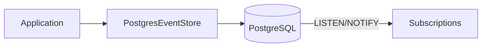

# StreamRune Postgres

PostgreSQL-backed `EventStore` implementation. Uses JSONB for event payloads, advisory locks for distributed concurrency, and LISTEN/NOTIFY for live event delivery.

## Overview

Production-grade persistence for StreamRune. Optimistic locking via a unique constraint on `(aggregate_type, aggregate_id, version)`, snapshot storage, gap-free commit-ordered global offsets, a dead letter queue, and subscription support via PostgreSQL LISTEN/NOTIFY.



## Installation

```groovy
// build.gradle
implementation("org.streamrune:streamrune-postgres:1.0.0-alpha-SNAPSHOT")
```

```kotlin
// build.gradle.kts
implementation("org.streamrune:streamrune-postgres:1.0.0-alpha-SNAPSHOT")
```

> `1.0.0-alpha-SNAPSHOT` is an unreleased preview, published only to the Maven Central snapshot
> repository: add that repository as shown in [Preview builds](../../README.md#preview-builds). See
> the [CHANGELOG](../../CHANGELOG.md) for what the preview contains.

## Database Schema

The schema ships with the module as one Flyway baseline, `V001__streamrune_baseline.sql`, at
`classpath:db/streamrune-migration`. It is recorded in its own history table,
`flyway_schema_history_streamrune`, so it never shares a version namespace with the application's
own migrations, and every object is created unqualified in the connection's current schema. The
baseline creates `event_stream`, `global_offset_sequence`, `snapshot_store`, `projection_offset`,
`subscription_leases`, `projection_dead_letters`, `command_inbox`, `dead_letter_queue`,
`audit_log`, `event_audit_log`, `outbox_events`, `saga_state` and `saga_dead_letters`. Read the
file itself for the column definitions.

`PostgresEventStoreFactory.create()` applies it by default (`autoInitializeSchema(true)`); it
tolerates a schema that already holds the application's own tables. When the configured
`CryptoEngine` needs crypto tables, it also applies the crypto baseline at
`classpath:db/crypto-migration` (shipped in `streamrune-postgres-crypto`) on its own history table,
`flyway_schema_history_crypto`.

The factory looks up each script by its exact name instead of letting Flyway list the
migration directory, so auto-initialization also works in a GraalVM native image, provided the
scripts are registered as resources (the Spring, Quarkus and Micronaut integrations register both
series; a plain-Java application follows Quickstart §10). A script missing from the class path
fails `create()` and `initializeSchema()` with an `IllegalStateException` that names it, before
anything is written. The module's `native-image.properties` enables the `https` URL protocol, which
Flyway needs to construct itself in a native image.

`create()` then validates the schema with `SchemaValidator` (`validateSchema(true)` by default):
a missing required table or column, a missing `global_offset_sequence` row, or a
`flyway_schema_history_streamrune` version behind the one this build ships fails with
`SchemaValidationException`; a missing history table only logs a warning. To manage the schema
yourself, call `autoInitializeSchema(false)` and apply the same migration location with your own
tooling.

## Usage

```java
PostgresEventStoreFactory factory = new PostgresEventStoreFactory(dataSource, typeRegistry)
    .cryptoEngine(cryptoEngine)                  // optional
    .upcasters(upcasters)                        // optional
    .statementTimeout(Duration.ofSeconds(30));   // optional, the default
EventStore store = factory.create(); // applies + validates the schema
```

The store borrows one connection from `dataSource` per operation and returns it when the operation
ends. The factory builds no pool of its own and changes none of the DataSource's settings, so pass
your application's connection pool (HikariCP, Agroal, …): its size and settings are the ones in
force, and closing it stays with your application. A plain `PGSimpleDataSource` works, but opens a
new physical connection for every operation.

`statementTimeout` (default 30 s; `Duration.ZERO` sets none) bounds every statement the store runs.
An append transaction carries it as `SET LOCAL statement_timeout`, which also covers the outbox,
inbox and audit rows written in that transaction; every other statement carries it as its JDBC
query timeout. Neither touches the connection's session, so the next borrower sees your own
`statement_timeout` again. A statement past the bound fails with SQLState `57014`, reported as an
`EventStoreException`.

## JSONB Event Format

**Payload column:**
```json
{
  "orderId": "order-123",
  "product": "Widget",
  "qty": 3
}
```

`@Encrypted` fields are stored as ciphertext in the payload when a `CryptoEngine` is configured.

**Metadata column:** the serialized `EventMetadata` record — `eventId`, `commandId`, `traceId`,
`spanId`, `correlationId`, `causationId`, `userId`, `timestamp` and `baggage`.

## Key Components

| Component | Description |
|---|---|
| `PostgresEventStore` | Main implementation, JSONB storage, optimistic locking |
| `PostgresEventStoreFactory` | Factory: constructor + fluent setters + `create()`; applies and validates the schema, builds the store on your DataSource |
| `PgAdvisoryLocker` | Distributed locking via `pg_advisory_xact_lock` |
| `PostgresNotificationSubscription` | Live events via LISTEN/NOTIFY |
| `HybridEventSubscription` | Combines polling + notifications |
| `PostgresDeadLetterQueue` | Dead letter queue for failed commands |
| `LeaseBasedLeadership` | Single-active-consumer leadership: a database-clocked lease with a fencing epoch |
| `SchemaValidator` | Checks required tables, columns and the schema history version |
| `PostgresServerVersion` | The supported server floor (PostgreSQL 17) and its startup check, `requireSupported(dataSource)`; `UnsupportedServerVersionException` is what an older server gets |

## Requirements

- Java 25
- PostgreSQL 17 or newer (uses JSONB, advisory locks). CI runs every PostgreSQL-backed suite on 17 and on 18; `PostgresEventStoreFactory.create()` refuses an older server with `UnsupportedServerVersionException` before it migrates anything, whatever the schema flags say (`PostgresServerVersion.requireSupported(dataSource)` is the same check for code that builds the stores without the factory)
- Depends on `streamrune-core`, `streamrune-runtime` and `streamrune-crypto-api`, plus Flyway, HikariCP and the PostgreSQL JDBC driver

## Best Practices

- **Size the pools** — the factory pools its own connections (see Usage). `PgAdvisoryLocker` holds a lock connection for the whole command while the store borrows another, so prefer `PgAdvisoryLocker.withDedicatedPool(jdbcUrl, username, password, maxPoolSize)` over sharing the event-store pool.
- **Let the factory own the schema** — keep `autoInitializeSchema` on unless you apply `db/streamrune-migration` yourself; keep `validateSchema` on either way.
- **Use `HybridEventSubscription` for live delivery** — LISTEN/NOTIFY push plus a polling fallback; its javadoc names it the recommended subscription for production.
- **Combine with `PgAdvisoryLocker`** — for distributed deployments, use advisory locks instead of `LocalStripedLocker`.

## Known Limitations

- **One write lane** — every append reserves its global offsets from the single-row `global_offset_sequence` counter and holds that row lock until it commits, so appends to unrelated streams serialize. This is the price of gap-free, commit-ordered global offsets: write throughput does not grow with application instances (see the `PostgresEventStore` class javadoc). Reads and projections never touch the counter.
- **Single writable primary** — no multi-master replication; use primary/standby failover (e.g. Patroni) for HA.
- **NOTIFY is best-effort** — it is sent after commit and carries only the highest new global offset; events are always read from `event_stream`. A lost notification is recovered by the subscriptions' polling fallback.
- **No embedded mode** — requires a running PostgreSQL instance. Use `InMemoryEventStore` for development without Docker.
