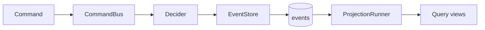

# StreamRune Runtime

Command bus, projection runners, and aggregate locking for StreamRune.

## Overview

StreamRune Runtime provides the runtime layer for a StreamRune application: a command bus built on Java virtual threads, projection runners for building read models, and distributed aggregate locking.

The main entry point is `StreamRune`, a fluent builder facade that wires together an `EventStore`, registered deciders, projections, and cross-cutting concerns.



## Usage

```java
var streamRune = StreamRune.builder()
    // Crypto/upcasters/type-registrations are only honored on a store the facade
    // constructs itself — pass eventStoreFactoryProvider(...) so the engine reaches it.
    // The store borrows from your DataSource; closing the DataSource stays with you.
    .eventStoreFactoryProvider(settings ->
        new PostgresEventStoreFactory(dataSource, settings.typeRegistry())
            .cryptoEngine(settings.cryptoEngine())
            .upcasters(settings.upcasters()))
    .cryptoEngine(cryptoEngine)
    .registerEventType("OrderPlaced", OrderPlaced.class)
    .registerDecider(AggregateType.of("order"), PlaceOrderCommand.class,
        c -> AggregateId.of(c.orderId()), new OrderDecider())
    .metrics(micrometerMetrics)
    .build();

CommandBus.CommandResult result = streamRune.execute(new PlaceOrderCommand(orderId, items));
```

> If you already hold a **pre-built** `EventStore` (or pass a configured factory to
> `eventStoreFactory(EventStoreFactory)`), set the engine on the store's factory
> directly (e.g. `new PostgresEventStoreFactory(...).cryptoEngine(...)`) and do **not** also
> call `.cryptoEngine(...)` on the `StreamRune` builder — `build()` rejects crypto, upcasters,
> and `registerEventType`/`registerStateType` on those forms via `requireNotConfigured`.

## Key Components

| Component | Description |
|---|---|
| `StreamRune` | Fluent builder facade, implements `CommandBus` and `AutoCloseable` |
| `VirtualThreadCommandBus` | Command bus using Java virtual threads for concurrent command processing |
| `LocalStripedLocker` | Per-aggregate-ID locking with configurable stripe count (default: 1024) |
| `ContinuousProjectionRunner` | Runs projections continuously using event subscriptions |
| `PollingProjectionRunner` | Runs projections by polling the global event stream |
| `MultiProjectionRunner` / `ScheduledProjectionRunner` | Run several registrations on one processor, continuously or on a cron schedule |
| `SseEventPublisher` | Server-Sent Events publisher for live projection delivery |

## Builder Options

| Option | Description |
|---|---|
| `eventStore(EventStore)` | A pre-built event store (not closed by `close()`) |
| `eventStoreFactoryProvider(settings -> factory)` | Builds the event store factory from the collected settings; the facade calls `create()`, and closes the factory on `close()` when it is `AutoCloseable` |
| `registerDecider(AggregateType, Class, Function, Decider)` | Register a decider for a command type under the aggregate type its streams carry (`order` → streams `order:<id>`); refuses a duplicate command type, overlapping command roots under different types, and one decider instance under two types |
| `cryptoEngine(CryptoEngine)` | Encryption engine for event payloads (factory forms only) |
| `upcasters(List<EventUpcaster>)` | Schema migration chain (factory forms only) |
| `locker(AggregateLocker)` | Aggregate locking (default: `LocalStripedLocker`) |
| `retryPolicy(RetryPolicy)` | Retry policy for optimistic lock conflicts |
| `snapshotPolicy(SnapshotPolicy)` | Snapshot frequency |
| `metrics(StreamRuneMetrics)` | Metrics collector (use `MicrometerStreamRuneMetrics` from `streamrune-integration-api`) |
| `registerProjection(String, Projection, ProjectionDeliveryMode)` | Register a projection to run under its declared delivery mode (required, no default); requires `projectionRunnerFactory(...)` or `projectionRunner(...)`, otherwise `build()` throws |
| `projectionRunnerFactory((store, config) -> runner)` | Creates one projection runner per registered projection |
| `deadLetterQueue(DeadLetterQueue)` | Queue for failed commands after retries exhausted (requires `objectMapper(...)`) |

## Requirements

- Java 25 (uses virtual threads)
- Depends on `streamrune-core` and `streamrune-crypto-api`

## Installation

```groovy
// build.gradle
implementation("org.streamrune:streamrune-runtime:1.0.0-alpha-SNAPSHOT")
```

```kotlin
// build.gradle.kts
implementation("org.streamrune:streamrune-runtime:1.0.0-alpha-SNAPSHOT")
```

> `1.0.0-alpha-SNAPSHOT` is an unreleased preview, published only to the Maven Central snapshot
> repository: add that repository as shown in [Preview builds](../README.md#preview-builds). See
> the [CHANGELOG](../CHANGELOG.md) for what the preview contains.

## Best Practices

- **Use virtual threads correctly** — `execute(...)` runs the command synchronously on the calling thread and blocks it on the aggregate lock and event-store I/O, so call it from virtual threads where you can; `VirtualThreadCommandBus.executeAsync(...)` (the `AsyncCommandBus` contract; the `StreamRune` facade exposes only `execute`) runs each command on its own virtual thread.
- **Stripe count** — `LocalStripedLocker` uses 1024 stripes by default. Increase for high-contention aggregates, or use `PgAdvisoryLocker` for distributed deployments.
- **Snapshot policy** — configure `SnapshotPolicy.everyNEvents(100)` or similar to avoid replaying all events on every aggregate load.
- **Declare what each projection promises** — every runner builder takes an explicit `atomicProcessor(...)` and every registration a `ProjectionDeliveryMode`. A projection that extends `BaseProjection` over the `JdbcProjectionRepository` you pass as the processor is `TRANSACTIONAL_LOCAL` (its writes and the checkpoint commit in one transaction); one that writes anywhere else is `AT_LEAST_ONCE_IDEMPOTENT` and must be idempotent. `AtomicBatchProcessor.nonAtomicAtLeastOnce()` is the processor for a runner of `AT_LEAST_ONCE_IDEMPOTENT` projections without leadership. The runners check the pairing before they read an event — see [Delivery modes](../docs/guide/concepts.md#delivery-modes--what-a-projection-promises).

  ```java
  var runner = ContinuousProjectionRunner.builder()
      .eventStore(eventStore)
      .offsetStore(offsetStore)                 // PostgresOffsetStore over the repository's DataSource
      .atomicProcessor(jdbcProjectionRepository)
      .build();
  // run(...) blocks until the runner is stopped; give it a thread of its own.
  // OrderProjection extends BaseProjection and saves under the name it is registered under.
  runner.run(ProjectionName.of("orders"), new OrderProjection(jdbcProjectionRepository),
      ProjectionDeliveryMode.TRANSACTIONAL_LOCAL);
  ```
- **Close on shutdown** — call `streamRune.close()` to stop projections, close the command bus and close an `AutoCloseable` factory passed via `eventStoreFactory(EventStoreFactory)` or produced by `eventStoreFactoryProvider(...)`. A store passed via `eventStore(EventStore)` is not closed. `PostgresEventStoreFactory` owns nothing to close: the event store borrows from your `DataSource`, which you close yourself.

## Known Limitations

- `LocalStripedLocker` is **single-JVM only** — does not coordinate across nodes. Use `PgAdvisoryLocker` from `streamrune-postgres` for distributed deployments.
- The module is built with a Java 25 toolchain and requires a Java 25 runtime.
- Projection runners run on every instance by default (`SubscriptionLeadership.NOOP`, always leader). For multiple replicas, pass `LeaseBasedLeadership` from `streamrune-postgres` — a database-clocked lease with a fencing epoch — to the runner builders' `leadership(...)`, together with a processor that fences (`JdbcProjectionRepository`; a runner refuses real leadership over one that does not), so at most one replica consumes each projection and a superseded leader's writes are rejected. The Spring, Quarkus and Micronaut integrations wire it automatically when a `DataSource` is present (`streamrune.subscription.single-active-consumer.enabled`, default on).
- The plain facade has no health surface: a projection thread started by `startProjections()` that dies is reported only as an ERROR log.
- `SseEventPublisher` requires a web framework integration (Spring, Quarkus, or Micronaut) to expose the SSE endpoint.
